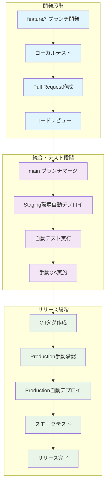

# suzumina.click リリースプロセス

## 🎯 概要

suzumina.clickプロジェクトの安全で効率的なリリース手順を定義します。品質担保と個人運用最適化を両立した3段階リリースプロセスを採用しています。

## 📊 リリースフロー全体像



## 🔄 段階別リリース手順

### **Phase 1: 開発・統合段階**

#### **1-1. 機能開発**
```bash
# 新機能開発開始
git checkout main
git pull origin main
git checkout -b feature/audio-buttons

# ローカル開発
pnpm dev  # Next.js開発サーバー + Firestore Emulator
pnpm test # 単体テスト実行
pnpm lint # コード品質チェック
```

#### **1-2. Pull Request作成**
```bash
# 開発完了後
git add .
git commit -m "feat: 音声ボタン機能の基本実装"
git push origin feature/audio-buttons

# GitHub でPull Request作成
# → 自動品質チェック実行（lint, test, type-check）
```

#### **1-3. main統合**
```bash
# PR承認・マージ後
git checkout main
git pull origin main
# → Staging環境に自動デプロイ開始
```

### **Phase 2: 自動テスト・QA段階**

#### **2-1. Staging自動デプロイ（mainプッシュ時トリガー）**
```yaml
# GitHub Actions で自動実行される処理
✅ Terraform apply (staging環境)
✅ アプリケーションビルド・デプロイ
✅ 環境変数設定
✅ データベースマイグレーション（必要時）
```

#### **2-2. 自動テスト実行**
```bash
# Staging環境で自動実行される項目
✅ Unit Tests              # Jest/Vitest
✅ Integration Tests       # API連携テスト
✅ E2E Tests              # Playwright (主要ユーザーフロー)
✅ Performance Tests      # Lighthouse CI (Core Web Vitals)
✅ Accessibility Tests    # axe-core
✅ Security Scan          # Snyk/CodeQL
✅ Build Verification     # Next.js build確認
✅ Type Safety Check      # TypeScript strict mode
✅ Code Quality Check     # Biome lint
```

#### **2-3. 手動QA実施**
```bash
# Staging環境URL: https://staging-${PROJECT_ID}.run.app

QA確認項目:
- [ ] 新機能の動作確認
  - [ ] 音声参照作成機能
  - [ ] YouTube埋め込みプレイヤー動作
  - [ ] メタデータ編集
  - [ ] 音声参照一覧表示

- [ ] 既存機能の回帰テスト
  - [ ] YouTube動画一覧表示
  - [ ] DLsite作品情報表示
  - [ ] ページネーション動作
  - [ ] 検索機能

- [ ] UI/UX品質確認
  - [ ] レスポンシブデザイン (モバイル/デスクトップ)
  - [ ] アクセシビリティ (キーボード操作/スクリーンリーダー)
  - [ ] 表示速度・体感パフォーマンス
  - [ ] エラーハンドリング・ユーザビリティ

- [ ] ブラウザ間互換性
  - [ ] Chrome (最新/1つ前)
  - [ ] Firefox (最新)
  - [ ] Safari (最新)
  - [ ] Edge (最新)

- [ ] データ整合性確認
  - [ ] Firestore データ正常性
  - [ ] Cloud Storage ファイル管理
  - [ ] ユーザー作成コンテンツ保持
```

### **Phase 3: Production リリース段階**

#### **3-1. リリース準備**
```bash
# QA完了・承認後
git checkout main
git pull origin main

# 変更履歴確認
git log --oneline --since="2 weeks ago"  # 前回リリース以降の変更
```

#### **3-2. セマンティックバージョニング**
```bash
# バージョン番号決定ルール
MAJOR.MINOR.PATCH (例: v1.2.3)

MAJOR: 破壊的変更 (v1.0.0 → v2.0.0)
- API仕様変更
- データベーススキーマ重大変更
- 非互換性導入

MINOR: 新機能追加 (v1.1.0 → v1.2.0)  
- 音声ボタン機能追加
- 新しいページ・機能
- 後方互換性維持した機能追加

PATCH: バグ修正 (v1.1.0 → v1.1.1)
- バグフィックス
- セキュリティパッチ
- パフォーマンス改善
```

#### **3-3. リリースタグ作成**
```bash
# リリース内容の詳細記述
git tag v1.1.0 -m "音声ボタン機能リリース v1.1.0

## 🎵 新機能
- 音声ファイルアップロード機能
- インタラクティブ音声プレイヤー
- 音声ボタン一覧・検索機能
- 音声メタデータ編集機能

## 🐛 バグ修正
- ページネーション表示問題修正
- モバイル表示レイアウト改善

## ⚡ パフォーマンス改善
- 画像読み込み最適化
- Core Web Vitals スコア向上

## 🔧 技術的改善
- TypeScript strict mode 対応
- E2E テストカバレッジ拡充
- セキュリティ脆弱性対応"

# タグをリモートにプッシュ（Productionデプロイトリガー）
git push origin v1.1.0
```

#### **3-4. Production デプロイ実行**
```bash
# GitHub Actions で実行される処理（手動承認後）

1. Production 環境準備
   - Terraform apply (production環境)
   - 環境変数更新
   - シークレット設定確認

2. アプリケーションデプロイ
   - Docker イメージビルド
   - Cloud Run デプロイ
   - ヘルスチェック確認

3. データベース更新 (必要時)
   - Firestore マイグレーション
   - インデックス更新
   - データ整合性確認

4. スモークテスト実行
   - ヘルスチェック API
   - 主要機能動作確認
   - パフォーマンス基本確認
```

#### **3-5. リリース後確認**
```bash
# Production環境での確認項目

# ヘルスチェック
curl -f https://suzumina.click/api/health

# 主要機能確認
- [ ] ホームページ表示
- [ ] YouTube動画一覧
- [ ] DLsite作品一覧  
- [ ] 音声参照機能
- [ ] 検索・フィルター機能

# 監視・アラート確認
- [ ] Cloud Monitoring ダッシュボード
- [ ] エラーログ監視
- [ ] パフォーマンス監視
- [ ] 予算アラート動作確認
- [ ] カスタムドメイン正常動作

# 自動テスト実行
pnpm test:production  # Production環境向けスモークテスト
```

#### **3-6. リリース完了処理**
```bash
# GitHub Release作成（自動）
- リリースノート自動生成
- タグからのアセット作成
- 変更履歴の整理

# ステークホルダー通知
- リリース完了通知
- 新機能紹介
- 既知の制限事項共有

# 次期開発準備
- 次のマイルストーン設定
- バックログ整理
- 技術負債の棚卸し
```

## 🚨 緊急時対応・ロールバック手順

### **障害発生時の即座対応**

#### **1. 緊急ロールバック**
```bash
# 前バージョンタグで即座ロールバック
git tag v1.0.1-hotfix-rollback
git push origin v1.0.1-hotfix-rollback

# 手動承認スキップでの緊急デプロイ
# GitHub Actions の emergency-deploy workflow 使用
```

#### **2. ホットフィックス手順**
```bash
# 重大バグの緊急修正
git checkout main
git checkout -b hotfix/critical-bug-fix

# 修正実装
# ... bug fix ...

# 緊急リリース
git commit -m "hotfix: 重大バグの緊急修正"
git checkout main
git merge hotfix/critical-bug-fix

# パッチバージョンで緊急リリース
git tag v1.1.1 -m "緊急バグ修正 v1.1.1"
git push origin v1.1.1
```

#### **3. データベース障害対応**
```bash
# Firestore 障害時
- 自動バックアップから復旧
- データ整合性確認
- アプリケーション再デプロイ

# Cloud Storage 障害時  
- 音声ファイル可用性確認
- CDN キャッシュクリア
- 代替表示の実装
```

## 📊 リリース品質メトリクス

### **リリース成功の指標**

```yaml
品質ゲート基準:
  自動テスト:
    - Unit Test カバレッジ: > 80%
    - E2E Test 成功率: 100%
    - Performance Score: > 90
    - Accessibility Score: > 90
    - Security Scan: 0 critical issues
  
  手動QA:
    - 機能テスト: 100% pass
    - UI/UX確認: 承認完了
    - ブラウザ互換: 主要ブラウザ対応
    - レスポンシブ: 全デバイス対応

  Production確認:
    - デプロイ成功率: 100%
    - スモークテスト: 100% pass
    - ヘルスチェック: 正常応答
    - 監視アラート: 異常なし
```

### **継続的改善**

```bash
# リリース後振り返り項目
- リリース所要時間の記録
- 品質問題の原因分析
- プロセス改善点の特定
- 自動化可能箇所の検討
- ドキュメント更新の必要性
```

## 🎯 このプロセスの利点

1. **品質担保**: 3段階品質ゲートで確実な品質確保
2. **個人運用最適**: 1人でも安全確実に運用可能
3. **自動化**: 手作業ミスを最小限に抑制
4. **トレーサビリティ**: 全リリースの詳細な記録
5. **安全性**: Production前の包括的検証
6. **迅速性**: 緊急時の迅速な対応手順
7. **継続改善**: 定期的なプロセス見直し

## 📝 関連ドキュメント

- [デプロイ戦略 (DEPLOYMENT_STRATEGY.md)](./DEPLOYMENT_STRATEGY.md)
- [インフラアーキテクチャ (INFRASTRUCTURE_ARCHITECTURE.md)](./INFRASTRUCTURE_ARCHITECTURE.md)
- [開発ガイドライン (DEVELOPMENT.md)](./DEVELOPMENT.md)
- [変更履歴 (CHANGELOG.md)](./CHANGELOG.md)

このリリースプロセスにより、個人開発でも企業レベルの品質担保と安全なリリース運用を実現します。