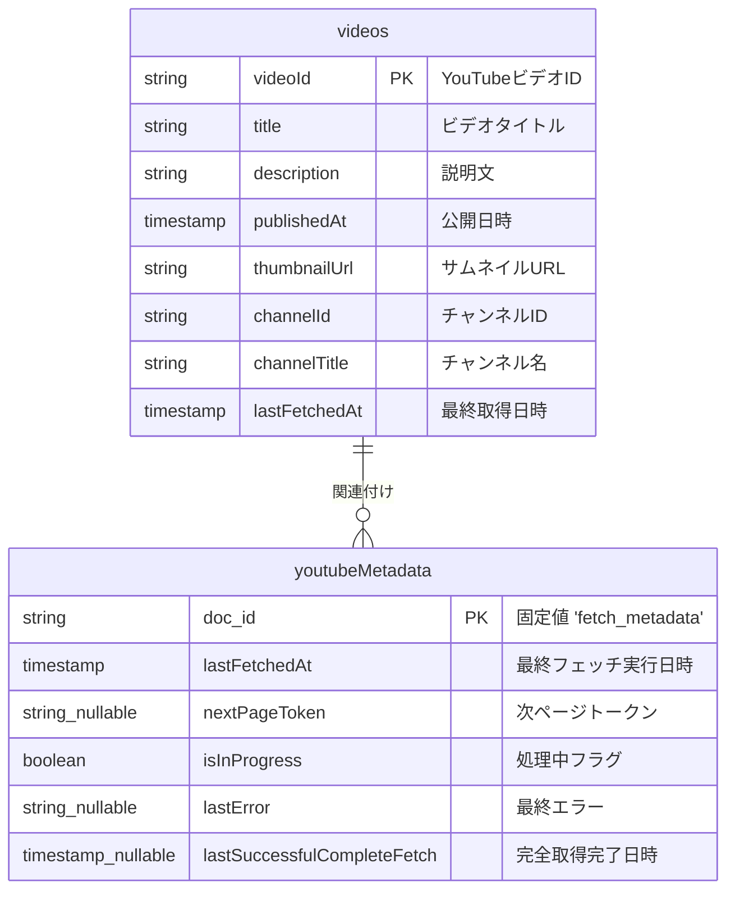

# データベーススキーマ設計 (Firestore)

このドキュメントでは、suzumina.click プロジェクトで使用する Firestore データベースのスキーマ設計を記述します。

## 1. 全体構成

当プロジェクトでは、主に以下のデータを Firestore で扱います：

- **YouTubeビデオ情報:** 定期的に取得される動画データ。
- **YouTubeビデオ取得メタデータ:** 動画取得バッチ処理の状態管理情報。

**ユーザー認証情報** (表示名、メールアドレス、プロフィール画像URLなど) は、**Firebase Authentication** サービスによって管理されており、Firestore のコレクションとしては直接管理していません。

これらは Firestore のコレクション・ドキュメントとして管理されます。

## 2. ER図 (Firestore コレクション)

以下に、Firestore で管理されている主要なデータモデルのER図を示します。


* `string_nullable` は `string | null` を、`timestamp_nullable` は `timestamp | null` を意味します。

## 3. コレクション詳細

### 3.1. `videos` コレクション

YouTubeの動画情報を格納します。Cloud Functions (`fetchYouTubeVideos`) によって定期的に更新されます。

#### スキーマ

| フィールド名 | 型 | 説明 |
|------------|------|------|
| `videoId` | string | **主キー** - YouTube動画ID（ドキュメントIDと同一） |
| `title` | string | 動画タイトル |
| `description` | string | 動画の説明文 |
| `publishedAt` | timestamp | 動画の公開日時（YouTubeから取得） |
| `thumbnailUrl` | string | サムネイル画像のURL |
| `channelId` | string | チャンネルID（"UChiMMOhl6FpzjoRqvZ5rcaA"固定） |
| `channelTitle` | string | チャンネル名（"涼花みなせ / Suzuka Minase"） |
| `lastFetchedAt` | timestamp | このデータの最終取得/更新日時 |

#### 使用例

```typescript
// 最新の動画10件を取得
const videosRef = firestore.collection('videos');
const recentVideos = await videosRef
  .orderBy('publishedAt', 'desc')
  .limit(10)
  .get();
```

### 3.2. `youtubeMetadata` コレクション

YouTube動画取得プロセスのメタデータを管理します。クォータ制限対応やページネーション管理に使用します。

#### スキーマ

このコレクションには1つのドキュメントのみが存在します（ドキュメントID: `fetch_metadata`）。

| フィールド名 | 型 | 説明 |
|------------|-----------------|------|
| `lastFetchedAt` | timestamp | 最後にフェッチを実行した日時 |
| `nextPageToken` | string \| null | 次回取得時に使用するYouTube API ページトークン。全件取得完了時は null。 |
| `isInProgress` | boolean | 処理が現在実行中かどうかを示すフラグ |
| `lastError` | string \| null | 最後に発生したエラーメッセージ。正常完了時は null。 |
| `lastSuccessfulCompleteFetch` | timestamp \| null | 最後に全ページの取得が正常に完了した日時 |

#### 使用例

```typescript
// メタデータの取得
const metadataRef = firestore.collection('youtubeMetadata').doc('fetch_metadata');
const metadata = await metadataRef.get();
if (metadata.exists) {
  const { lastFetchedAt, nextPageToken, isInProgress } = metadata.data() as FetchMetadata; // FetchMetadata は適切な型定義
  // メタデータを使用した処理
}
```

### 3.3. `users` コレクション (廃止)

**注意:** 以前の設計では `users` コレクションが検討されていましたが、現在の実装では使用されていません。ユーザー認証と基本的なプロフィール情報（表示名、メール、アバターURL）は Firebase Authentication によって管理されています。Firestore にユーザーごとの追加情報を保存する必要が生じた場合に、別途コレクションを設計します。

### 3.4. `userPreferences` コレクション (廃止)

**注意:** このコレクションは将来的な拡張のために予定されていましたが、現在使用されていません。

## 4. データアクセスパターン

### 主要なクエリパターン

1.  **最新の動画取得:**
    ```typescript
    const recentVideos = await firestore.collection('videos')
      .orderBy('publishedAt', 'desc')
      .limit(10)
      .get();
    ```

2.  **特定の動画の詳細取得:**
    ```typescript
    const videoDoc = await firestore.collection('videos')
      .doc(videoId)
      .get();
    ```

3.  **処理メタデータの確認:**
    ```typescript
    const metadataDoc = await firestore.collection('youtubeMetadata')
      .doc('fetch_metadata')
      .get();
    ```

## 5. セキュリティルール

Firestore セキュリティルールは以下の方針に基づいています：

1.  **videos コレクション:** 読み取りは全てのユーザーに許可、書き込みは Cloud Functions からのみ許可 (実質的に管理者のみ)。
2.  **youtubeMetadata コレクション:** 読み取り/書き込みは Cloud Functions からのみ許可 (実質的に管理者のみ)。

```javascript
rules_version = '2';
service cloud.firestore {
  match /databases/{database}/documents {
    // videos コレクション - 読み取りは全員可能、書き込みは Cloud Functions のみ
    match /videos/{videoId} {
      allow read;
      // 書き込みはサービスアカウント経由 (Cloud Functions) のみ許可する想定
      // セキュリティルールレベルでの明示的な制限は難しい場合があるため、
      // Functions の IAM 権限で制御する。ここでは念のため false にしておく。
      allow write: if false;
    }

    // youtubeMetadata コレクション - Cloud Functions のみアクセス可能
    match /youtubeMetadata/{docId} {
      // Functions の IAM 権限で制御する。ここでは念のため false にしておく。
      allow read, write: if false;
    }

    // users, userPreferences コレクションは現在使用していないため、ルール不要
  }
}
```
**注意:** 上記のセキュリティルールでは、書き込み権限を `false` としていますが、これは Cloud Functions (サービスアカウント) からのアクセスを前提としているためです。実際のアクセス制御は主に IAM によって行われます。必要に応じて、より詳細なルール（例: `request.auth.token.firebase.sign_in_provider` の確認など）を検討してください。

## 6. インデックス設定

以下のインデックスが必要です：

1.  `videos` コレクション:
    -   `publishedAt` (降順) - 最新の動画を取得するため

```yaml
indexes:
  - collectionGroup: videos # collectionGroup を使用 (単一コレクションインデックスでも可)
    queryScope: COLLECTION
    fields:
      - fieldPath: publishedAt
        order: DESCENDING
```
*Firebase コンソールまたは `firebase deploy --only firestore:indexes` でデプロイが必要です。*

## 7. データ移行・バックアップ戦略

1.  **定期バックアップ:** Firestore のエクスポート機能を使用して定期的にバックアップを取得します。
2.  **データ移行:** スキーマ変更時は、Cloud Functions を使用して既存データを新スキーマに変換することを検討します。
3.  **バージョン管理:** データモデルの変更履歴を本ドキュメントに記録します。

## 変更履歴

| 日付       | バージョン | 変更内容                                                                                                |
|------------|-----------|-------------------------------------------------------------------------------------------------------|
| 2025-04-21 | 1.1       | 実装に合わせて更新: `youtubeMetadata` の型を修正、`users`, `userPreferences` コレクション定義を削除、関連記述を修正 |
| 2025-04-20 | 1.0       | 初版作成 - YouTubeビデオ情報とメタデータスキーマの定義                                                     |