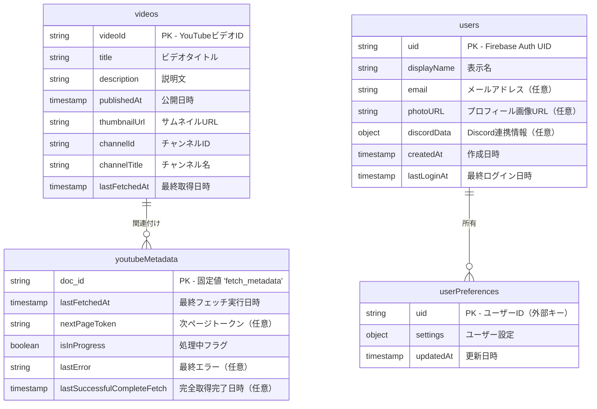

# データベーススキーマ設計

このドキュメントでは、suzumina.click プロジェクトで使用するデータベース（主にFirestore）のスキーマ設計を記述します。

## 1. 全体構成

当プロジェクトでは、主に以下のデータを扱います：

- YouTubeビデオ情報
- ユーザー認証情報
- メタデータ管理情報

これらはFirestoreのコレクション・ドキュメントとして管理されます。

## 2. ER図

以下に、主要なデータモデルのER図を示します。



## 3. コレクション詳細

### 3.1. `videos` コレクション

YouTubeの動画情報を格納します。Cloud Functions (`fetchYouTubeVideos`) によって定期的に更新されます。

#### スキーマ

| フィールド名 | 型 | 説明 |
|------------|------|------|
| `videoId` | string | **主キー** - YouTube動画ID（ドキュメントIDと同一） |
| `title` | string | 動画タイトル |
| `description` | string | 動画の説明文 |
| `publishedAt` | timestamp | 動画の公開日時（YouTubeから取得） |
| `thumbnailUrl` | string | サムネイル画像のURL |
| `channelId` | string | チャンネルID（"UChiMMOhl6FpzjoRqvZ5rcaA"固定） |
| `channelTitle` | string | チャンネル名（"涼花みなせ / Suzuka Minase"） |
| `lastFetchedAt` | timestamp | このデータの最終取得/更新日時 |

#### 使用例

```typescript
// 最新の動画10件を取得
const videosRef = firestore.collection('videos');
const recentVideos = await videosRef
  .orderBy('publishedAt', 'desc')
  .limit(10)
  .get();
```

### 3.2. `youtubeMetadata` コレクション

YouTube動画取得プロセスのメタデータを管理します。クォータ制限対応やページネーション管理に使用します。

#### スキーマ

このコレクションには1つのドキュメントのみが存在します（ドキュメントID: `fetch_metadata`）。

| フィールド名 | 型 | 説明 |
|------------|------|------|
| `lastFetchedAt` | timestamp | 最後にフェッチを実行した日時 |
| `nextPageToken` | string | （任意）次回取得時に使用するYouTube API ページトークン |
| `isInProgress` | boolean | 処理が現在実行中かどうかを示すフラグ |
| `lastError` | string | （任意）最後に発生したエラーメッセージ |
| `lastSuccessfulCompleteFetch` | timestamp | （任意）最後に全ページの取得が完了した日時 |

#### 使用例

```typescript
// メタデータの取得
const metadataRef = firestore.collection('youtubeMetadata').doc('fetch_metadata');
const metadata = await metadataRef.get();
if (metadata.exists) {
  const { lastFetchedAt, nextPageToken, isInProgress } = metadata.data();
  // メタデータを使用した処理
}
```

### 3.3. `users` コレクション

ユーザー情報を格納します。Firebase Authenticationと連携して使用されます。

#### スキーマ

| フィールド名 | 型 | 説明 |
|------------|------|------|
| `uid` | string | **主キー** - Firebase Auth UID（ドキュメントIDと同一） |
| `displayName` | string | ユーザー表示名 |
| `email` | string | （任意）メールアドレス |
| `photoURL` | string | （任意）プロフィール画像URL |
| `discordData` | object | （任意）Discord連携情報 |
| `discordData.id` | string | Discord ユーザーID |
| `discordData.username` | string | Discord ユーザー名 |
| `discordData.avatar` | string | Discord アバターハッシュ |
| `discordData.avatarUrl` | string | 生成されたアバターURL |
| `createdAt` | timestamp | アカウント作成日時 |
| `lastLoginAt` | timestamp | 最終ログイン日時 |

#### 使用例

```typescript
// 現在ログイン中のユーザー情報を取得
const userRef = firestore.collection('users').doc(auth.currentUser.uid);
const userDoc = await userRef.get();
if (userDoc.exists) {
  const userData = userDoc.data();
  // ユーザーデータを使用した処理
}
```

### 3.4. `userPreferences` コレクション（予定）

ユーザーの設定情報を格納します。今後の機能拡張用です。

#### スキーマ

| フィールド名 | 型 | 説明 |
|------------|------|------|
| `uid` | string | **主キー** - ユーザーID（外部キー、ドキュメントIDと同一） |
| `settings` | object | ユーザー設定データ |
| `updatedAt` | timestamp | 設定の最終更新日時 |

## 4. データアクセスパターン

### 主要なクエリパターン

1. **最新の動画取得:**
   ```typescript
   const recentVideos = await firestore.collection('videos')
     .orderBy('publishedAt', 'desc')
     .limit(10)
     .get();
   ```

2. **特定の動画の詳細取得:**
   ```typescript
   const videoDoc = await firestore.collection('videos')
     .doc(videoId)
     .get();
   ```

3. **処理メタデータの確認:**
   ```typescript
   const metadataDoc = await firestore.collection('youtubeMetadata')
     .doc('fetch_metadata')
     .get();
   ```

4. **ユーザー情報の取得:**
   ```typescript
   const userDoc = await firestore.collection('users')
     .doc(uid)
     .get();
   ```

## 5. セキュリティルール

Firestore セキュリティルールは以下の方針に基づいています：

1. **videos コレクション:** 読み取りは全てのユーザーに許可、書き込みは管理者のみ許可
2. **youtubeMetadata コレクション:** 読み取り/書き込みは管理者のみ許可
3. **users コレクション:** 自分のドキュメントのみ読み取り可能、書き込みは認証済みユーザーのみ自分のドキュメントのみ
4. **userPreferences コレクション:** 自分のドキュメントのみ読み取り/書き込み可能

```javascript
rules_version = '2';
service cloud.firestore {
  match /databases/{database}/documents {
    // videos コレクション - 読み取りは全員可能、書き込みは管理者のみ
    match /videos/{videoId} {
      allow read;
      allow write: if false;  // Cloud Functions からのみ書き込み可能
    }
    
    // youtubeMetadata コレクション - 管理者のみアクセス可能
    match /youtubeMetadata/{docId} {
      allow read, write: if false;  // Cloud Functions からのみアクセス可能
    }
    
    // users コレクション - 自分のデータのみアクセス可能
    match /users/{userId} {
      allow read: if request.auth != null && request.auth.uid == userId;
      allow write: if request.auth != null && request.auth.uid == userId;
    }
    
    // userPreferences コレクション - 自分のデータのみアクセス可能
    match /userPreferences/{userId} {
      allow read, write: if request.auth != null && request.auth.uid == userId;
    }
  }
}
```

## 6. インデックス設定

以下のインデックスが必要です：

1. `videos` コレクション:
   - `publishedAt` (降順) - 最新の動画を取得するため

```yaml
indexes:
- collection: videos
  fields:
  - field: publishedAt
    order: DESCENDING
```

## 7. データ移行・バックアップ戦略

1. **定期バックアップ:** Firestore のエクスポート機能を使用して定期的にバックアップを取得
2. **データ移行:** スキーマ変更時は、Cloud Functions を使用して既存データを新スキーマに変換
3. **バージョン管理:** データモデルの変更履歴を本ドキュメントに記録

## 変更履歴

| 日付 | バージョン | 変更内容 |
|------|-----------|---------|
| 2025-04-20 | 1.0 | 初版作成 - YouTubeビデオ情報とメタデータスキーマの定義 |