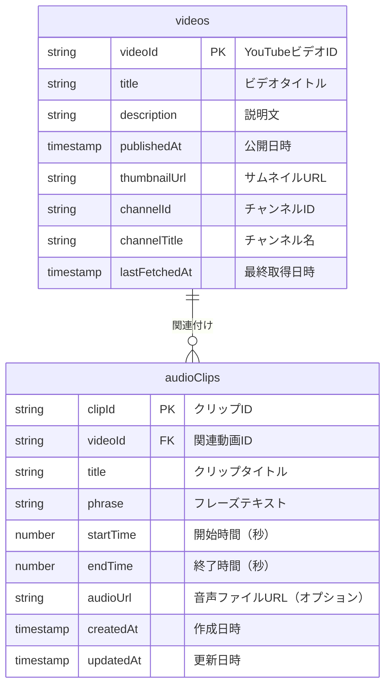
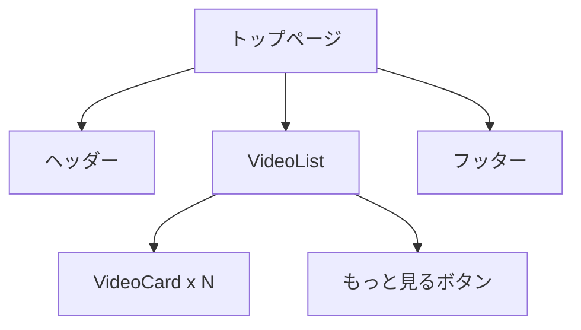
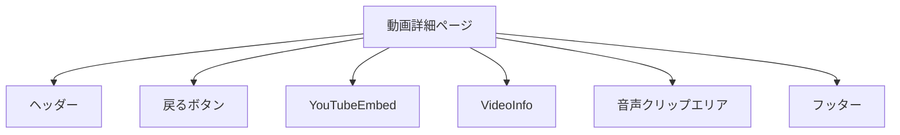

# 動画ページ実装計画

このドキュメントでは、suzumina.click プロジェクトにおける動画ページの実装計画について詳細に記述します。

## 1. 概要

「音声ボタンサービス」の一部として、YouTube動画情報を表示するページを実装します。具体的には以下の機能を提供します：

1. トップページに最新の動画サムネイルとリンクを表示
2. 動画を選択すると詳細ページに移動
3. 詳細ページにはYouTube動画プレイヤーを表示

将来的には、動画から抽出した特定のフレーズや名言を音声ボタンとして提供する機能を追加する予定です。

## 2. データモデル

### 現在のデータモデル

現在、Firestoreには以下のコレクションが実装されています：

- `videos`: YouTube動画情報
- `youtubeMetadata`: YouTube動画取得プロセスのメタデータ

### 将来的な拡張

音声クリップ機能のために、以下のコレクションを追加予定です：

- `audioClips`: 動画から抽出した音声クリップ情報



## 3. ファイル構造

```
apps/web/
├── src/
│   ├── app/
│   │   ├── page.tsx                    # トップページ（動画一覧）
│   │   ├── videos/
│   │   │   └── [videoId]/
│   │   │       └── page.tsx            # 動画詳細ページ
│   │   └── _components/                # ページ固有コンポーネント
│   │       ├── VideoList.tsx           # 動画一覧コンポーネント
│   │       └── VideoPlayer.tsx         # 動画プレイヤーコンポーネント
│   ├── components/
│   │   ├── ui/                         # 汎用UIコンポーネント
│   │   │   ├── VideoCard.tsx           # 動画カードコンポーネント
│   │   │   └── Pagination.tsx          # ページネーションコンポーネント
│   │   └── videos/                     # 動画関連コンポーネント
│   │       ├── YouTubeEmbed.tsx        # YouTube埋め込みコンポーネント
│   │       └── VideoInfo.tsx           # 動画情報表示コンポーネント
│   ├── lib/
│   │   ├── firebase/                   # Firebase関連
│   │   │   └── client.ts               # 既存のFirebaseクライアント
│   │   └── videos/                     # 動画関連ロジック
│   │       ├── types.ts                # 型定義
│   │       └── api.ts                  # データ取得関数
│   └── utils/                          # ユーティリティ関数
│       └── date-format.ts              # 日付フォーマット関数
```

## 4. コンポーネント設計

### 4.1 トップページ（動画一覧）



### 4.2 動画詳細ページ



## 5. 実装フェーズ

### フェーズ1: 動画一覧ページの実装
- 型定義の作成
- データ取得ロジックの実装
- VideoCardコンポーネントの実装
- VideoListコンポーネントの実装
- トップページの更新

### フェーズ2: 動画詳細ページの実装
- YouTubeEmbedコンポーネントの実装
- VideoInfoコンポーネントの実装
- 動画詳細ページの実装

### フェーズ3: 音声クリップ機能の準備（将来実装）
- `audioClips`コレクションのスキーマ設計
- 音声クリップ管理用のバックエンド機能

### フェーズ4: 音声ボタン機能の実装（将来実装）
- 音声クリップの再生機能
- 音声ボタンUIの実装

## 6. 主要コンポーネントの実装詳細

### 6.1 VideoCard

動画一覧で表示する各動画のカードコンポーネント。

- サムネイル画像の表示（Next.js Imageコンポーネント使用）
- タイトルと公開日の表示
- クリックで詳細ページへ遷移

### 6.2 VideoList

動画一覧を表示し、ページネーションを管理するコンポーネント。

- 初期読み込み時に最新の動画を取得
- 「もっと見る」ボタンでさらに動画を読み込み
- レスポンシブグリッドレイアウト

### 6.3 YouTubeEmbed

YouTube動画プレイヤーを埋め込むコンポーネント。

- iframeを使用してYouTube動画を埋め込み
- レスポンシブ対応（16:9のアスペクト比を維持）

### 6.4 VideoInfo

動画の詳細情報を表示するコンポーネント。

- タイトル、公開日、チャンネル名の表示
- 説明文の表示（改行を保持）

## 7. データ取得ロジック

### 7.1 動画一覧の取得

```typescript
// 最新の動画を取得する関数
export async function getRecentVideos(
  params: PaginationParams = { limit: 10 }
): Promise<VideoListResult> {
  // Firestoreから動画を取得するロジック
  // ...
}
```

### 7.2 動画詳細の取得

```typescript
// 特定の動画IDの詳細を取得する関数
export async function getVideoById(videoId: string): Promise<Video | null> {
  // Firestoreから特定の動画を取得するロジック
  // ...
}
```

## 8. パフォーマンス最適化

- Next.js Imageコンポーネントによる画像最適化
- ページネーションによるデータ量の制限
- YouTube埋め込みの遅延読み込み

## 9. 将来的な拡張性

- 音声クリップの検索機能
- タグ付け機能
- ユーザーによるお気に入り登録機能

## 10. セキュリティ考慮事項

Firestore セキュリティルールは現在以下のように設定されています：

```javascript
rules_version = '2';
service cloud.firestore {
  match /databases/{database}/documents {
    // videos コレクション - 読み取りは全員可能、書き込みは Cloud Functions のみ
    match /videos/{videoId} {
      allow read;
      allow write: if false;
    }
    
    // youtubeMetadata コレクション - Cloud Functions のみアクセス可能
    match /youtubeMetadata/{docId} {
      allow read, write: if false;
    }
  }
}
```

将来的に`audioClips`コレクションを追加する際は、以下のようなルールを追加する予定です：

```javascript
// audioClips コレクション - 読み取りは全員可能、書き込みは管理者のみ
match /audioClips/{clipId} {
  allow read;
  allow write: if false; // 管理者のみ書き込み可能
}