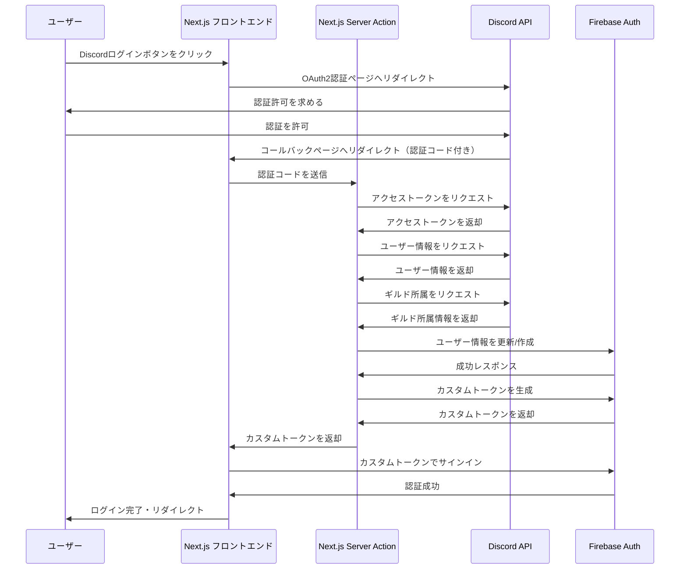

# Discord認証のNext.js Server Actions移行計画（完了）

## 背景

現在、Firebase AuthとDiscord認証はCloud Functionsで実装されていますが、Next.jsをCloud Runに移行したため、サーバーサイドの処理をNext.js内で実装できるようになりました。この文書では、Discord認証をNext.jsのServer Actionsを使用して実装する計画を説明します。

## 現状の認証フロー

現在の実装では、以下のような認証フローになっています：

1. フロントエンド（Next.js）：ユーザーがDiscordログインボタンをクリック
2. Discord OAuth2認証ページへリダイレクト
3. ユーザーが認証を許可
4. Discordからコールバックページへリダイレクト（認証コード付き）
5. フロントエンド：認証コードをCloud Functionsに送信
6. Cloud Functions：
   - Discordからアクセストークンを取得
   - ユーザー情報とギルド所属を確認
   - Firebase Authでユーザー情報を更新/作成
   - カスタムトークンを生成して返却
7. フロントエンド：カスタムトークンでFirebase Authにサインイン

## 新しい認証フロー

Next.jsのServer Actionsを活用して、以下のようにシンプル化します：



## 実装計画

### 1. Server Actionsの作成

`app/api/auth/discord/actions.ts`ファイルを作成し、以下の機能を実装します：

```typescript
"use server";

import { initializeApp, cert, getApps } from "firebase-admin/app";
import { getAuth } from "firebase-admin/auth";
import axios from "axios";
import { cookies } from "next/headers";
import { redirect } from "next/navigation";

// Firebase Admin初期化
function initializeFirebaseAdmin() {
  if (getApps().length === 0) {
    // 環境変数またはシークレットから認証情報を取得
    const serviceAccount = JSON.parse(
      process.env.FIREBASE_SERVICE_ACCOUNT_KEY || "{}"
    );
    
    initializeApp({
      credential: cert(serviceAccount)
    });
  }
  
  return getAuth();
}

// Discord認証処理
export async function handleDiscordCallback(code: string) {
  try {
    // 環境変数の取得
    const clientId = process.env.NEXT_PUBLIC_DISCORD_CLIENT_ID;
    const clientSecret = process.env.DISCORD_CLIENT_SECRET;
    const redirectUri = process.env.NEXT_PUBLIC_DISCORD_REDIRECT_URI;
    const targetGuildId = process.env.DISCORD_TARGET_GUILD_ID;
    
    if (!clientId || !clientSecret || !redirectUri || !targetGuildId) {
      throw new Error("Discord設定が不足しています");
    }
    
    // 1. Discordからアクセストークンを取得
    const tokenResponse = await axios.post(
      "https://discord.com/api/oauth2/token",
      new URLSearchParams({
        client_id: clientId,
        client_secret: clientSecret,
        grant_type: "authorization_code",
        code: code,
        redirect_uri: redirectUri,
      }),
      {
        headers: {
          "Content-Type": "application/x-www-form-urlencoded",
        },
      }
    );
    
    const accessToken = tokenResponse.data.access_token;
    
    // 2. Discordからユーザー情報を取得
    const userResponse = await axios.get(
      "https://discord.com/api/users/@me",
      {
        headers: { Authorization: `Bearer ${accessToken}` },
      }
    );
    
    const discordUser = userResponse.data;
    const discordUserId = discordUser.id;
    const discordUsername = discordUser.username;
    const discordEmail = discordUser.email;
    const discordAvatarHash = discordUser.avatar;
    
    // アバターURLの生成
    let discordAvatarUrl;
    if (discordAvatarHash) {
      const format = discordAvatarHash.startsWith("a_") ? "gif" : "png";
      discordAvatarUrl = `https://cdn.discordapp.com/avatars/${discordUserId}/${discordAvatarHash}.${format}?size=128`;
    }
    
    // 3. Discordからギルド情報を取得
    const guildsResponse = await axios.get(
      "https://discord.com/api/users/@me/guilds",
      {
        headers: { Authorization: `Bearer ${accessToken}` },
      }
    );
    
    const userGuilds = guildsResponse.data;
    
    // 4. ターゲットギルドに所属しているか確認
    const isMember = userGuilds.some(
      (guild) => guild.id === targetGuildId
    );
    
    if (!isMember) {
      throw new Error("対象ギルドのメンバーではありません");
    }
    
    // 5. Firebase Authユーザー情報の更新または作成
    const auth = initializeFirebaseAdmin();
    
    const userProperties = {
      displayName: discordUsername,
      photoURL: discordAvatarUrl,
      email: discordEmail || undefined,
    };
    
    try {
      // 既存ユーザーの情報を更新
      await auth.updateUser(discordUserId, userProperties);
    } catch (error) {
      // ユーザーが存在しない場合は新規作成
      if (error.code === "auth/user-not-found") {
        await auth.createUser({
          uid: discordUserId,
          ...userProperties,
        });
      } else {
        throw error;
      }
    }
    
    // 6. Firebaseカスタムトークンを生成
    const customToken = await auth.createCustomToken(discordUserId);
    
    // 7. カスタムトークンをクッキーに保存（または直接返却）
    // セキュリティのため、HTTPOnly, Secure, SameSiteの設定を推奨
    cookies().set("firebase_token", customToken, {
      httpOnly: true,
      secure: process.env.NODE_ENV === "production",
      sameSite: "lax",
      maxAge: 60 * 5, // 5分間有効（サインインに使用後は不要）
      path: "/",
    });
    
    return { success: true };
  } catch (error) {
    console.error("Discord認証エラー:", error);
    return { 
      success: false, 
      error: error.message || "認証処理中にエラーが発生しました" 
    };
  }
}
```

### 2. コールバッククライアントの更新

`app/auth/discord/callback/CallbackClient.tsx`を更新して、Server Actionを呼び出すように変更します：

```typescript
"use client";

import { auth } from "@/lib/firebase/client";
import { signInWithCustomToken } from "firebase/auth";
import { useRouter, useSearchParams } from "next/navigation";
import { useEffect, useState } from "react";
import { handleDiscordCallback } from "@/app/api/auth/discord/actions";
import { getCookie, deleteCookie } from "cookies-next";

export default function CallbackClient() {
  const searchParams = useSearchParams();
  const router = useRouter();
  const [message, setMessage] = useState("認証処理中...");
  const [error, setError] = useState<string | null>(null);

  useEffect(() => {
    const code = searchParams.get("code");

    if (!code) {
      setError("認証コードが見つかりません。");
      setMessage("エラーが発生しました。");
      return;
    }

    async function processAuth() {
      try {
        // Server Actionを呼び出して認証処理
        const result = await handleDiscordCallback(code);

        if (!result.success) {
          throw new Error(result.error || "認証処理に失敗しました");
        }

        // クッキーからカスタムトークンを取得
        const customToken = getCookie("firebase_token");
        
        if (!customToken) {
          throw new Error("認証トークンが見つかりません");
        }

        // クッキーを削除（使用後は不要）
        deleteCookie("firebase_token");

        // authがnullでないことを確認
        if (!auth) {
          throw new Error("認証システムの初期化に失敗しました。");
        }

        // カスタムトークンでサインイン
        await signInWithCustomToken(auth, customToken);
        
        setMessage("認証に成功しました！ホームページにリダイレクトします...");
        router.push("/");
      } catch (err) {
        console.error("Authentication failed:", err);
        setError(err.message || "認証中にエラーが発生しました。");
        setMessage("認証に失敗しました。");
      }
    }

    processAuth();
  }, [searchParams, router]);

  return (
    <>
      <p>{message}</p>
      {error && <p className="text-error mt-2">エラー: {error}</p>}
      {!error && message === "認証処理中..." && (
        <span
          data-testid="loading-indicator"
          className="loading loading-dots loading-lg mt-4"
        />
      )}
    </>
  );
}
```

### 3. 環境変数の設定

#### ローカル開発環境

`.env.local`ファイルに必要な環境変数を追加します：

```
# Discord OAuth2設定
NEXT_PUBLIC_DISCORD_CLIENT_ID=your_discord_client_id
NEXT_PUBLIC_DISCORD_REDIRECT_URI=https://your-domain.com/auth/discord/callback
DISCORD_CLIENT_SECRET=your_discord_client_secret
DISCORD_TARGET_GUILD_ID=your_discord_guild_id

# Firebase Admin SDK
FIREBASE_SERVICE_ACCOUNT_KEY={"type":"service_account","project_id":"...","private_key_id":"...","private_key":"...","client_email":"...","client_id":"...","auth_uri":"...","token_uri":"...","auth_provider_x509_cert_url":"...","client_x509_cert_url":"..."}
```

#### 本番環境（Cloud Run）

本番環境では、環境変数をSecret Managerで管理し、Cloud Runのサービスアカウントにアクセス権限を付与しています。

1. Secret Managerに以下のシークレットを追加：
   - `NEXT_PUBLIC_DISCORD_CLIENT_ID`
   - `NEXT_PUBLIC_DISCORD_REDIRECT_URI`
   - `DISCORD_CLIENT_SECRET`
   - `DISCORD_TARGET_GUILD_ID`
   - `FIREBASE_SERVICE_ACCOUNT_KEY`

2. Cloud Run用のサービスアカウント（`nextjs-app-sa`）を作成し、以下の権限を付与：
   - Secret Managerへのアクセス権限（`roles/secretmanager.secretAccessor`）
   - Firebase Admin権限（`roles/firebase.admin`）

3. Cloud Runの環境変数設定で、これらのシークレットを参照するように設定

これらの設定は、Terraformで管理されています。詳細は以下のファイルを参照してください：

- `terraform/secrets.tf` - シークレットの定義
- `terraform/cloudrun.tf` - Cloud Runの設定

## セキュリティ上の考慮事項

1. **サービスアカウントキーの管理**：
   - 本番環境では、サービスアカウントキーをJSON文字列として環境変数に保存するのではなく、Secret Managerを使用して管理することを推奨します。
   - Cloud Runでは、サービスアカウントの権限を適切に設定し、必要最小限の権限を付与します。

2. **トークンの受け渡し**：
   - カスタムトークンをHTTPOnlyクッキーとして保存し、JavaScriptからアクセスできないようにします。
   - 使用後はすぐにクッキーを削除します。

3. **CORS設定**：
   - 必要に応じて、Next.jsのミドルウェアでCORS設定を行います。

## メリット

1. **インフラの簡素化**：
   - Cloud Functionsの1つを削減できます。
   - デプロイとメンテナンスが一元化されます。

2. **コードの一元管理**：
   - 認証関連のコードがNext.jsアプリケーション内に統合されます。
   - 環境変数の管理が一元化されます。

3. **パフォーマンスの向上**：
   - 外部サービス呼び出しが減少し、レイテンシが改善される可能性があります。

## 実装上の注意点

1. **Firebase Admin SDKの初期化**：
   - Server Actionsが呼び出されるたびに初期化されないよう、適切にキャッシュします。

2. **エラーハンドリング**：
   - ユーザーフレンドリーなエラーメッセージを表示します。
   - 詳細なエラーログをサーバーサイドで記録します。

3. **テスト**：
   - Server Actionsのユニットテストを作成します。
   - E2Eテストで認証フローを検証します。

## 実装スケジュール

1. Server Actionsの実装 - 1日
2. コールバックページの更新 - 0.5日
3. 環境変数の設定とテスト - 0.5日
4. 本番環境へのデプロイとテスト - 1日

合計: 約3日

## 結論

Next.jsのServer Actionsを使用してDiscord認証を実装することで、Cloud Functionsを1つ削減し、コードの一元管理とメンテナンスの簡素化が可能になります。また、認証フローのパフォーマンスも向上する可能性があります。

## 実装完了

このドキュメントに記載された計画は2025年4月26日に完了しました。認証機能はServer Actionsを使用して実装され、Cloud Functionsから移行されています。詳細はAUTH.mdドキュメントを参照してください。
