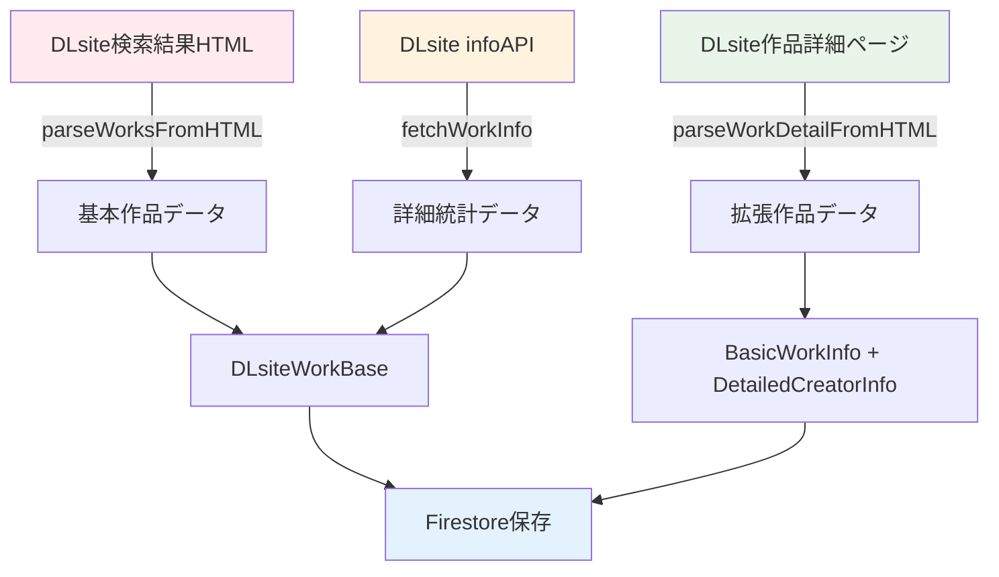

# DLsiteデータ取得システム最適化分析レポート

> **📅 作成日**: 2025年7月3日  
> **📝 ステータス**: 分析完了・改善提案段階  
> **🔧 対象バージョン**: v0.2.6  

## 📋 概要

DLsiteからのデータ取得システムにおいて、一覧取得（fetchDLsiteWorks）と詳細取得（fetchWorkDetailPage）で重複データが発生している問題を分析し、最適化の方向性を提案する。

## 🔍 現在のデータフロー

### 3段階データ取得構造



### データソース詳細

| データソース | 取得方法 | 主要データ | 処理時間 | API制限 |
|-------------|---------|-----------|---------|---------|
| **検索結果HTML** | スクレイピング | title, circle, price, rating, tags | 高速 | レート制限あり |
| **infoAPI** | REST API | sales, ranking, metadata | 中速 | 厳しい制限 |
| **詳細ページHTML** | スクレイピング | trackInfo, creators, basicInfo | 低速 | レート制限あり |

## 🔄 重複データ分析

### 1. 💯 **確実に重複している項目**

#### **基本作品情報の重複**
```typescript
// DLsiteWorkBase (一覧取得)
{
  productId: "RJ01393393",
  title: "作品タイトル",
  circle: "サークル名",
  author: ["声優名1", "声優名2"],       // ← 重複
  ageRating: "R18",                    // ← 重複
  tags: ["ジャンル1", "ジャンル2"],     // ← 重複
  registDate: "2025-06-14T00:00:00Z"   // ← 重複
}

// BasicWorkInfo (詳細取得)
{
  releaseDate: "2025年06月14日",       // ← registDateと重複
  author: ["声優名1", "声優名2"],       // ← authorと重複
  voiceActors: ["声優名1", "声優名2"], // ← authorと重複
  ageRating: "R18",                    // ← ageRatingと重複
  genres: ["ジャンル1", "ジャンル2"]    // ← tagsと重複
}
```

#### **価格・評価情報の重複**
```typescript
// 3箇所で同じデータを取得
const priceData = {
  listHTML: { current: 1200, discount: 20 },    // 検索結果ページ
  infoAPI: { current: 1200, discount: 20 },     // info エンドポイント
  detailPage: { current: 1200, discount: 20 }   // 詳細ページ
};
```

### 2. ⚠️ **部分的に重複している項目**

#### **クリエイター情報の階層重複**
```typescript
// 同じ声優情報が3箇所に格納
{
  author: ["涼花みなせ"],                          // 一覧HTML (基本)
  basicInfo: {
    voiceActors: ["涼花みなせ", "乙倉ゅい"]        // 詳細ページ (詳細)
  },
  detailedCreators: {
    voiceActors: ["涼花みなせ", "乙倉ゅい"]        // 詳細ページ (重複)
  }
}
```

#### **タグ・ジャンル情報の分散**
```typescript
{
  tags: ["淫語", "バイノーラル"],                   // 一覧HTML
  basicInfo: {
    genres: ["淫語", "バイノーラル", "ギャル"],     // 詳細ページ (work_outline)
    detailTags: []                                 // 詳細ページ (追加タグ)
  },
  customGenres: ["カスタムジャンル"]               // infoAPI
}
```

## 📊 パフォーマンス・効率性への影響

### 1. **API呼び出しコスト**

| 処理段階 | API呼び出し数 | 平均処理時間 | レート制限リスク |
|---------|-------------|-------------|----------------|
| 基本取得 | 1回 (HTML) | 100ms | 低 |
| 詳細統計 | 1回 (API) | 300ms | **高** |
| 拡張情報 | 1回 (HTML) | 500ms | 中 |
| **合計** | **3回/作品** | **900ms** | **高** |

### 2. **データ容量の無駄**

```typescript
// 推定重複データサイズ (1作品あたり)
const duplicateDataSize = {
  basicInfo: 500,      // bytes (title, circle, etc.)
  priceInfo: 100,      // bytes (price, rating)
  creatorInfo: 300,    // bytes (voice actors)
  tagsInfo: 200,       // bytes (genres, tags)
  total: 1100          // bytes per work
};

// 10,000作品の場合: 約11MB の重複データ
```

### 3. **処理複雑性の増加**

```typescript
// 現在のデータ統合処理例（WorkDetailコンポーネント）
const getVoiceActors = (work) => {
  return work.basicInfo?.voiceActors ||     // 優先度1
         work.detailedCreators?.voiceActors || // 優先度2  
         work.author ||                        // 優先度3
         [];                                   // フォールバック
};

// 同様の統合ロジックが複数箇所に分散
```

## 🎯 最適化提案

### Phase 1: **重複データの統合マッピング**

#### **優先度ベースデータ統合**
```typescript
// データソース優先度の定義
export const DATA_SOURCE_PRIORITY = {
  // 基本情報: infoAPI > 詳細ページ > 一覧HTML
  price: ['infoAPI', 'detailPage', 'listHTML'],
  rating: ['infoAPI', 'listHTML'],
  
  // クリエイター情報: 詳細ページ > 一覧HTML
  voiceActors: ['detailPage.basicInfo', 'detailPage.detailed', 'listHTML'],
  
  // 日付情報: 詳細ページ > infoAPI
  releaseDate: ['detailPage.basicInfo', 'infoAPI.registDate'],
  
  // タグ情報: 全ソースをマージ
  tags: ['detailPage.genres', 'detailPage.detailTags', 'listHTML.tags', 'infoAPI.customGenres']
};
```

#### **統合データマッパー関数**
```typescript
export function createUnifiedWorkData(
  listData: ParsedWorkData,
  infoData?: DLsiteInfoResponse,
  detailData?: ExtendedWorkData
): DLsiteWorkBase {
  
  const unified = {
    // 基本情報 (重複排除)
    ...mapBasicInfo(listData),
    
    // 価格情報 (優先度: infoAPI > listHTML)
    price: selectBestData('price', { listData, infoData }),
    
    // クリエイター情報 (優先度: detailData > listData)
    author: selectBestData('voiceActors', { listData, detailData }),
    
    // タグ情報 (全ソースマージ + 重複除去)
    tags: mergeAndDeduplicateTags({ listData, infoData, detailData }),
    
    // 日付情報 (優先度: detailData > infoData)
    registDate: selectBestData('releaseDate', { infoData, detailData })
  };
  
  return unified;
}
```

### Phase 2: **条件付きデータ取得戦略**

#### **環境ベース取得戦略**
```typescript
export type DataFetchStrategy = 'minimal' | 'standard' | 'comprehensive';

export const FETCH_STRATEGIES: Record<DataFetchStrategy, DataSourceConfig> = {
  // 最小構成: 基本情報のみ (高速)
  minimal: {
    sources: ['listHTML'],
    estimated_time: 100,  // ms
    api_calls: 1,
    use_cases: ['開発環境', 'プレビュー']
  },
  
  // 標準構成: 詳細統計含む (推奨)
  standard: {
    sources: ['listHTML', 'infoAPI'],
    estimated_time: 400,  // ms
    api_calls: 2,
    use_cases: ['本番環境', '通常運用']
  },
  
  // 包括構成: 全詳細データ (高品質)
  comprehensive: {
    sources: ['listHTML', 'infoAPI', 'detailPage'],
    estimated_time: 900,  // ms
    api_calls: 3,
    use_cases: ['重要作品', 'フル機能']
  }
};
```

#### **条件付き取得実装**
```typescript
export async function fetchWorkDataConditionally(
  productId: string,
  strategy: DataFetchStrategy = process.env.DLSITE_FETCH_STRATEGY as DataFetchStrategy || 'standard'
): Promise<DLsiteWorkBase> {
  
  const config = FETCH_STRATEGIES[strategy];
  let listData, infoData, detailData;
  
  // 段階1: 基本データ (必須)
  if (config.sources.includes('listHTML')) {
    listData = await fetchFromSearchResults(productId);
  }
  
  // 段階2: 詳細統計 (条件付き)
  if (config.sources.includes('infoAPI')) {
    infoData = await fetchWorkInfo(productId);
  }
  
  // 段階3: 拡張情報 (条件付き)
  if (config.sources.includes('detailPage')) {
    detailData = await fetchAndParseWorkDetail(productId);
  }
  
  // 統合データ生成
  return createUnifiedWorkData(listData, infoData, detailData);
}
```

### Phase 3: **段階的データ更新システム**

#### **非同期データ拡張**
```typescript
// メイン処理: 基本データの即座保存
export async function saveWorkWithBasicData(productId: string): Promise<void> {
  const basicData = await fetchWorkDataConditionally(productId, 'minimal');
  await saveToFirestore(basicData);
  
  // バックグラウンドで詳細データ取得をスケジュール
  await scheduleDetailedDataEnrichment(productId);
}

// バックグラウンド処理: 詳細データで拡張
export async function enrichWorkWithDetailedData(productId: string): Promise<void> {
  const detailedData = await fetchWorkDataConditionally(productId, 'comprehensive');
  await updateFirestoreWork(productId, detailedData);
}
```

#### **キューベース処理**
```typescript
// Cloud Tasks または Pub/Sub を使用した非同期処理
export const ENRICHMENT_QUEUE = {
  name: 'dlsite-data-enrichment',
  concurrency: 5,        // 同時実行数制限
  retry_attempts: 3,     // リトライ回数
  backoff_multiplier: 2  // 指数バックオフ
};
```

## 🔧 実装ロードマップ

### **Phase 1: 基盤整備** (1-2週間)
- [ ] データ統合マッパー関数の実装
- [ ] 重複データ分析ツールの作成
- [ ] 優先度ベース統合ロジックの実装
- [ ] ユニットテストの作成

### **Phase 2: 条件付き取得** (2-3週間)  
- [ ] 環境変数ベース戦略選択の実装
- [ ] 条件付きデータ取得関数の実装
- [ ] パフォーマンステストの実行
- [ ] 本番環境での段階的適用

### **Phase 3: 高度最適化** (3-4週間)
- [ ] 非同期データ拡張システムの実装
- [ ] キューベース処理の導入
- [ ] データ品質監視システムの構築
- [ ] A/Bテストによる効果測定

## 📈 期待される効果

### **パフォーマンス改善**
- **API呼び出し削減**: 33-66% (戦略による)
- **処理時間短縮**: 300-600ms/作品
- **レート制限回避**: 段階的取得による制限分散

### **データ品質向上**
- **重複データ削除**: 約1.1KB/作品の容量削減
- **データ整合性**: 優先度ベース統合による品質向上
- **エラー分離**: データソース別エラーハンドリング

### **開発・運用効率**
- **明確なデータフロー**: 単一責任原則による保守性向上
- **条件付き取得**: 環境・用途に応じた最適化
- **監視・デバッグ**: データソース追跡可能

## 🚨 実装上の注意点

### **後方互換性**
- 既存のFirestoreスキーマとの互換性確保
- 段階的移行による既存データの保護
- フロントエンドコンポーネントの影響最小化

### **レート制限対策**
- DLsite APIの制限遵守
- エクスポネンシャルバックオフの実装
- 失敗時のフォールバック戦略

### **データ整合性**
- 部分取得時のデータ不整合防止
- タイムスタンプベースの新鮮性管理
- スキーマバリデーションの強化

## 📚 関連ファイル

### **現在の実装（エンタープライズ構造）**
- `/apps/functions/src/endpoints/dlsite.ts` - メインのDLsite取得処理
- `/apps/functions/src/services/dlsite/dlsite-parser.ts` - 一覧ページパーサー
- `/apps/functions/src/services/dlsite/dlsite-detail-parser.ts` - 詳細ページパーサー
- `/apps/functions/src/services/dlsite/dlsite-mapper.ts` - データマッピング処理
- `/apps/functions/src/services/dlsite/dlsite-firestore.ts` - Firestore操作

### **データ型定義**
- `/packages/shared-types/src/work.ts` - 作品データスキーマ
- `/packages/shared-types/src/dlsite.ts` - DLsite固有型定義

### **フロントエンド統合**
- `/apps/web/src/app/works/[workId]/components/WorkDetail.tsx` - 詳細表示コンポーネント
- `/apps/web/src/app/works/components/WorkCard.tsx` - 一覧表示コンポーネント

---

**📝 次のアクション**: このドキュメントを基に、Phase 1の実装計画を策定し、チーム合意を得る。

**🔄 更新頻度**: 実装進捗に応じて月次更新

**👥 関係者**: バックエンド開発者、フロントエンド開発者、インフラエンジニア