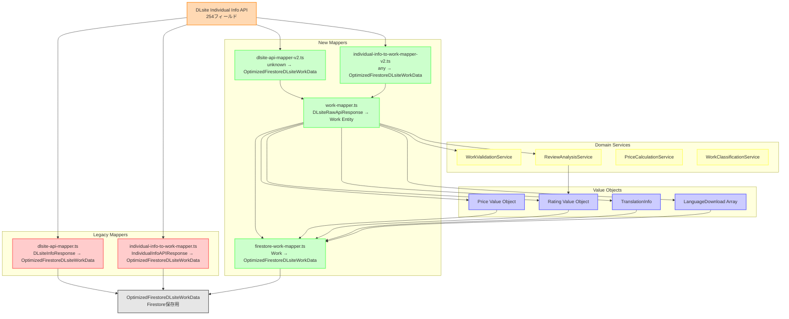

# マッパーデータ削減箇所レビュー

このドキュメントは、レガシーマッパーにおけるデータ削減・最適化処理の詳細レビューです。各項目について、実装内容、影響、リスクを評価します。

## データフロー図



### マッパーの役割と変換内容

#### レガシーマッパー（削除予定）
1. **dlsite-api-mapper.ts**
   - 入力: `DLsiteInfoResponse` (簡易型定義)
   - 出力: `OptimizedFirestoreDLsiteWorkData`
   - 特徴: データ削減処理が多い、スクレイピング時代の名残

2. **individual-info-to-work-mapper.ts**
   - 入力: `IndividualInfoAPIResponse` (完全型定義)
   - 出力: `OptimizedFirestoreDLsiteWorkData`
   - 特徴: 1000行以上の巨大ファイル、多くの最適化処理

#### 新マッパー（統合対象）
3. **dlsite-api-mapper-v2.ts**
   - 入力: `unknown` (バリデーション後に処理)
   - 出力: `OptimizedFirestoreDLsiteWorkData`
   - 特徴: 薄いマッパーへの委譲

4. **individual-info-to-work-mapper-v2.ts**
   - 入力: `any` (型変換後に処理)
   - 出力: `OptimizedFirestoreDLsiteWorkData`
   - 特徴: 新しい構造への橋渡し

5. **work-mapper.ts**（薄いマッパー）
   - 入力: `DLsiteRawApiResponse`
   - 出力: `Work` Entity
   - 特徴: 純粋なデータ変換、ビジネスロジックなし

6. **firestore-work-mapper.ts**
   - 入力: `Work` Entity
   - 出力: `OptimizedFirestoreDLsiteWorkData`
   - 特徴: 下位互換性のための変換

## 1. ジャンル情報のフィルタリング

### 実装箇所
- `dlsite-api-mapper.ts` (L284-290)
- `individual-info-to-work-mapper.ts` (L412-427) 
- `work-mapper.ts` (L238-257)

### 実装内容
```typescript
const promotionalPatterns = [
  /\d+%OFF/,
  /クーポン/,
  /対象作品/,
  /特集/,
  /キャンペーン/,
  /アワード/,
  /投票/,
  /過去最安値/,
  /新作ピックアップ/,
];
```

### データ削減の詳細
- プロモーション関連のジャンルを除外
- 正規表現パターンマッチングで判定
- マッチした場合、そのジャンルは配列から除外

### 影響とリスク
- **影響**: ジャンル配列がクリーンになり、実際の作品ジャンルのみが残る
- **リスク**: 
  - DLsite APIでは`genres`（公式ジャンル）と`custom_genres`（カスタムジャンル）が明確に分離されている
  - プロモーション情報は主に`custom_genres`に含まれるため、`genres`に対するフィルタリングは不要
  - 正当な`genres`情報が誤って削除される可能性

### レビュー結果
- **判定**: ❌ **削除推奨**
- **理由**: 
  - APIの構造上、`genres`と`custom_genres`は既に分離されている
  - プロモーション情報のフィルタリングは不要
  - 現在の実装は過剰な最適化

### 推奨事項
- [x] `genres`フィールドのフィルタリングを削除
- [x] `custom_genres`は現状通り無視（既に実装済み）
- [x] APIの仕様に準拠した実装に変更

---

## 2. 声優情報の抽出ロジック

### 実装箇所
- `individual-info-to-work-mapper.ts` (L359-389)
- `work-mapper.ts` (L196-217)

### 実装内容
```typescript
// creatorsフィールドから優先
if (raw.creaters?.voice_by?.length) {
  return raw.creaters.voice_by.map((c) => c.name).filter(Boolean);
}

// authorフィールドからフォールバック
const cvMatch = raw.author?.match(/CV:([^,]+(?:,[^,]+)*)/);
if (cvMatch?.[1]) {
  return cvMatch[1].split(",").map((name) => name.trim());
}

// CV:なしの場合は全体を声優名として扱う
if (raw.author && !raw.author.includes("CV:")) {
  return [raw.author.trim()];
}
```

### データ削減の詳細
- creatorsフィールドがない場合、authorフィールドから推測
- 「CV:」パターンがない場合、author全体を1人の声優として扱う
- 複数声優の場合、カンマ区切りで分割

### 影響とリスク
- **影響**: 統一された声優情報の抽出
- **リスク**:
  - APIでは`creaters.voice_by`として明確に定義されている
  - `author`フィールドからの推測は不正確で不要
  - スクレイピング時代の名残であり、API時代には不適切

### レビュー結果
- **判定**: ❌ **削除推奨**
- **理由**: 
  - Individual Info APIでは`creaters.voice_by`に声優情報が構造化されている
  - `author`フィールドからの推測は不要かつ不正確
  - APIの構造化データを優先すべき

### 推奨事項
- [x] `creaters.voice_by`のみを使用する実装に変更
- [x] `author`フィールドからの推測ロジックを削除
- [x] APIの構造化データを信頼する

---

## 3. 画像URL処理

### 実装箇所
- `individual-info-to-work-mapper.ts` (L686-704, L891-927)
- `work-mapper.ts` (L182-190)

### 実装内容
```typescript
// srcsetから最高解像度を選択
if (raw.srcset && typeof raw.srcset === "string") {
  const urls = raw.srcset.split(",").map((s) => s.trim().split(" ")[0]);
  return urls[urls.length - 1] ? WorkMapper.normalizeUrl(urls[urls.length - 1]) : undefined;
}

// オブジェクト形式の画像データは無視
if (typeof url === "object") {
  return undefined;
}
```

### データ削減の詳細
- srcsetの複数URLから最後の（通常最高解像度の）URLのみ選択
- オブジェクト形式の画像データは文字列化せずに無視
- プロトコル相対URLをHTTPSに正規化

### 影響とリスク
- **影響**: 単一の高解像度画像URLのみ保存
- **リスク**:
  - レスポンシブ画像の複数解像度情報が失われる
  - 画像のメタデータ（幅、高さなど）が失われる
  - 特殊な画像形式やCDN情報が失われる可能性

### レビュー結果
- **判定**: ⚠️ **改善必要**
- **理由**: 
  - APIが提供する豊富な画像情報を活用すべき
  - フロントエンドの移行コストは低い（段階的移行可能）
  - マッパーの複雑さを削減し、API準拠の実装に移行

### 推奨実装
```typescript
interface WorkImages {
  // 下位互換性（段階的廃止）
  thumbnailUrl?: string;
  highResImageUrl?: string;
  
  // API準拠の新構造
  main?: ImageData;
  thumbnail?: ImageData;
  srcset?: string;
  samples?: ImageData[];
}

interface ImageData {
  url: string;
  width?: number;
  height?: number;
  format?: string;
  // オブジェクト形式のメタデータをそのまま保持
  metadata?: Record<string, any>;
}
```

### 推奨事項
- [x] APIの画像データをそのまま保持する構造に変更
- [x] 単一URL抽出ロジックをマッパーから削除
- [x] 下位互換フィールドは段階的廃止計画を策定
- [x] フロントエンドにユーティリティ関数を提供

---

## 4. 空文字列の除去

### 実装箇所
- `individual-info-to-work-mapper.ts` (L1003-1033)

### 実装内容
```typescript
function removeEmptyStringsRecursively(obj: any): any {
  if (typeof value === "string") {
    if (value.trim() !== "") {
      result[key] = value;
    }
  }
}
```

### データ削減の詳細
- 全てのフィールドを再帰的に走査
- 空文字列、空白のみの文字列を削除
- 配列内の空文字列も除去

### 影響とリスク
- **影響**: データのクリーンアップ、ストレージ効率化
- **リスク**:
  - 意図的な空文字列（デフォルト値など）が削除される
  - フロントエンドで空文字列を期待している箇所でエラー
  - undefinedと空文字列の区別が失われる

### レビュー結果
- **判定**: ❌ **削除推奨**
- **理由**: 
  - APIの場合、空文字列は意味のあるデータとして存在
  - undefinedと空文字列は明確に異なる意味を持つ
  - スクレイピング時代の不要な最適化

### 推奨事項
- [x] 空文字列の再帰的除去処理を削除
- [x] APIのレスポンスをそのまま保持
- [x] 空文字列の意味をドキュメント化

---

## 5. 価格情報の単純化

### 実装箇所
- `dlsite-api-mapper.ts` (L205-216)
- `individual-info-to-work-mapper.ts` (L303-319)

### 実装内容
```typescript
price: infoData?.prices?.[0]
  ? {
      current: infoData.prices[0].price,
      currency: infoData.prices[0].currency,
      original: undefined,
      discount: undefined,
      point: undefined,
    }
  : {
      current: 0,
      currency: "JPY",
    }
```

### データ削減の詳細
- locale_prices配列の最初の要素のみ使用
- 他の通貨情報（USD、EUR等）は無視
- 複雑な価格構造を単純化

### 影響とリスク
- **影響**: 単一通貨（通常JPY）のみ保存
- **リスク**:
  - 国際展開時の多通貨対応が困難
  - 地域別価格設定情報の喪失
  - 為替レート情報の欠如

### レビュー結果
- **判定**: ❌ **削除推奨**
- **理由**: 
  - 多通貨対応の重大な障害となる
  - 価格履歴システムは既に多通貨対応済み
  - APIが提供する全通貨情報を活用すべき

### 推奨実装
```typescript
interface WorkPrice {
  // 単一通貨（下位互換性・段階的廃止）
  current?: number;
  currency?: string;
  
  // 多通貨対応（価格履歴と統合）
  prices: {
    JPY?: PriceInfo;
    USD?: PriceInfo;
    EUR?: PriceInfo;
    CNY?: PriceInfo;
    TWD?: PriceInfo;
    KRW?: PriceInfo;
  };
  
  // メタ情報
  defaultCurrency: string;
  lastUpdated: string;
}

interface PriceInfo {
  amount: number;
  original?: number;
  discount?: number;
  point?: number;
}
```

### 推奨事項
- [x] locale_prices配列の全データを保持
- [x] 価格履歴システムのデータ構造と統合
- [x] 単一通貨フィールドは下位互換性のため段階的廃止
- [x] APIが提供する全通貨情報を活用

---

## 6. 評価詳細の正規化

### 実装箇所
- `work-mapper.ts` (L116-119)

### 実装内容
```typescript
const distribution = ReviewAnalysisService.normalizeReviewDistribution(
  raw.rate_count_detail,
  count,
);

// 0の値は除外
distribution.forEach((value, index) => {
  if (value > 0) {
    distributionRecord[index + 1] = value;
  }
});
```

### データ削減の詳細
- rate_count_detailを正規化
- 評価が0件のスコアは記録しない
- 配列形式からオブジェクト形式に変換

### 影響とリスク
- **影響**: ストレージ効率化、一貫性のあるデータ形式
- **リスク**:
  - 評価分布の完全な情報が失われる（0件も情報として重要）
  - 元データとの差異により統計分析が困難
  - 将来的な分析要件に対応できない可能性

### レビュー結果
- **判定**: ❌ **削除推奨**
- **理由**: 
  - DLsiteでは評価1-3が0になる傾向があり、これも重要な情報
  - 評価分布の完全性は統計分析に必須
  - ストレージ削減効果は限定的

### 推奨事項
- [x] rate_count_detailをそのまま保持
- [x] 0件の評価も含めて完全な分布を保存
- [x] 正規化処理を削除し、APIデータをそのまま使用

---

## 7. 言語版情報の処理

### 実装箇所
- `work-mapper.ts` (L296-322)
- `individual-info-to-work-mapper.ts` (L642-666)

### 実装内容
```typescript
// 配列形式とオブジェクト形式の両対応
if (Array.isArray(raw.language_editions)) {
  return raw.language_editions.map((edition) => ({
    workId: edition.workno,
    downloadCount: edition.dl_count ? Number.parseInt(edition.dl_count, 10) : undefined,
  }));
}
```

### データ削減の詳細
- dl_countを文字列から数値に変換
- 変換できない場合はundefined
- 配列とオブジェクトの形式を統一

### 影響とリスク
- **影響**: 一貫したデータ形式、型安全性の向上
- **リスク**:
  - 元の文字列形式の情報が失われる（例："10,000+"のような表記）
  - 言語版固有のメタデータが失われる可能性
  - 版権情報や地域制限情報の欠如

### レビュー結果
- **判定**: ⚠️ **要確認**
- **理由**: 
  - 最新のAPIレスポンスには`dl_count`フィールドが存在しない
  - 文字列から数値への変換は不要な可能性
  - APIの仕様変更に追従していない可能性

### 実際のAPIデータ（RJ01422491）
```json
{
  "workno": "RJ01422491",
  "edition_id": 38196,
  "edition_type": "language",
  "display_order": 9,
  "label": "韓国語",
  "lang": "KO_KR"
  // dl_countフィールドは存在しない
}
```

### 推奨事項
- [x] APIの最新仕様を確認し、存在しないフィールドの処理を削除
- [x] 言語版情報はそのまま保持（変換不要）
- [ ] dl_countが必要な場合は別のAPIエンドポイントから取得を検討

---

## 8. クリエイター情報のフィルタリング

### 実装箇所
- `individual-info-to-work-mapper.ts` (L783-801)

### 実装内容
```typescript
voice_by: (apiData.creaters?.voice_by || []).filter(
  (creator) => creator.name && creator.name.trim() !== "",
)
```

### データ削減の詳細
- nameが空のクリエイターを除外
- trimした結果が空の場合も除外
- IDのみのクリエイターは保存されない

### 影響とリスク
- **影響**: クリーンなクリエイターリスト
- **リスク**:
  - クリエイターIDとの関連付けが失われる
  - 名前未設定でもIDで識別可能なクリエイターの情報喪失
  - クリエイターページへのリンク生成が困難

### レビュー結果
- **判定**: ❌ **削除推奨**
- **理由**: 
  - APIの完全性を優先すべき
  - IDのみでも有効なクリエイター情報
  - 名前の有無での判断は不適切

### 推奨事項
- [x] フィルタリング処理を削除し、全クリエイター情報を保持
- [x] APIが提供するデータをそのまま信頼
- [x] 表示時に名前の有無を判断する実装に変更

---

## 9. ファイル情報の廃止

### 実装箇所
- コメントアウトされた箇所多数

### 実装内容
```typescript
// fileInfo は廃止済み
// fileInfo: apiData.file_size_string
//   ? {
//       totalSizeText: apiData.file_size_string,
//       totalSizeBytes: apiData.file_size,
//       formats: apiData.file_type_string ? [apiData.file_type_string] : [],
//       additionalFiles: [],
//     }
//   : undefined,
```

### データ削減の詳細
- ファイルサイズ情報を保存しない
- ファイル形式情報を保存しない
- 追加ファイル情報を保存しない

### 影響とリスク
- **影響**: データ構造の簡素化
- **リスク**:
  - ユーザーがダウンロード前にファイルサイズを確認できない
  - ファイル形式による検索・フィルタリングが不可能
  - ストレージ容量の見積もりが困難

### レビュー結果
- **判定**: ⚠️ **部分的に保持**
- **理由**: 
  - APIは部分的なファイル情報を提供（file_type、file_type_special）
  - file_sizeは多くの作品でnullの可能性
  - 完全な廃止ではなく、利用可能な情報は保持すべき

### 実際のAPIデータ（RJ01422491）
```json
{
  "file_size": null,           // 提供されない場合が多い
  "file_type": "WAV",          
  "file_type_string": "WAV",
  "file_type_special": "mp3同梱",  // 追加情報
  "contents_file_size": 0      // 詳細情報なし
}
```

### 推奨事項
- [x] APIが提供するファイル情報は保持（file_type、file_type_special）
- [x] nullやundefinedの値も許容する柔軟な実装
- [ ] 詳細なファイル情報が必要な場合は別途対応を検討

---

## 10. 販売状態情報の未使用

### 実装箇所
- `individual-info-to-work-mapper.ts` (L668-681)

### 実装内容
```typescript
// 販売状態（一時的に未使用）
// const salesStatus: SalesStatus | undefined = apiData.sales_status ? {
//   isSale: apiData.sales_status.is_sale,
//   onSale: apiData.sales_status.on_sale,
//   isDiscount: apiData.sales_status.is_discount,
//   isPointup: apiData.sales_status.is_pointup,
//   isFree: apiData.sales_status.is_free,
//   ...
// } : undefined;
```

### データ削減の詳細
- 全ての販売状態フラグを無視
- 割引、ポイントアップ、無料などの情報が失われる
- 予約、売り切れ、レンタルなどの状態も不明

### 影響とリスク
- **影響**: 現在の販売状態が不明
- **リスク**:
  - 販売終了作品を購入可能と誤認
  - 割引情報を見逃す
  - 在庫切れ商品へのアクセス
  - タイムセール情報の欠如

### レビュー結果
- **判定**: ❌ **削除推奨（実装必須）**
- **理由**: 
  - 無料作品の判別に必要
  - 販売終了の判定に必要
  - ユーザー体験に直接影響する重要情報

### 推奨事項
- [x] 販売状態情報の実装を必須とする
- [x] APIが提供する全ての販売状態フラグを保持
- [x] 無料作品、販売終了、割引などの状態を正確に反映

---

## 総合評価と次のステップ

### レビュー結果サマリー

| 項目 | 判定 | 理由 |
|------|------|------|
| 1. ジャンルフィルタリング | ❌ 削除 | APIで genres と custom_genres が分離済み |
| 2. 声優情報の抽出 | ❌ 削除 | creaters.voice_by で構造化済み |
| 3. 画像URL処理 | ⚠️ 改善 | API準拠の構造に変更、段階的移行 |
| 4. 空文字列の除去 | ❌ 削除 | APIの空文字列は意味がある |
| 5. 価格情報の単純化 | ❌ 削除 | 多通貨対応の障害となる |
| 6. 評価詳細の正規化 | ❌ 削除 | 0件の評価も重要な情報 |
| 7. 言語版情報の処理 | ⚠️ 要確認 | dl_count フィールドが存在しない |
| 8. クリエイター情報フィルタ | ❌ 削除 | APIの完全性を優先 |
| 9. ファイル情報の廃止 | ⚠️ 部分保持 | APIが提供する情報は保持 |
| 10. 販売状態情報 | ❌ 削除（実装必須） | 無料作品判別等に必要 |

### 基本方針
**APIの完全性を優先し、データ削減処理は原則削除**

### 推奨アクション
1. **即座に実施**
   - 不要なデータ削減処理の削除
   - APIデータをそのまま保持する実装への変更
   
2. **段階的実施**
   - 画像URL構造の改善（下位互換性維持）
   - 多通貨対応の実装
   - 販売状態情報の完全実装

3. **今後の方針**
   - スクレイピング時代の最適化を全て見直し
   - API仕様に準拠したクリーンな実装
   - マッパーの責務を純粋なデータ変換に限定

---

**Document Version**: 1.1  
**Last Updated**: 2025-07-23  
**Status**: Review Completed