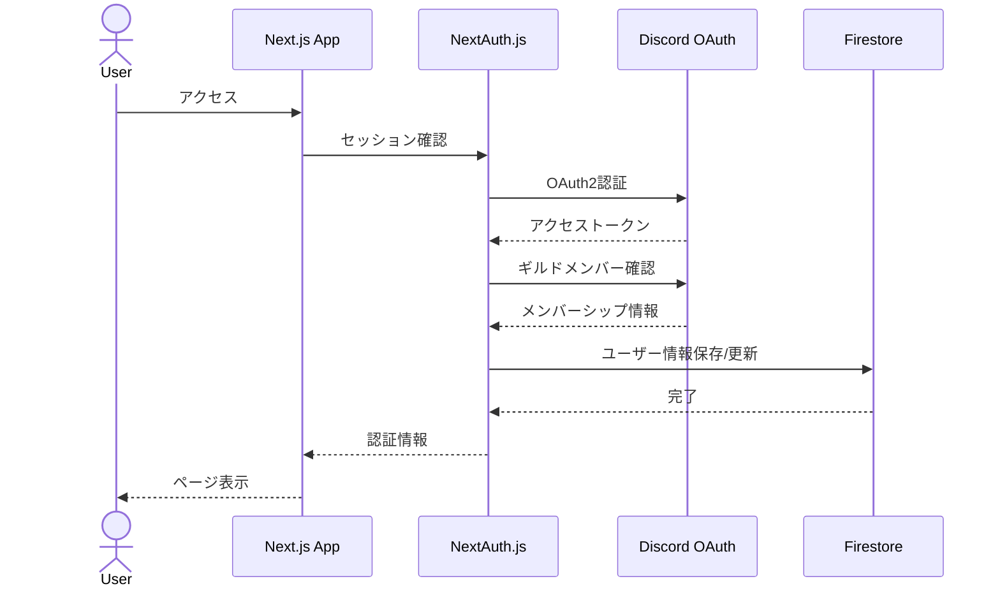
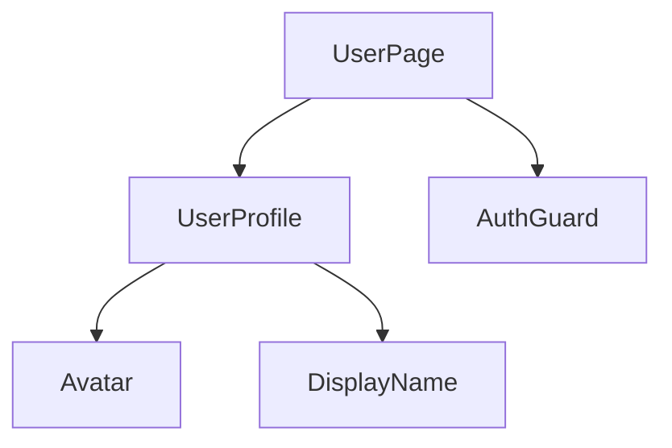

# 認証システム設計

## アーキテクチャ概要



## 認証フロー

1. ユーザーがログインボタンをクリック
2. Discord OAuth2認証画面にリダイレクト
3. ユーザーが認証を許可
4. コールバックURLで認証情報を受け取り
5. ギルドメンバーシップを確認
6. Firestoreにユーザー情報を保存/更新
7. セッションを作成してユーザーページへリダイレクト

## データモデル

### Firestore コレクション構造

```typescript
// users コレクション
interface User {
  id: string;              // Discord ユーザーID
  displayName: string;     // Discord表示名
  avatarUrl: string;      // Discordアバター画像URL
  role: string;           // Discordロール
  createdAt: Timestamp;   // 作成日時
  updatedAt: Timestamp;   // 更新日時
}
```

## 実装詳細

### 必要なパッケージ

```bash
bun add @auth/core@beta @auth/nextjs@beta next@latest firebase firebase-admin
```

### 環境変数

```env
DISCORD_CLIENT_ID="DiscordアプリケーションのクライアントID"
DISCORD_CLIENT_SECRET="Discordアプリケーションのシークレット"
DISCORD_GUILD_ID="すずみなふぁみりーのギルドID"
NEXTAUTH_SECRET="NextAuthシークレット"
NEXTAUTH_URL="https://suzumina.click"
```

## セキュリティ考慮事項

1. セッションの安全な管理
   - JWT署名の使用
   - セキュアなクッキー設定

2. 権限の適切な制御
   - ギルドメンバーのみアクセス可能
   - ユーザー固有のデータへのアクセス制限

3. データの保護
   - 必要最小限の情報のみ保存
   - 定期的なデータクリーンアップ

## ユーザーページ設計

### コンポーネント構造



これらのUIコンポーネントは、共有UIライブラリである shadcn/ui を利用して構築します。

### ルーティング設計

- `/auth/signin` - ログインページ
- `/auth/error` - エラーページ
- `/users/[id]` - ユーザーページ
- `/api/auth/[...nextauth]` - 認証API

### アクセス制御

ミドルウェア (`apps/web/middleware.ts`) を使用して、特定のパスへのアクセスを制御します。

```typescript
// middleware.ts
import { auth } from "@/auth";
import { NextResponse } from "next/server";
// ... (他のインポート)

export default auth((req) => {
  // 未認証ユーザーが /users/* にアクセスしたら /auth/signin へリダイレクト
  // 認証済みユーザーが /auth/* にアクセスしたら /users/[id] へリダイレクト
  // ... (詳細なロジック)
});

export const config = {
  matcher: [
    "/auth/:path*", // 認証関連ページ
    "/users/:path*", // ユーザー固有ページ
  ]
}
```

## エラーハンドリング

1. 未認証エラー
   - ログインページへリダイレクト

2. 権限エラー
   - エラーページで「すずみなふぁみりーメンバーのみアクセス可能」を表示

3. API エラー
   - 適切なステータスコードとエラーメッセージを返却

## 今後の拡張性

1. 追加の認証プロバイダー対応
2. ユーザープロフィールの拡張
3. 権限管理の細分化

## 実装手順

1. NextAuth.js の基本セットアップ
2. Discord OAuth2 の設定
3. Firestore 連携の実装
4. ユーザーページの作成
5. ミドルウェアによるアクセス制御の実装
6. エラーハンドリングの実装

最終更新日: 2025年4月7日
