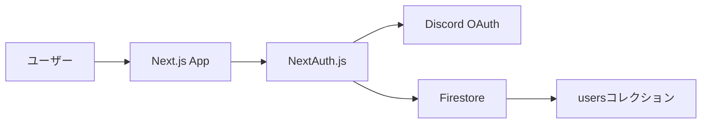
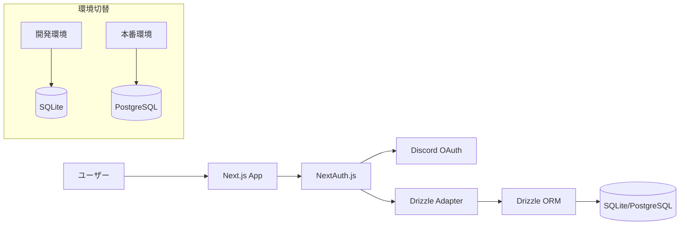

# NextAuth データベース移行計画: Firestore から Drizzle ORM へ

## 概要

現在の NextAuth 実装は Firestore を使用していますが、これを Drizzle ORM を使用して、開発環境では SQLite、本番環境では Cloud SQL の PostgreSQL インスタンスに接続するように移行します。
本書では、開発環境にて安定してSQLiteでサイトが動作するように計画を立てます。

## 現状分析

### 現在のアーキテクチャ



### 現在の実装の特徴

- NextAuth.js を使用した Discord OAuth 認証
- JWT ベースのセッション管理（データベースにセッション情報は保存しない）
- Firestore の `users` コレクションにユーザー情報を保存
- 環境変数による設定

## 目標アーキテクチャ



## 移行の目標と要件

### 目標

1. 開発環境でSQLiteを使用して、NextAuthの認証機能を正常に動作させる
2. 既存のユーザーデータを損なわずに移行する
3. テストカバレッジを維持する
4. 将来的に本番環境でPostgreSQLに切り替えられるようにする

### 要件

1. Drizzle ORMを使用してデータベーススキーマを定義する
2. NextAuth用のDrizzleアダプターを実装する
3. 環境変数で開発/本番環境の切り替えを可能にする
4. 既存のテストを更新して、新しいデータベース実装をカバーする

## 移行手順

### 1. 依存関係の追加

```bash
bun add drizzle-orm @libsql/client
bun add -d drizzle-kit
```

### 2. データベーススキーマの定義

`apps/web/src/db/schema.ts` ファイルを作成し、NextAuthに必要なテーブルスキーマを定義します。

```typescript
import { integer, sqliteTable, text } from "drizzle-orm/sqlite-core";

// ユーザーテーブル
export const users = sqliteTable("users", {
  id: text("id").primaryKey(),
  displayName: text("display_name").notNull(),
  avatarUrl: text("avatar_url").notNull(),
  role: text("role").notNull().default("member"),
  email: text("email"),
  createdAt: integer("created_at", { mode: "timestamp" }).notNull(),
  updatedAt: integer("updated_at", { mode: "timestamp" }).notNull(),
});

// アカウントテーブル（OAuth連携用）
export const accounts = sqliteTable("accounts", {
  id: text("id").primaryKey(),
  userId: text("user_id")
    .notNull()
    .references(() => users.id, { onDelete: "cascade" }),
  type: text("type").notNull(),
  provider: text("provider").notNull(),
  providerAccountId: text("provider_account_id").notNull(),
  refreshToken: text("refresh_token"),
  accessToken: text("access_token"),
  expiresAt: integer("expires_at"),
  tokenType: text("token_type"),
  scope: text("scope"),
  idToken: text("id_token"),
  sessionState: text("session_state"),
});

// セッションテーブル（必要に応じて）
export const sessions = sqliteTable("sessions", {
  id: text("id").primaryKey(),
  userId: text("user_id")
    .notNull()
    .references(() => users.id, { onDelete: "cascade" }),
  sessionToken: text("session_token").notNull().unique(),
  expires: integer("expires", { mode: "timestamp" }).notNull(),
});

// 検証トークンテーブル（必要に応じて）
export const verificationTokens = sqliteTable("verification_tokens", {
  identifier: text("identifier").notNull(),
  token: text("token").notNull(),
  expires: integer("expires", { mode: "timestamp" }).notNull(),
});
```

### 3. データベース接続の設定

`apps/web/src/db/index.ts` ファイルを作成し、環境に応じたデータベース接続を設定します。

```typescript
import { createClient } from "@libsql/client";
import { drizzle } from "drizzle-orm/libsql";
import * as schema from "./schema";

// 環境変数から接続情報を取得
const isDevelopment = process.env.NODE_ENV === "development";
const isBuildTime = process.env.NEXT_PHASE === "phase-production-build";

// 開発環境またはビルド時はSQLiteを使用
const sqliteUrl = isDevelopment || isBuildTime
  ? "file:./local.db"
  : process.env.DATABASE_URL;

if (!sqliteUrl) {
  throw new Error("DATABASE_URL is not defined");
}

// SQLiteクライアントの作成
const client = createClient({
  url: sqliteUrl,
});

// Drizzle ORMインスタンスの作成
export const db = drizzle(client, { schema });

// スキーマのエクスポート
export * from "./schema";
```

### 4. マイグレーションファイルの作成

`drizzle.config.ts` ファイルをプロジェクトルートに作成します。

```typescript
import type { Config } from "drizzle-kit";

export default {
  schema: "./apps/web/src/db/schema.ts",
  out: "./apps/web/drizzle",
  driver: "libsql",
  dbCredentials: {
    url: "file:./local.db",
  },
} satisfies Config;
```

package.jsonにマイグレーションコマンドを追加します。

```json
{
  "scripts": {
    "db:generate": "drizzle-kit generate:sqlite",
    "db:migrate": "bun run apps/web/src/db/migrate.ts"
  }
}
```

マイグレーション実行スクリプト `apps/web/src/db/migrate.ts` を作成します。

```typescript
import { migrate } from "drizzle-orm/libsql/migrator";
import { createClient } from "@libsql/client";
import { drizzle } from "drizzle-orm/libsql";

// マイグレーションの実行
async function main() {
  const client = createClient({
    url: "file:./local.db",
  });

  const db = drizzle(client);

  console.log("Running migrations...");
  await migrate(db, { migrationsFolder: "./apps/web/drizzle" });
  console.log("Migrations completed!");

  process.exit(0);
}

main().catch((err) => {
  console.error("Migration failed!");
  console.error(err);
  process.exit(1);
});
```

### 5. NextAuth用のDrizzleアダプターの実装

`apps/web/src/auth/drizzle-adapter.ts` ファイルを作成し、NextAuth用のアダプターを実装します。

```typescript
import { and, eq } from "drizzle-orm";
import type { Adapter } from "next-auth/adapters";
import { db, accounts, sessions, users, verificationTokens } from "../db";

export function DrizzleAdapter(): Adapter {
  return {
    async createUser(userData) {
      const now = new Date();
      const id = crypto.randomUUID();

      await db.insert(users).values({
        id,
        displayName: userData.name || `User_${id.substring(0, 5)}`,
        avatarUrl: userData.image || "",
        email: userData.email,
        role: "member",
        createdAt: now,
        updatedAt: now,
      });

      const user = await db.query.users.findFirst({
        where: eq(users.id, id),
      });

      if (!user) throw new Error("User not found after creation");

      return {
        id: user.id,
        name: user.displayName,
        email: user.email,
        image: user.avatarUrl,
        emailVerified: null,
      };
    },

    async getUser(id) {
      const user = await db.query.users.findFirst({
        where: eq(users.id, id),
      });

      if (!user) return null;

      return {
        id: user.id,
        name: user.displayName,
        email: user.email,
        image: user.avatarUrl,
        emailVerified: null,
      };
    },

    async getUserByEmail(email) {
      if (!email) return null;

      const user = await db.query.users.findFirst({
        where: eq(users.email, email),
      });

      if (!user) return null;

      return {
        id: user.id,
        name: user.displayName,
        email: user.email,
        image: user.avatarUrl,
        emailVerified: null,
      };
    },

    async getUserByAccount({ provider, providerAccountId }) {
      const account = await db.query.accounts.findFirst({
        where: and(
          eq(accounts.provider, provider),
          eq(accounts.providerAccountId, providerAccountId)
        ),
        with: {
          user: true,
        },
      });

      if (!account) return null;

      const user = account.user;

      return {
        id: user.id,
        name: user.displayName,
        email: user.email,
        image: user.avatarUrl,
        emailVerified: null,
      };
    },

    async updateUser(user) {
      const now = new Date();

      await db
        .update(users)
        .set({
          displayName: user.name || undefined,
          avatarUrl: user.image || undefined,
          email: user.email || undefined,
          updatedAt: now,
        })
        .where(eq(users.id, user.id));

      const updatedUser = await db.query.users.findFirst({
        where: eq(users.id, user.id),
      });

      if (!updatedUser) throw new Error("User not found after update");

      return {
        id: updatedUser.id,
        name: updatedUser.displayName,
        email: updatedUser.email,
        image: updatedUser.avatarUrl,
        emailVerified: null,
      };
    },

    async deleteUser(userId) {
      await db.delete(users).where(eq(users.id, userId));
    },

    async linkAccount(account) {
      await db.insert(accounts).values({
        id: crypto.randomUUID(),
        userId: account.userId,
        type: account.type,
        provider: account.provider,
        providerAccountId: account.providerAccountId,
        refreshToken: account.refresh_token,
        accessToken: account.access_token,
        expiresAt: account.expires_at,
        tokenType: account.token_type,
        scope: account.scope,
        idToken: account.id_token,
        sessionState: account.session_state,
      });
    },

    async unlinkAccount({ provider, providerAccountId }) {
      await db
        .delete(accounts)
        .where(
          and(
            eq(accounts.provider, provider),
            eq(accounts.providerAccountId, providerAccountId)
          )
        );
    },

    async createSession({ sessionToken, userId, expires }) {
      await db.insert(sessions).values({
        id: crypto.randomUUID(),
        userId,
        sessionToken,
        expires,
      });

      const session = await db.query.sessions.findFirst({
        where: eq(sessions.sessionToken, sessionToken),
      });

      if (!session) throw new Error("Session not found after creation");

      return session;
    },

    async getSessionAndUser(sessionToken) {
      const session = await db.query.sessions.findFirst({
        where: eq(sessions.sessionToken, sessionToken),
        with: {
          user: true,
        },
      });

      if (!session) return null;

      const user = session.user;

      return {
        session,
        user: {
          id: user.id,
          name: user.displayName,
          email: user.email,
          image: user.avatarUrl,
          emailVerified: null,
        },
      };
    },

    async updateSession({ sessionToken, expires }) {
      await db
        .update(sessions)
        .set({ expires })
        .where(eq(sessions.sessionToken, sessionToken));

      const session = await db.query.sessions.findFirst({
        where: eq(sessions.sessionToken, sessionToken),
      });

      if (!session) return null;
      return session;
    },

    async deleteSession(sessionToken) {
      await db.delete(sessions).where(eq(sessions.sessionToken, sessionToken));
    },

    async createVerificationToken({ identifier, token, expires }) {
      await db.insert(verificationTokens).values({
        identifier,
        token,
        expires,
      });

      const verificationToken = await db.query.verificationTokens.findFirst({
        where: and(
          eq(verificationTokens.identifier, identifier),
          eq(verificationTokens.token, token)
        ),
      });

      if (!verificationToken)
        throw new Error("Verification token not found after creation");

      return verificationToken;
    },

    async useVerificationToken({ identifier, token }) {
      const verificationToken = await db.query.verificationTokens.findFirst({
        where: and(
          eq(verificationTokens.identifier, identifier),
          eq(verificationTokens.token, token)
        ),
      });

      if (!verificationToken) return null;

      await db
        .delete(verificationTokens)
        .where(
          and(
            eq(verificationTokens.identifier, identifier),
            eq(verificationTokens.token, token)
          )
        );

      return verificationToken;
    },
  };
}
```

### 6. NextAuth設定の更新

`apps/web/src/auth.ts` ファイルを更新して、Drizzleアダプターを使用するように変更します。主な変更点は以下の通りです：

1. Firestoreの直接使用を削除
2. DrizzleAdapterを追加
3. セッションコールバックを簡略化（ユーザー情報はアダプターから取得）

### 7. データ移行スクリプトの作成

Firestoreからのデータ移行スクリプト `apps/web/scripts/migrate-users.ts` を作成します。このスクリプトは以下の処理を行います：

1. Firestoreからユーザーデータを取得
2. SQLiteデータベースに変換して保存
3. 移行結果のログ出力

### 8. テストの更新

テスト用のモックを更新して、Drizzle ORMをサポートします：

1. Firestoreモックの代わりにDrizzleモックを使用
2. テストケースを更新して新しいアダプターをテスト

## テスト計画

1. ユニットテスト
   - Drizzleアダプターの各メソッドのテスト
   - NextAuthコールバック関数のテスト
   - データベース接続のテスト

2. 統合テスト
   - 認証フローのテスト（サインイン、セッション管理）
   - ユーザーデータの取得と更新のテスト

3. マイグレーションテスト
   - データ移行スクリプトのテスト
   - 移行後のデータ整合性の確認

## 検証ステップ

### 1. Firestore依存コードの完全な削除確認

移行完了後、以下の手順でFirestore依存コードが完全に削除されたことを確認します：

```bash
# Firestoreのインポートを検索
grep -r "import.*@google-cloud/firestore" --include="*.ts" .

# Firestoreクラスの使用を検索
grep -r "new Firestore" --include="*.ts" .

# Firestoreコレクション参照を検索
grep -r "firestore\.collection" --include="*.ts" .
grep -r "\.collection(" --include="*.ts" .

# Firestoreドキュメント操作を検索
grep -r "\.doc(" --include="*.ts" .
grep -r "\.set(" --include="*.ts" .
grep -r "\.update(" --include="*.ts" .
grep -r "\.get(" --include="*.ts" .
```

これらの検索で結果が出ないことを確認します。結果が出た場合は、該当するコードを修正します。

### 2. 依存関係のクリーンアップ

package.jsonから`@google-cloud/firestore`依存関係を削除します：

```bash
bun remove @google-cloud/firestore
```

### 3. 環境変数の整理

Firestore関連の環境変数を確認し、不要なものを削除します：

```bash
# .env.localや.env.developmentなどの環境変数ファイルを確認
grep -r "FIRESTORE" --include=".env*" .
grep -r "GOOGLE_CLOUD" --include=".env*" .
```

### 4. 機能検証

以下の機能が正常に動作することを確認します：

1. **ユーザー認証フロー**
   - 新規ユーザーのサインアップ
   - 既存ユーザーのサインイン
   - セッション維持
   - サインアウト

2. **ユーザーデータ操作**
   - ユーザー情報の取得
   - ユーザー情報の更新

3. **エラーハンドリング**
   - 不正なアクセストークン
   - 存在しないユーザー
   - データベース接続エラー

### 5. パフォーマンス検証

SQLiteとFirestoreのパフォーマンスを比較します：

1. **レイテンシ測定**
   - ユーザー情報取得の応答時間
   - 認証処理の完了時間

2. **同時接続テスト**
   - 複数ユーザーの同時サインイン
   - 高負荷時のデータベース応答性

### 6. セキュリティ検証

1. **データアクセス制御**
   - 適切な権限設定
   - 認証されていないアクセスの拒否

2. **データ保護**
   - 機密情報の適切な保存
   - SQLインジェクション対策

### 7. 移行後の監視計画

1. **エラー監視**
   - データベース接続エラーの監視
   - 認証エラーの監視

2. **パフォーマンス監視**
   - レスポンスタイムの監視
   - データベース操作の監視

## 実装タイムライン

1. 依存関係の追加とスキーマ定義（1日）
2. データベース接続とマイグレーション設定（1日）
3. Drizzleアダプターの実装（2日）
4. NextAuth設定の更新（1日）
5. データ移行スクリプトの作成（1日）
6. テストの更新と実行（2日）
7. 検証ステップの実施（1日）
8. 動作確認とデバッグ（1日）

合計：約10日間

## ロールバック計画

問題が発生した場合は、以下の手順でロールバックします：

1. NextAuth設定を元のFirestore実装に戻す
2. 新しく追加したファイルを削除または無効化
3. テストを元の状態に戻す

## 次のステップ

1. 開発環境でのSQLite実装が安定したら、本番環境用のPostgreSQL設定を追加
2. Cloud SQLへの接続設定とセキュリティ対策
3. 本番環境でのデータ移行計画の策定
