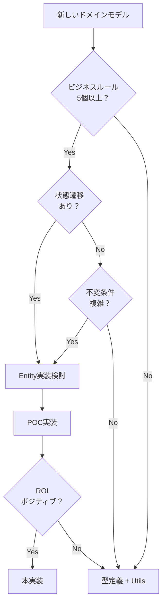

# ADR-002: Entity実装の教訓と学習事項

## ステータス
承認済み (2025-01-29)

## コンテキスト

2025年1月にCircle/Creator/CreatorWorkMapping Entityの実装を試みた結果、
コード量が大幅に増加し、実装を見送ることになりました。
この経験から得られた教訓を記録し、今後の開発に活かす必要があります。

## 実装履歴

### 2025年8月: Work Entityのモジュール分割とリファクタリング

#### 背景
- 1,352行の巨大なwork.tsファイルを保守性向上のために分割
- WorkPlainObjectとWork Entityの統合を検討

#### 実装内容（Phase 1 - 成功）
1. **モジュール分割** (PR #226でマージ)
   - work.tsを9つのモジュールに分割
   - 最大ファイルサイズを403行に削減
   - 100%後方互換性を維持
   - テストカバレッジ88.26%達成

2. **分割されたモジュール**:
   - work-types.ts: 基本型定義
   - work-validators.ts: バリデーションロジック
   - work-factory.ts: ファクトリメソッド
   - work-builder.ts: Builderパターン
   - work-converters.ts: 変換メソッド
   - work-entity.ts: Entityクラス本体
   - work-getters.ts: getterメソッド
   - work-serializers.ts: シリアライズ処理
   - index.ts: re-export層

#### 実装内容（Phase 2 - 失敗）
1. **WorkPlainObject廃止の試み**
   - 新しい統合型システムの設計
   - work-v2ディレクトリでの実装
   - Result: **RSC制約により断念**

2. **失敗の原因**:
   - React Server Components (RSC)でクラスインスタンスがシリアライズできない
   - Server/Client境界を越えるデータはプリミティブ型のみ
   - WorkPlainObjectは実はRSCのための必須パターンだった

#### 教訓
- **成功**: モジュール分割によるコード整理は有効
- **失敗**: 型システムの根本的な変更は慎重に（RSC制約を考慮）
- **重要**: 「複雑度を減らす」つもりが逆に増やす可能性がある

### 2025年1月: Circle/Creator/CreatorWorkMapping Entity実装の試み

#### 背景
- Video Entityの実装が成功していたため、他のドメインモデルにも展開を検討
- CircleとCreatorは基本的なドメインオブジェクトとして重要と判断

#### 実装内容
1. **Circle Entity** (429行)
   - CircleId値オブジェクト
   - CircleName値オブジェクト  
   - ビジネスメソッド: isNewCircle(), isActive()

2. **Creator Entity** (526行)
   - CreatorId値オブジェクト
   - CreatorName値オブジェクト
   - CreatorRoles値オブジェクト
   - ビジネスメソッド: hasRole(), isVoiceActor()

3. **CreatorWorkMapping Entity** (510行)
   - MappingId複合値オブジェクト
   - CreatorRolesInWork値オブジェクト
   - ビジネスメソッド: isRecentMapping()

#### 結果
- **コード量**: 3,588行追加 vs 144行削減（約25倍の増加）
- **テスト**: 1,271行のテストコード追加
- **影響範囲**: 5ファイルの本番コード修正

#### 判断
**実装を見送り、mainブランチへのマージを中止**

### 学習事項

#### 1. ドメインの複雑性評価の重要性

**失敗パターン**:
```typescript
// 過度に抽象化されたEntity
export class CreatorEntity extends BaseEntity {
  constructor(
    private readonly _id: CreatorId,
    private readonly _name: CreatorName,
    private readonly _roles: CreatorRoles,
    // ... 多くのボイラープレート
  ) {}
  
  // 単純すぎるビジネスロジック
  hasRole(role: CreatorRole): boolean {
    return this._roles.hasRole(role);
  }
}
```

**適切なパターン**:
```typescript
// シンプルな型定義で十分
export interface CreatorPageInfo {
  id: string;
  name: string;
  types: string[];
  workCount: number;
}

// 必要に応じてユーティリティ関数
export const hasRole = (creator: CreatorPageInfo, role: string) => 
  creator.types.includes(role);
```

#### 2. Entity実装のコスト構造

| コンポーネント | 行数 | 必要性 |
|------------|-----|-------|
| 値オブジェクト | 100-150行/個 | IDの検証には有用 |
| Entityクラス | 300-500行 | 複雑なビジネスロジックがある場合のみ |
| Factory/変換 | 100-200行 | Firestoreとの変換は必須 |
| テスト | 400-500行 | 完全なカバレッジには必要 |
| **合計** | **1,000-1,500行** | - |

#### 3. Video Entity成功の理由

Video Entityが成功した理由の分析:

1. **複雑な状態管理**
   - draft → published → archived の状態遷移
   - 公開予約機能
   - 統計情報の更新

2. **外部システムとの統合**
   - YouTubeメタデータ
   - 再生回数の同期
   - タグの正規化

3. **ビジネスルールの存在**
   - タイトルの文字数制限
   - タグの個数制限
   - 公開条件のチェック

これらの要素がCircle/Creatorドメインには欠けていた。

#### 4. 段階的アプローチの重要性

**推奨プロセス**:
1. 最小限のValue Objectから開始
2. ビジネスロジックが増えたらユーティリティ関数
3. 複雑性が閾値を超えたらEntity化

```typescript
// Step 1: Value Object only
export class WorkId {
  constructor(private readonly value: string) {
    if (!value.match(/^RJ\d+$/)) {
      throw new Error("Invalid work ID");
    }
  }
}

// Step 2: Utility functions
export const workUtils = {
  isNewRelease: (date: Date) => { /* ... */ },
  calculateDiscount: (price: number, rate: number) => { /* ... */ }
};

// Step 3: Full Entity (必要になったら)
export class WorkEntity {
  // 複雑なビジネスロジックが必要になった時点で実装
}
```

## 今後の方針

### 0. RSC環境での制約事項

**Next.js Server Components環境では以下を必ず考慮**:

1. **PlainObjectパターンは必須**
   - Entity/Value Objectインスタンスは直接シリアライズ不可
   - Server/Client境界ではプリミティブ型のみ
   - WorkPlainObjectのようなインターフェースは廃止できない

2. **Entity実装の再評価**
   - RSC環境ではEntityパターンの利点が限定的
   - PlainObject + ユーティリティ関数が最適解の場合が多い
   - 複雑なビジネスロジックがない限りEntity化は避ける

### 1. Entity化の判断プロセス



### 2. 既存Entityの評価

- **Video Entity**: 6ヶ月後に再評価（2025年7月）
  - バグ率の変化
  - 開発速度への影響
  - チームの習熟度

### 3. 新規Entity候補の優先順位

優先度高:
- DlsiteWork（価格履歴、キャンペーン管理）
- User（認証、権限、プリファレンス）

優先度低:
- DlsiteMetadata（単純なデータ保存）
- YoutubeMetadata（外部API依存）

## 決定

以下の教訓を今後のEntity実装に適用する：

1. **ドメインの複雑性を正確に評価**してからEntity化を検討する
2. **段階的アプローチ**を採用し、最小限から始める
3. **ROI計算**を必ず行い、コストが利益を上回る場合は実装しない
4. **既存コードが安定**している場合は変更しない
5. **RSC制約を必ず考慮**し、PlainObjectパターンの必要性を認識する
6. **リファクタリングの目的を見失わない** - 複雑度削減が本当に達成されるか常に検証

## 理由

- Circle/Creatorドメインは想定より単純だった（CRUD操作のみ）
- Entity実装のオーバーヘッドが大きすぎた（約1,200-1,300行/Entity）
- 既存の型定義で十分機能していた

## 結果

**良い点:**
- 過度な抽象化を避けることができた
- 貴重な学習経験を得た
- 明確な判断基準を確立できた

**悪い点:**
- 実装に費やした時間（ただし学習としては有益）

## 参考

- [ADR-001: DDD実装ガイドライン](ADR-001-ddd-implementation-guidelines.md)
- [PR #133: feat: implement Circle, Creator, and CreatorWorkMapping entities](https://github.com/nothink-jp/suzumina.click/pull/133) (マージ見送り)
- [PR #226: refactor: shared-types パッケージの大規模モジュール化](https://github.com/nothink-jp/suzumina.click/pull/226) (マージ済み)
- [Entity実装ガイド](../../reference/entity-implementation-guide.md) (RSC制約追加済み)