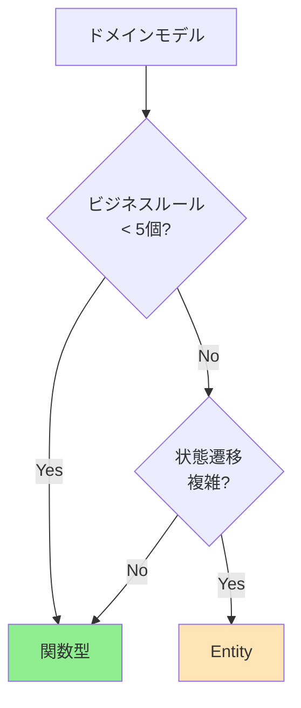

# ADR-003: 関数型ドメインモデリングの段階的採用

## ステータス
提案中 (2025-08-18)

## コンテキスト

現在のDDD/Entityパターン実装において、以下の課題が明らかになりました：

### 技術的制約
1. **React Server Components (RSC) 制約**
   - クラスインスタンスがServer/Client境界を越えられない
   - Entity + PlainObjectの二重型システムが必須
   - 変換オーバーヘッドが常に発生

2. **Cloud Functions パフォーマンス**
   - shared-typesパッケージ: 292KB（37,292行）
   - Entity初期化によるCold Start 50-100msのペナルティ
   - 深い継承階層によるパース時間増加

3. **コード複雑性**
   - Circle/Creator Entity実装で25倍のコード増加（144行→3,588行）
   - Entity当たり1,200-1,300行のボイラープレート
   - 認知負荷の増大

### 成功事例と失敗事例

**成功**:
- Work Entityのモジュール分割（1,352行→9モジュール）
- Video Entity（複雑な状態管理で有効）

**失敗**:
- WorkPlainObject廃止の試み（RSC制約により断念）
- Circle/Creator/CreatorWorkMapping Entity（ROI negative）

## 決定

**関数型ドメインモデリングを段階的に採用**し、既存のEntityパターンとのハイブリッドアーキテクチャを構築します。

### 基本方針

1. **新規機能**: 関数型パターンを優先採用
2. **既存の複雑なEntity**: 維持（Video, AudioButton）
3. **シンプルなドメイン**: 関数型へ移行
4. **段階的移行**: 3フェーズで実施

### 実装パターン

```typescript
// 関数型パターン（推奨）
export interface WorkData {
  readonly id: string;
  readonly title: string;
  readonly price: PriceData;
}

export const WorkActions = {
  updatePrice: (work: WorkData, price: number): WorkData => ({
    ...work,
    price: { ...work.price, current: price },
    lastModified: new Date().toISOString()
  }),
  
  isNewRelease: (work: WorkData): boolean =>
    isWithinDays(work.releaseDate, 30)
} as const;
```

## 移行計画

### Phase 1: 即時実施（2週間）
- 新機能での関数型パターン採用
- ドキュメント整備
- チーム教育

**注**: 新機能開発がない場合は、Phase 1をスキップしてPhase 2から開始可能

### Phase 1-Alternative: 既存コード準備（新機能がない場合）
- 小規模な既存機能で関数型パターンを試験導入
- ユーティリティ関数の関数型への書き換え
- テスト環境の整備
- パフォーマンス計測基盤の構築

### Phase 2: 段階的移行（1-2ヶ月）
- Circle, Creator, Metadata の関数型移行
- パフォーマンス測定
- フィードバック収集

### Phase 3: 最適化（3-6ヶ月）
- Work Entity の部分的リファクタリング
- Bundle最適化
- アーキテクチャ評価

## 判断基準

### 関数型パターンを選択



**条件**:
- CRUD中心の操作
- ビジネスルール5個未満
- RSCでの直接使用
- パフォーマンスクリティカル

### Entityパターンを維持

**条件**:
- 複雑な状態管理（10個以上の状態）
- 外部システムとの統合
- 監査・コンプライアンス要件
- 既存の大規模Entityコード

## 結果

### 期待される利益

1. **パフォーマンス向上**
   - Cold Start: 100ms → 30ms（70%削減）
   - Bundle Size: 292KB → 150KB（48%削減）
   - メモリ使用量: 50MB → 25MB（50%削減）

2. **開発効率向上**
   - ボイラープレート削減: 1,200行 → 200行
   - テスト記述簡素化: 純粋関数のテスト容易性
   - RSC完全互換: シリアライゼーション不要

3. **保守性向上**
   - 認知負荷削減
   - Tree-shaking による未使用コード除去
   - 型安全性維持

### リスクと対策

| リスク | 影響度 | 対策 |
|--------|--------|------|
| チーム学習コスト | 中 | ドキュメント整備、段階的導入 |
| 既存コードとの不整合 | 低 | ブリッジ関数提供、併存可能 |
| パラダイムシフトの混乱 | 中 | 明確な判断基準、レビュー強化 |

## 代替案

### 1. 全面的なEntity継続
- **利点**: 一貫性、既存知識活用
- **欠点**: RSC制約、パフォーマンス問題継続
- **却下理由**: 技術的制約が解決しない

### 2. 全面的な関数型移行
- **利点**: 完全な最適化
- **欠点**: 移行コスト大、既存資産破棄
- **却下理由**: リスクが高すぎる

### 3. Zodスキーマ中心設計
- **利点**: ランタイム検証、型生成
- **欠点**: 新規依存、学習コスト
- **考慮**: Phase 2で部分採用検討

## 実装例

### Before: Entityパターン
```typescript
// 292行のボイラープレート
class WorkEntity extends BaseEntity<WorkEntity> {
  private constructor(
    private _id: WorkId,
    private _title: WorkTitle,
    // ... 多数のフィールド
  ) {
    super();
  }
  
  updatePrice(price: number): Result<WorkEntity, Error> {
    // 複雑なバリデーション
    // 新しいインスタンス生成
    // Result型でラップ
  }
  
  toPlainObject(): WorkPlainObject {
    // RSC用変換
  }
}
```

### After: 関数型パターン
```typescript
// 20行で同等機能
export interface WorkData {
  readonly id: string;
  readonly title: string;
  readonly price: { current: number; original?: number };
}

export const updatePrice = (work: WorkData, price: number): WorkData => ({
  ...work,
  price: { ...work.price, current: price },
  lastModified: new Date().toISOString()
});
```

## 参考資料

- [関数型ドメインモデリングガイド](../../reference/functional-domain-modeling-guide.md)
- [関数型パターン実装集](../../reference/functional-patterns-cookbook.md)
- [ADR-002: Entity実装の教訓](./ADR-002-entity-implementation-lessons.md)
- [Scott Wlaschin - Domain Modeling Made Functional](https://fsharpforfunandprofit.com/books/)

## レビュー履歴

- 2025-08-18: 初稿作成
- (予定) チームレビュー
- (予定) 承認・却下

---

**作成者**: Claude AI  
**承認者**: (未定)  
**最終更新**: 2025-08-18