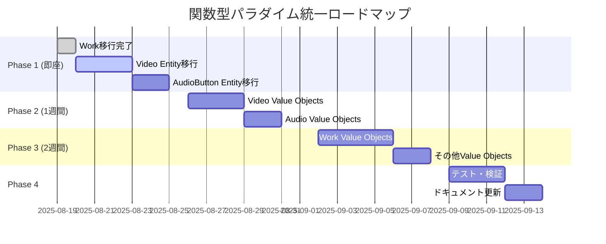

# ADR-004: 完全関数型移行計画

## ステータス
提案 (2025-08-19)

## コンテキスト

現在のコードベースには3つの異なるパラダイム（Entity/DDD、PlainObject、関数型）が混在しており、次の担当者への引き継ぎを考慮すると、単一パラダイムへの統一が必要です。

React Server Components (RSC) の制約により、クラスベースのEntity/Value Objectパターンは技術的負債となっています。

## 決定

すべてのEntity/Value Objectを**関数型プログラミングパターン（PlainObject + 純粋関数）**に移行します。

## 移行対象の全体像

### 現在の実装状況

| カテゴリ | 対象 | 行数 | 複雑度 | 優先度 |
|---------|------|------|--------|--------|
| **Entity** | Video | 1,355 | 高 | P1 |
| **Entity** | AudioButton | 625 | 中 | P1 |
| **Entity** | Work (複数形式) | 2,000+ | 高 | 完了 |
| **Value Objects** | video/* (4ファイル) | 2,488 | 中 | P2 |
| **Value Objects** | audio-button/* (3ファイル) | 1,212 | 低 | P2 |
| **Value Objects** | work/* (10ファイル) | 3,200 | 中 | P3 |
| **Plain Objects** | 各種Plain型 | 1,500+ | - | 維持 |

### 移行ロードマップ



## 移行戦略

### Phase 1: Entity移行（1週間）

#### Video Entity → VideoData
```typescript
// Before (Entity)
class Video extends BaseEntity<Video> {
  private constructor(
    private readonly _id: VideoId,
    private readonly _content: VideoContent,
    // ...
  ) {}
}

// After (Functional)
interface VideoData {
  readonly id: string;
  readonly title: string;
  readonly description?: string;
  readonly channelId: string;
  // ...
}

// actions/video-actions.ts
export const VideoActions = {
  updateTitle: (video: VideoData, title: string): VideoData => ({
    ...video,
    title
  }),
  
  publish: (video: VideoData): VideoData => ({
    ...video,
    status: 'published',
    publishedAt: new Date().toISOString()
  })
};
```

#### AudioButton Entity → AudioButtonData
```typescript
// 同様のパターンで移行
interface AudioButtonData {
  readonly id: string;
  readonly text: string;
  readonly audioUrl: string;
  readonly playCount: number;
  // ...
}
```

### Phase 2: Value Objects移行（1週間）

#### 複雑なValue Object → ユーティリティ関数
```typescript
// Before
class WorkPrice extends ValueObject<number> {
  applyDiscount(rate: number): WorkPrice {
    return new WorkPrice(this.value * (1 - rate));
  }
}

// After
export const PriceUtils = {
  applyDiscount: (price: number, rate: number): number => 
    price * (1 - rate),
  
  format: (price: number, currency = 'JPY'): string =>
    new Intl.NumberFormat('ja-JP', { 
      style: 'currency', 
      currency 
    }).format(price)
};
```

### Phase 3: 統合と最適化（3日）

1. **型定義の統一**
   - 重複する型定義を削除
   - 命名規則の統一（`*Data`接尾辞）

2. **ディレクトリ構造の整理**
```
packages/shared-types/src/
├── models/          # データ型定義
│   ├── work-data.ts
│   ├── video-data.ts
│   └── audio-button-data.ts
├── actions/         # ビジネスロジック
│   ├── work-actions.ts
│   ├── video-actions.ts
│   └── audio-button-actions.ts
├── transformers/    # データ変換
└── validators/      # バリデーション
```

## 成功基準

- [ ] すべてのEntityクラスが削除される
- [ ] すべてのValue Objectクラスが削除される
- [ ] RSC境界でのシリアライゼーションエラーがゼロ
- [ ] 統一されたコーディングパターン
- [ ] 100%の後方互換性維持

## リスクと対策

| リスク | 影響度 | 対策 |
|-------|--------|------|
| 破壊的変更の発生 | 高 | 段階的移行、互換レイヤーの提供 |
| パフォーマンス劣化 | 中 | ベンチマークテストの実施 |
| 開発期間の長期化 | 中 | 優先度に基づく段階実装 |

## 実装チェックリスト

### 各Entity/Value Object移行時の手順

- [ ] 1. PlainObject型定義の作成
- [ ] 2. Actions（純粋関数）の実装
- [ ] 3. Transformer（変換関数）の実装
- [ ] 4. 既存コードの移行
- [ ] 5. テストの修正・追加
- [ ] 6. 古いEntity/Value Objectの削除
- [ ] 7. ドキュメントの更新

## 参考

- [ADR-002: Entity実装の教訓](./ADR-002-entity-implementation-lessons.md)
- [ADR-003: 関数型ドメインモデリングの採用](./ADR-003-functional-domain-modeling-adoption.md)
- [関数型ドメインモデリングガイド](../../reference/functional-domain-modeling-guide.md)