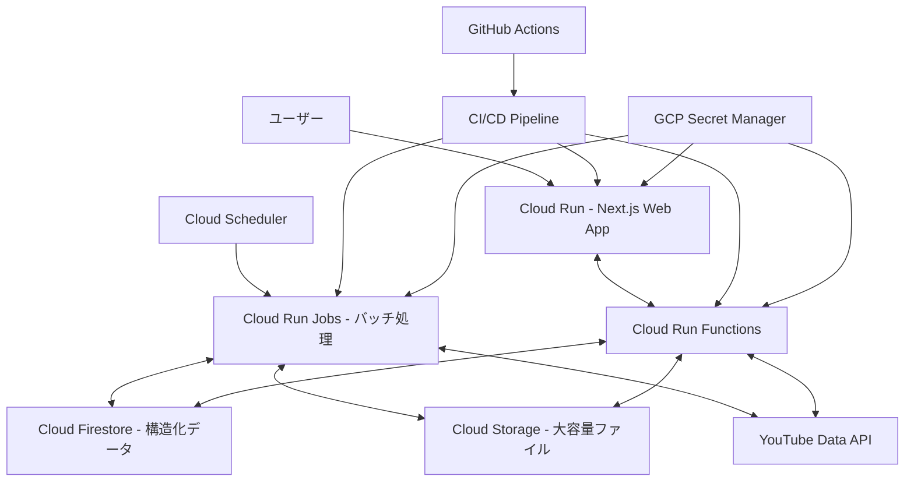

# Google Cloud Platform デプロイ設計書

## 1. 全体アーキテクチャ

## 2. GCPプロジェクト設定

- プロジェクトID: `suzumina-click-dev`（検証環境）
- リージョン: `asia-northeast1`（東京）
- 必要なAPI: Cloud Run, Cloud Run Functions, Build, Container Registry, Secret Manager, Artifact Registry, Scheduler, Tasks, Firestore, Storage, YouTube Data API v3

## 3. コンポーネント設計

### Web アプリ (Cloud Run)

- Dockerfile: node:22-alpine ベース、bun を使用
- Next.js 設定: `output: 'standalone'` で最適化
- インスタンス：最小1、最大2、メモリ1GB、CPU1

### API エンドポイント (Cloud Run Functions)

- TypeScript/Node.js と Python 両方をサポート
- 構造: `api/`, `lib/`, `utils/` ディレクトリ構成
- HTTP トリガーを使用

### バッチ処理 (Cloud Run Jobs)

- スケジュール実行または手動実行のタスク用
- TypeScript/Node.js と Python 両方をサポート
- JOB_TYPE 環境変数で実行するジョブを決定
- Cloud Scheduler による定期実行

## 4. サービス選択指針

| 用途 | 推奨サービス | 理由 |
|------|------------|------|
| API エンドポイント | Cloud Run Functions | HTTPリクエスト応答に最適 |
| 定期的なデータ処理 | Cloud Run Jobs | スケジュール実行、長時間実行可能 |
| リソース集約処理 | Cloud Run Jobs | より多くのリソース割当可能 |

## 5. 言語選択指針

| 用途 | 推奨言語 | 理由 |
|------|---------|------|
| 軽量 API | TypeScript/Node.js | 起動時間が速い、非同期処理に強い |
| YouTube API 連携 | Python | 公式ライブラリが充実 |
| データ処理ジョブ | Python | データ科学ライブラリが充実 |

## 6. ストレージ戦略

- **Cloud Firestore**: 構造化データ（ユーザー情報、設定、関係性のあるデータ）
- **Cloud Storage**: 大容量ファイル、バイナリデータ、静的アセット
  - バケット: uploads, static, logs, backups

## 7. CI/CD パイプライン

GitHub Actions を使用して:

- コードの検証 (lint, type-check)
- Docker イメージのビルドとプッシュ
- Cloud Run, Cloud Run Functions, Jobs へのデプロイ
- Cloud Scheduler ジョブの設定

## 8. 実装ロードマップ

1. 基本環境整備: GCP プロジェクト作成、API 有効化
2. Web アプリケーション (Cloud Run) 実装
3. バックエンド API (Cloud Run Functions) 実装
4. バッチ処理 (Cloud Run Jobs) 実装
5. CI/CD パイプライン整備
6. 動作検証とデバッグ
