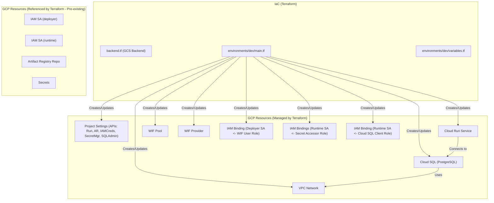

# GCP IaC 設計書

## 1. 目的

このドキュメントは、`suzumina-click-dev` GCPプロジェクトにおいて、Next.jsアプリケーションとPostgreSQLデータベースを実行するためのインフラストラクチャをInfrastructure as Code (IaC) で構築・管理するための設計を定義します。Artifact Registryリポジトリとサービスアカウントは**事前に作成されている前提**とします。

## 2. IaCツール

- **Terraform** を使用します。

## 3. IaC管理対象リソース

以下のGCPリソースをTerraformで管理します。

### GCPプロジェクト設定

- 有効化するAPI:
  - `run.googleapis.com` (Cloud Run API)
  - `artifactregistry.googleapis.com` (Artifact Registry API)
  - `iamcredentials.googleapis.com` (IAM Credentials API - WIFに必要)
  - `secretmanager.googleapis.com` (Secret Manager API)
  - `sqladmin.googleapis.com` (Cloud SQL Admin API)

### Cloud Run

- サービス定義 (`web`)
  - 実行サービスアカウント (`app-runtime`) の指定
  - 環境変数 (`NODE_ENV`) の設定
  - Secret Managerからのシークレット参照
    - `NEXTAUTH_URL`
    - `DISCORD_GUILD_ID`
    - `NEXTAUTH_SECRET`
    - `DISCORD_CLIENT_ID`
    - `DISCORD_CLIENT_SECRET`
    - `AUTH_TRUST_HOST`
    - `DATABASE_URL`
  - 公開アクセス設定 (`ingress`)
  - **注意:** コンテナイメージはCI/CDで更新されるため、Terraformのライフサイクルで `ignore_changes` を設定。

### Cloud SQL

- PostgreSQLインスタンス
  - インスタンス設定 (`db-f1-micro`, PostgreSQL 14)
  - バックアップ設定（自動バックアップ、ポイントインタイムリカバリ）
  - ネットワーク設定（VPCネットワーク、プライベートIP）
  - データベース作成
  - ユーザー作成
  - SSL/TLS設定

### IAM

- **Workload Identity Federation (WIF) for GitHub Actions:**
  - Workload Identity Pool (`github-actions-pool`)
  - Workload Identity Pool Provider (`github-provider`)
  - IAM Binding: Deployerサービスアカウント (`github-actions-deployer`) に `roles/iam.workloadIdentityUser` ロールを付与。
- **Secret Manager Access:**
  - IAM Binding: Runtimeサービスアカウント (`app-runtime`) に、参照する各シークレットに対する `roles/secretmanager.secretAccessor` ロールを付与。
- **Cloud SQL Access:**
  - IAM Binding: Runtimeサービスアカウント (`app-runtime`) に `roles/cloudsql.client` ロールを付与。

## 4. Terraform参照対象リソース (事前作成前提)

以下のリソースはTerraformの `data` ソースで参照します。

- **IAM:**
  - サービスアカウント:
    - `github-actions-deployer@...` (CI/CD用)
    - `app-runtime@...` (Cloud Run実行用)
- **Artifact Registry:**
  - Dockerイメージ用リポジトリ (`suzumina-click-docker-repo`)
- **Secret Manager:**
  - 必要なシークレット
    - `nextauth-secret-dev`
    - `discord-client-id-dev`
    - `discord-client-secret-dev`
    - `nextauth-url-dev`
    - `discord-guild-id-dev`
    - `auth-trust-host-dev`
    - `database-url-dev`（Cloud SQL接続情報）

## 5. Terraform構成

開発環境のリソース定義を `environments/dev` ディレクトリ内に記述します。

```plaintext
iac/
├── environments/
│   └── dev/
│       ├── main.tf         # リソース定義
│       ├── variables.tf    # dev環境用変数
│       └── terraform.tfvars # dev環境用変数ファイル (Git管理外)
├── backend.tf          # Terraform状態管理バックエンド設定 (GCS)
└── variables.tf        # 共通変数
```

## 6. Terraform状態管理

- Terraformの状態ファイル (`.tfstate`) は、GCPプロジェクト内のCloud Storageバケットで管理します。
- バケット名: `suzumina-click-dev-tfstate`

## 7. Mermaid図による構成イメージ



## 8. 次のステップ

1. このドキュメントは、Cloud RunサービスとCloud SQLインスタンスをTerraformで管理する構成を反映しています。
2. Secret Managerに必要なシークレットが存在し、適切な値が設定されていることを確認してください。
3. `terraform init` と `terraform apply` を実行して変更を適用します。

## 9. 注記

- 本番環境（`suzumina-click`）のインフラストラクチャ設定は今後の課題として、現在は開発環境のみを管理します。
- 本番環境の設定が必要になった時点で、`environments/prod` ディレクトリを作成し、適切な設定を行います。

最終更新日: 2025年4月11日
