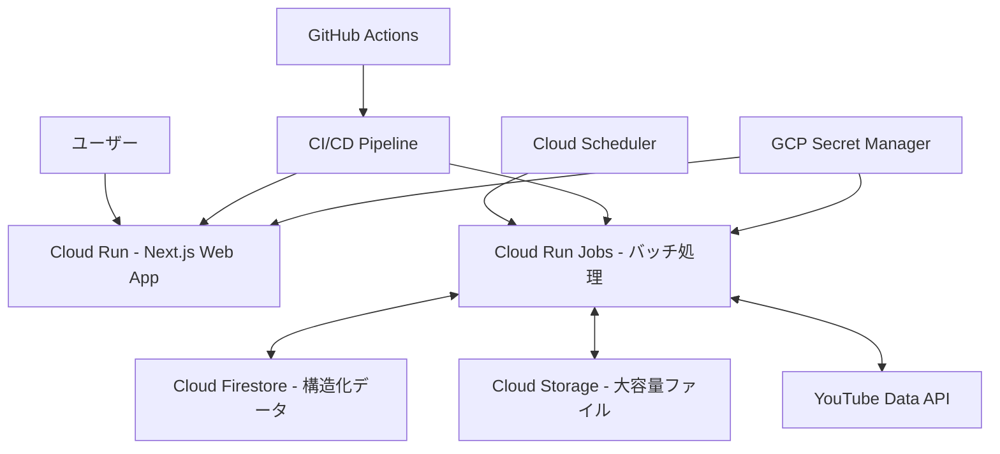

# Google Cloud Platform デプロイ概要

suzuminaclick の Google Cloud Platform（GCP）デプロイに関する概要を説明します。

## 全体アーキテクチャ

## 主要コンポーネント

| コンポーネント | 使用サービス | 主な目的 | 詳細 |
|--------------|------------|--------|------|
| Webフロントエンド | Cloud Run | ユーザーインターフェース提供 | Next.jsアプリケーションをホスティング。 **Cloud Run設定:** サービス名 `web`, 最小1/最大2インスタンス, 1GBメモリ, 1CPU, 60秒タイムアウト, HTTPS必須。 **Dockerfile:** マルチステージビルド (Node.js 22 Alpine, Bun), 依存関係キャッシュ最適化, Next.jsスタンドアロン出力。 **Next.js設定:** `output: 'standalone'`, `serverActions: true`。詳細は `apps/web/README.md` 参照。 |
| バッチ処理 | Cloud Run Jobs | 定期的なデータ同期と処理 | |
| データベース | Firestore | 構造化データの保存 | ユーザー情報、アプリ設定、YouTubeメタデータなど。 **設計原則:** 浅いコレクション、読み取りパターン最適化、データ整合性確保、インデックス活用、1MB上限考慮。 **認証:** Cloud Run環境ではサービスアカウント権限 (ADC) を自動利用。 |
| オブジェクトストレージ | Cloud Storage | 大容量ファイルの保存 | メディアファイル、バックアップ、ログなど。 **設計原則:** アクセス頻度に基づくクラス選択、ライフサイクル管理、アクセス制御、CDN連携。 |
| CI/CD | GitHub Actions | 自動デプロイとテスト | |
| シークレット管理 | Secret Manager | 認証情報と機密データの管理 | |
| スケジューラ | Cloud Scheduler | バッチジョブのトリガー | |

## ストレージ戦略

- **構造化データ**: Cloud Firestore を使用。
- **非構造化・大容量データ**: Cloud Storage を使用。
- **バックアップ**:
  - Firestore: Cloud Run Jobsによる自動バックアップ（日次増分・週次完全）、Cloud Storageへエクスポート。
  - Cloud Storage: 複数リージョンストレージ、オブジェクトバージョニング。

## デプロイ環境

- **開発環境**: `suzumina-click-dev`
- **本番環境**: `suzumina-click-prod`（計画中）
- **リージョン**: `asia-northeast1`（東京）

## セキュリティ設定

- **原則**: 最小権限、機密情報保護 (Secret Manager)、通信暗号化 (HTTPS)、適切な認証/認可、定期監査。
- **認証**:
  - Webアプリ (NextAuth.js): Discord OAuthを使用。認証フローは `apps/web/src/auth.ts` 参照。
  - バッチジョブ: サービスアカウントベース。
- **Secret Manager**: 機密情報管理。命名規則 `{service}-{purpose}-{env}`、最小権限アクセス、バージョン管理。
  - **必須シークレット:**
    - `NEXTAUTH_SECRET`: NextAuth.jsセッション署名用。
    - `DISCORD_CLIENT_ID`: Discord OAuthクライアントID。
    - `DISCORD_CLIENT_SECRET`: Discord OAuthクライアントシークレット。
  - **Cloud Run環境変数 (Secret Manager経由推奨):**
    - `NEXTAUTH_URL`: アプリケーションのベースURL。
    - `DISCORD_GUILD_ID`: 認証を許可するDiscordサーバーID。
- **サービスアカウント**: 主要アカウント (`github-actions-deployer`, `app-runtime`, `youtube-api-client`) に最小権限付与、キー発行最小化。
- **その他**: Workload Identity FederationによるGitHub Actionsからの認証。

最終更新日: 2025年4月6日
