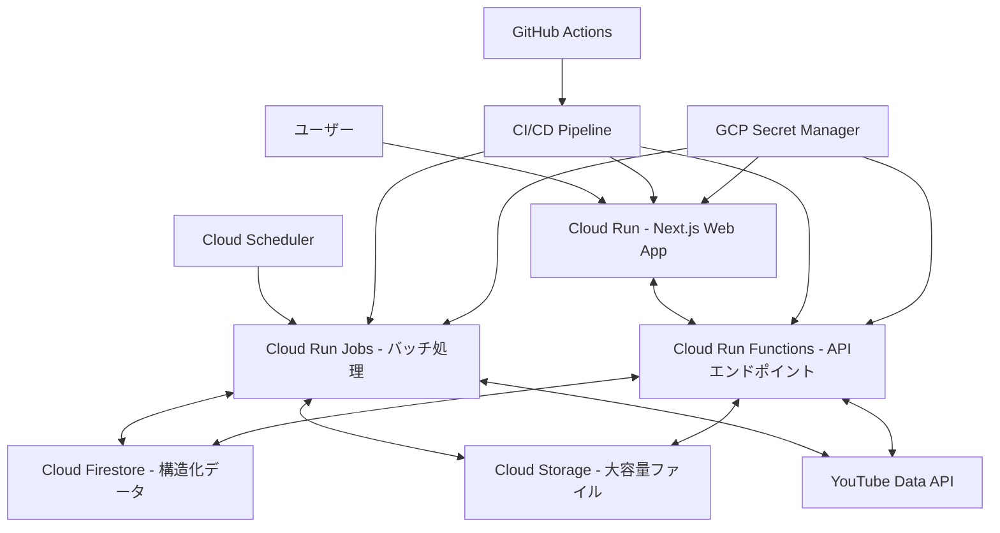

# Google Cloud Platform デプロイ概要

このドキュメントは、suzumina.clickのGoogle Cloud Platform（GCP）デプロイに関する概要を説明します。詳細な設計については、各トピック別のドキュメントを参照してください。

## 全体アーキテクチャ

## ドキュメント一覧

suzumina.clickのGCPデプロイに関する詳細設計は、以下のドキュメントに分割されています：

1. **[全体デプロイ設計](GCP_DEPLOYMENT_DESIGN.md)** - GCPコンポーネント、サービス/言語選択、ストレージ、CI/CD等の全体設計
2. **[プロジェクト設定](GCP_PROJECT_SETUP.md)** - GCPプロジェクトの基本設定とAPI有効化
3. **[Webアプリケーション設計](GCP_WEB_APP.md)** - Cloud Runを使用したNext.jsアプリケーションのデプロイ
4. **[API設計](GCP_CLOUD_RUN_FUNCTIONS.md)** - Cloud Run Functionsを使用したAPIエンドポイントの実装
5. **[CI/CD設計](GCP_CICD.md)** - GitHub Actionsを使用した継続的インテグレーション/デリバリー
6. **[セキュリティ設計](GCP_SECURITY.md)** - 環境変数と機密情報の管理
7. **[監視設計](GCP_MONITORING.md)** - ログ収集と監視アラートの設定
8. **[ベストプラクティス](GCP_BEST_PRACTICES.md)** - サービスと言語選択のガイドライン
9. **[外部API連携設計](GCP_EXTERNAL_APIS.md)** - YouTube Data APIなどの外部サービスとの連携
10. **[ストレージ設計](GCP_STORAGE.md)** - FirestoreとCloud Storageの利用方針
11. **[実装計画](GCP_ROADMAP.md)** - 段階的な実装ロードマップとタスク優先順位

各ドキュメントは独立して参照できますが、全体像を把握するためには、このオーバービュードキュメントから始めることをお勧めします。

## 主要コンポーネント

| コンポーネント | 使用サービス | 主な目的 |
|--------------|------------|--------|
| Webフロントエンド | Cloud Run | ユーザーインターフェース提供 |
| APIバックエンド | Cloud Run Functions | データ処理とビジネスロジック |
| バッチ処理 | Cloud Run Jobs | 定期的なデータ同期と処理 |
| データベース | Firestore | 構造化データの保存 |
| オブジェクトストレージ | Cloud Storage | 大容量ファイルの保存 |
| CI/CD | GitHub Actions | 自動デプロイとテスト |
| シークレット管理 | Secret Manager | 認証情報と機密データの管理 |
| スケジューラ | Cloud Scheduler | バッチジョブのトリガー |

## デプロイ環境

- **開発環境**: `suzumina-click-dev`
- **本番環境**: `suzumina-click-prod`（計画中）
- **リージョン**: `asia-northeast1`（東京）

## 最終更新日

2025年4月2日
