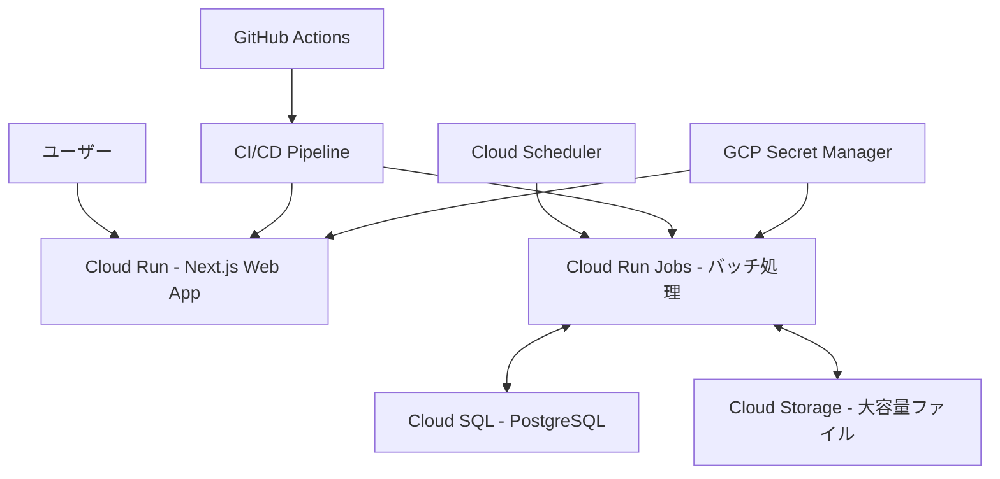

# Google Cloud Platform デプロイ概要

suzuminaclick の Google Cloud Platform（GCP）デプロイに関する概要を説明します。

## 全体アーキテクチャ

## 主要コンポーネント

| コンポーネント | 使用サービス | 主な目的 | 詳細 |
|--------------|------------|--------|------|
| Webフロントエンド | Cloud Run | ユーザーインターフェース提供 | Next.jsアプリケーションをホスティング。 **Cloud Run設定:** サービス名 `web`, 最小1/最大2インスタンス, 1GBメモリ, 1CPU, 60秒タイムアウト, HTTPS必須。 **Dockerfile:** マルチステージビルド (Node.js 22 Alpine, Bun), 依存関係キャッシュ最適化, Next.jsスタンドアロン出力。 **Next.js設定:** `output: 'standalone'`, `serverActions: true`。詳細は `apps/web/README.md` 参照。 |
| バッチ処理 | Cloud Run Jobs | 定期的なデータ同期と処理 | |
| データベース | Cloud SQL | ユーザーデータと認証情報の永続化 | PostgreSQLインスタンス。 **設計原則:** プライベートIPアクセス、SSL/TLS暗号化、自動バックアップ、ポイントインタイムリカバリ。 **認証:** Cloud Run環境からSecure IAM認証を使用。 |
| オブジェクトストレージ | Cloud Storage | 大容量ファイルの保存 | メディアファイル、バックアップ、ログなど。 **設計原則:** アクセス頻度に基づくクラス選択、ライフサイクル管理、アクセス制御、CDN連携。 |
| CI/CD | GitHub Actions | 自動デプロイとテスト | アプリケーションコードの変更を検知し、テスト、Dockerイメージビルド＆プッシュ、Cloud Runサービスのイメージ更新を行う。詳細は [CI/CD設計](./GCP_CICD.md) 参照。 |
| シークレット管理 | Secret Manager | 認証情報と機密データの管理 | |
| スケジューラ | Cloud Scheduler | バッチジョブのトリガー | |
| インフラ管理 (IaC) | Terraform | インフラ構成のコード管理 | Cloud Runサービス定義、IAM、Secret Manager参照、WIFなどを管理。詳細は [IaC設計](./GCP_IAC_DESIGN_MINIMAL.md) 参照。 |

## 設計原則とベストプラクティス

- **サーバーレスファースト**: Cloud Run などマネージドサービスを優先。
- **マイクロサービス指向**: 機能ごとに独立したサービスを検討。
- **セキュリティバイデザイン**: 最小権限、機密情報保護 (Secret Manager)、通信暗号化 (HTTPS)。
- **コスト最適化**: オートスケーリング、適切なリソースサイジング、モニタリング。

## ストレージ戦略

- **構造化データ**: Cloud SQL (PostgreSQL) を使用。
  - ユーザー認証情報、セッション管理
  - アプリケーションデータ
  - トランザクション処理が必要なデータ
- **非構造化・大容量データ**: Cloud Storage を使用。
- **バックアップ**:
  - PostgreSQL: Cloud SQLの自動バックアップ（日次）とポイントインタイムリカバリ。
  - Cloud Storage: 複数リージョンストレージ、オブジェクトバージョニング。

## デプロイ環境

### 現在の環境

- **ローカル開発環境**
  - SQLiteデータベース使用
  - ローカル開発とテスト用

- **GCP開発環境** (`suzumina-click-dev`)
  - Cloud Run + Cloud SQL (PostgreSQL)
  - 開発版のデプロイとテスト用
  - リージョン: `asia-northeast1`（東京）

### 計画中の環境

- **GCP本番環境** (`suzumina-click`）
  - 環境構築とプロジェクト設定は今後対応予定
  - 開発環境と同様のアーキテクチャを予定
  - リージョン: `asia-northeast1`（東京）

## セキュリティ設定

- **原則**: 最小権限、機密情報保護 (Secret Manager)、通信暗号化 (HTTPS)、適切な認証/認可、定期監査。
- **認証**:
  - Webアプリ (NextAuth.js): Discord OAuthを使用。認証フローは `../auth/AUTH_DESIGN.md` 参照。
  - バッチジョブ: サービスアカウントベース。
  - CI/CD: Workload Identity FederationによるGitHub Actionsからの認証。詳細は [CI/CD設計](./GCP_CICD.md) 参照。
- **Secret Manager**: 機密情報管理。命名規則 `{service}-{purpose}-{env}`、最小権限アクセス、バージョン管理。
  - **必須シークレット (dev環境):** `nextauth-secret-dev`, `discord-client-id-dev`, `discord-client-secret-dev`, `discord-guild-id-dev`, `nextauth-url-dev`, `auth-trust-host-dev`, `database-url-dev`。
- **サービスアカウント**: 主要アカウント (`github-actions-deployer`, `app-runtime`) に最小権限付与、キー発行最小化。

## 外部API連携

- **YouTube Data API**: 将来的な連携を検討中 (優先度: 低)。

## 注記

- データベースをFirestoreからCloud SQL (PostgreSQL)に移行済み（2025年4月）
- GCP本番環境は計画段階であり、プロジェクト設定や環境構築は今後対応予定

最終更新日: 2025年4月11日
