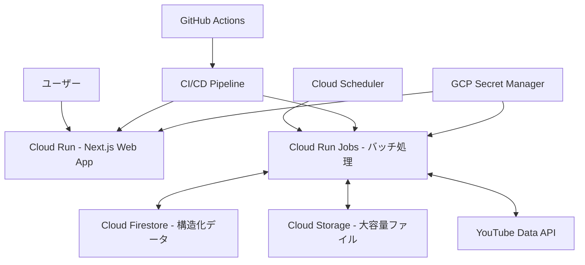

# Google Cloud Platform デプロイ概要

suzumina.clickのGoogle Cloud Platform（GCP）デプロイに関する概要を説明します。

## 全体アーキテクチャ

## 主要コンポーネント

| コンポーネント | 使用サービス | 主な目的 |
|--------------|------------|--------|
| Webフロントエンド | Cloud Run | ユーザーインターフェース提供 |
| バッチ処理 | Cloud Run Jobs | 定期的なデータ同期と処理 |
| データベース | Firestore | 構造化データの保存 |
| オブジェクトストレージ | Cloud Storage | 大容量ファイルの保存 |
| CI/CD | GitHub Actions | 自動デプロイとテスト |
| シークレット管理 | Secret Manager | 認証情報と機密データの管理 |
| スケジューラ | Cloud Scheduler | バッチジョブのトリガー |

## デプロイ環境

- **開発環境**: `suzumina-click-dev`
- **本番環境**: `suzumina-click-prod`（計画中）
- **リージョン**: `asia-northeast1`（東京）

## セキュリティ設定

- Workload Identity Federationによる認証
- Secret Managerによる機密情報管理
- 最小権限の原則に基づくIAM設定

最終更新日: 2025年4月4日
