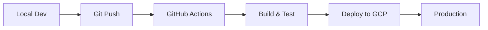

# Deployment Guide

This guide covers deployment procedures for suzumina.click.

## Overview

suzumina.click uses Google Cloud Platform with automated deployment via GitHub Actions.

## Infrastructure Stack

- **Web Application**: Cloud Run
- **Functions**: Cloud Functions v2
- **Database**: Cloud Firestore
- **Storage**: Cloud Storage
- **CDN**: Cloud CDN
- **Infrastructure as Code**: Terraform

## Deployment Flow

### 1. Development to Production



### 2. Automated Deployment

Deployment is triggered automatically:
- **Main branch**: Deploys to production
- **Pull requests**: Runs tests only

## Pre-deployment Checklist

```bash
# 1. Run all quality checks
pnpm check
pnpm test
pnpm build

# 2. Update version in package.json
# Edit apps/web/package.json

# 3. Update CHANGELOG
# Edit docs/operations/changelog.md

# 4. Commit and push
git add .
git commit -m "chore: prepare release v0.3.x"
git push origin main
```

## GitHub Actions Workflow

### Web Application Deployment

```yaml
# .github/workflows/deploy-web.yml
name: Deploy Web
on:
  push:
    branches: [main]
    paths:
      - 'apps/web/**'
      - 'packages/**'
```

### Cloud Functions Deployment

```yaml
# .github/workflows/deploy-functions.yml
name: Deploy Functions
on:
  push:
    branches: [main]
    paths:
      - 'apps/functions/**'
      - 'packages/shared-types/**'
```

## Environment Variables

### Production Secrets (Set in GitHub)

```bash
# GitHub Secrets
GOOGLE_CLOUD_PROJECT
GCP_SA_KEY
DISCORD_CLIENT_ID
DISCORD_CLIENT_SECRET
NEXTAUTH_SECRET
YOUTUBE_API_KEY
```

### Public Environment Variables

```bash
# apps/web/.env.production
NEXT_PUBLIC_GA_MEASUREMENT_ID=G-9SYZ48LBPH
NEXT_PUBLIC_GTM_ID=GTM-W7QT5PCR
```

## Manual Deployment (Emergency)

If automated deployment fails:

```bash
# 1. Authenticate with GCP
gcloud auth login
gcloud config set project suzumina-click

# 2. Build and deploy web app
cd apps/web
pnpm build
gcloud run deploy web \
  --source . \
  --region asia-northeast1 \
  --allow-unauthenticated

# 3. Deploy functions
cd apps/functions
pnpm build
gcloud functions deploy dlsite-collector \
  --runtime nodejs20 \
  --trigger-topic dlsite-collection \
  --region asia-northeast1
```

## Rollback Procedures

### Quick Rollback

```bash
# List revisions
gcloud run revisions list --service web

# Rollback to previous revision
gcloud run services update-traffic web \
  --to-revisions=web-00001-abc=100
```

### Database Rollback

Firestore backups are taken daily. To restore:

```bash
# List backups
gcloud firestore backups list

# Restore from backup
gcloud firestore import gs://suzumina-click-backups/2025-07-28
```

## Monitoring Deployment

### Health Checks

- **Web App**: https://suzumina.click/api/health
- **Functions**: Check Cloud Functions console

### Metrics to Monitor

1. **Response Time**: < 200ms p95
2. **Error Rate**: < 0.1%
3. **Memory Usage**: < 80%
4. **Cold Starts**: Monitor function execution time

## Post-deployment Tasks

1. **Verify deployment**
   ```bash
   curl https://suzumina.click/api/health
   ```

2. **Check application logs**
   ```bash
   gcloud logging read "resource.type=cloud_run_revision"
   ```

3. **Monitor error rates**
   - Check Cloud Monitoring dashboard
   - Review Sentry for new errors

4. **Update status page** (if applicable)

## Resource Limits and Scaling

### Cloud Run Configuration

**Web Application**:
- CPU: 1 vCPU
- Memory: 2Gi
- Concurrency: 100
- Min instances: 0
- Max instances: 10
- Timeout: 300s

**Admin Application**:
- CPU: 1 vCPU  
- Memory: 1Gi
- Concurrency: 50
- Min instances: 0
- Max instances: 3
- Timeout: 300s

### Cloud Functions Configuration

**dlsite-collector-function**:
- Memory: 512MB
- Timeout: 540s
- Max instances: 10
- Trigger: Pub/Sub topic

**youtube-updater-function**:
- Memory: 256MB
- Timeout: 300s
- Max instances: 5
- Trigger: Cloud Scheduler

## Secret Management

### Using Secret Manager

```bash
# List secrets
gcloud secrets list

# View secret value (be careful!)
gcloud secrets versions access latest --secret="discord-client-secret"

# Update secret
echo -n "new-secret-value" | gcloud secrets create discord-client-secret --data-file=-
```

### Required Secrets

- `discord-client-id`
- `discord-client-secret`  
- `nextauth-secret`
- `youtube-api-key`
- `dlsite-api-key` (if applicable)

## Troubleshooting

### Common Issues

1. **Build failures**
   - Check GitHub Actions logs
   - Verify all dependencies are installed
   - Check for TypeScript errors

2. **Deployment timeouts**
   - Increase Cloud Run timeout
   - Check for large assets

3. **Environment variable issues**
   - Verify all secrets are set in GitHub
   - Check Cloud Run service configuration

### Emergency Contacts

- **Infrastructure**: Check Terraform state
- **Application**: Review Cloud Run logs
- **Database**: Check Firestore console

## Infrastructure Updates

For infrastructure changes:

```bash
cd terraform
terraform plan
terraform apply
```

Always review the plan before applying!

## Deployment Checklist

### Pre-deployment
- [ ] All tests passing (`pnpm test`)
- [ ] No TypeScript errors (`pnpm typecheck`)
- [ ] No lint errors (`pnpm lint`)
- [ ] Version updated in package.json
- [ ] CHANGELOG updated
- [ ] Environment variables documented

### Post-deployment
- [ ] Health check passing
- [ ] No error spike in logs
- [ ] Performance metrics normal
- [ ] User-facing features tested
- [ ] Admin features tested (if changed)
- [ ] Monitoring alerts configured

---

**Last Updated**: 2025-07-28  
**Next Review**: When moving to multi-region deployment