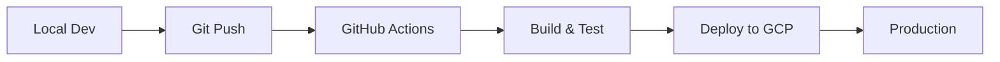

# Deployment Guide

This guide covers deployment procedures for suzumina.click.

## Overview

suzumina.click uses Google Cloud Platform with automated deployment via GitHub Actions.

## Infrastructure Stack

- **Web Application**: Cloud Run
- **Functions**: Cloud Functions v2
- **Database**: Cloud Firestore
- **Storage**: Cloud Storage
- **CDN**: Cloud CDN
- **Infrastructure as Code**: Terraform

## Deployment Flow

### 1. Development to Production


```mermaid
graph LR
    A[Local Dev] --> B[Git Push]
    B --> C[GitHub Actions]
    C --> D[Build & Test]
    D --> E[Deploy to GCP]
    E --> F[Production]
```

### 2. Automated Deployment

Deployment is triggered automatically:
- **Main branch**: Deploys to production
- **Pull requests**: Runs tests only

## Pre-deployment Checklist

```bash
# 1. Run all quality checks（CI と同一判定: lint + typecheck + test 一括）
pnpm verify
pnpm build

# 2. Update version in ALL package.json（monorepo は lockstep で揃える）
#   package.json / apps/web / apps/functions /
#   packages/shared-types / packages/ui / packages/typescript-config
# 例: sed -i '' 's/"version": "0.3.12"/"version": "0.3.13"/' \
#       package.json apps/*/package.json packages/*/package.json
# その後 pnpm install で lockfile を同期

# 3. Update CHANGELOG
# Edit docs/operations/changelog.md（前タグ以降の変更をカテゴリ要約で追記）

# 4. Commit and push（main へは PR 経由でマージ）
git add .
git commit -m "chore: bump version to v0.3.x"
git push -u origin chore/bump-v0.3.x

# 5. マージ後、main で git tag を手動作成（タグは手動運用）
git tag v0.3.x && git push origin v0.3.x
```

## GitHub Actions Workflow

### Web Application Deployment

```yaml
# .github/workflows/deploy-web.yml
name: Deploy Web
on:
  push:
    branches: [main]
    paths:
      - 'apps/web/**'
      - 'packages/**'
```

### Cloud Functions Deployment

```yaml
# .github/workflows/deploy-functions.yml
name: Deploy Functions
on:
  push:
    branches: [main]
    paths:
      - 'apps/functions/**'
      - 'packages/shared-types/**'
```

## Environment Variables

### Production Secrets (Set in GitHub)

```bash
# GitHub Secrets
GOOGLE_CLOUD_PROJECT
GCP_SA_KEY
DISCORD_CLIENT_ID
DISCORD_CLIENT_SECRET
NEXTAUTH_SECRET  # SPR-158 で better-auth へ移行後も Secret 名は流用。Cloud Run の env は BETTER_AUTH_SECRET
YOUTUBE_API_KEY
```

### Public Environment Variables

```bash
# apps/web/.env.production
NEXT_PUBLIC_GA_MEASUREMENT_ID=G-9SYZ48LBPH
NEXT_PUBLIC_GTM_ID=GTM-W7QT5PCR
```

## Manual Deployment (Emergency)

If automated deployment fails:

```bash
# 1. Authenticate with GCP
gcloud auth login
gcloud config set project suzumina-click

# 2. Build and deploy web app
cd apps/web
pnpm build
gcloud run deploy web \
  --source . \
  --region asia-northeast1 \
  --allow-unauthenticated

# 3. Deploy functions
cd apps/functions
pnpm build
gcloud functions deploy dlsite-collector \
  --runtime nodejs20 \
  --trigger-topic dlsite-collection \
  --region asia-northeast1
```

## Rollback Procedures

### Quick Rollback

```bash
# List revisions
gcloud run revisions list --service web

# Rollback to previous revision
gcloud run services update-traffic web \
  --to-revisions=web-00001-abc=100
```

### Database Rollback

Firestore backups are taken daily. To restore:

```bash
# List backups
gcloud firestore backups list

# Restore from backup
gcloud firestore import gs://suzumina-click-backups/2025-07-28
```

## Monitoring Deployment

### Health Checks

- **Web App**: https://suzumina.click/api/health
- **Functions**: Check Cloud Functions console

### Metrics to Monitor

1. **Response Time**: < 200ms p95
2. **Error Rate**: < 0.1%
3. **Memory Usage**: < 80%
4. **Cold Starts**: Monitor function execution time

## Post-deployment Tasks

1. **Verify deployment**
   ```bash
   curl https://suzumina.click/api/health
   ```

2. **Check application logs**
   ```bash
   gcloud logging read "resource.type=cloud_run_revision"
   ```

3. **Monitor error rates**
   - Check Cloud Monitoring dashboard
   - Review Sentry for new errors

4. **Update status page** (if applicable)

## Resource Limits and Scaling

### Cloud Run Configuration

**Web Application**:
- CPU: 1 vCPU
- Memory: 2Gi
- Concurrency: 100
- Min instances: 0
- Max instances: 10
- Timeout: 300s

**Admin Application**:
- CPU: 1 vCPU  
- Memory: 1Gi
- Concurrency: 50
- Min instances: 0
- Max instances: 3
- Timeout: 300s

### Cloud Functions Configuration

**dlsite-collector-function**:
- Memory: 512MB
- Timeout: 540s
- Max instances: 10
- Trigger: Pub/Sub topic

**youtube-updater-function**:
- Memory: 256MB
- Timeout: 300s
- Max instances: 5
- Trigger: Cloud Scheduler

## Secret Management

### Using Secret Manager

```bash
# List secrets
gcloud secrets list

# View secret value (be careful!)
gcloud secrets versions access latest --secret="discord-client-secret"

# Update secret
echo -n "new-secret-value" | gcloud secrets create discord-client-secret --data-file=-
```

### Required Secrets

- `discord-client-id`
- `discord-client-secret`  
- `nextauth-secret`（Secret 名は流用。better-auth が env `BETTER_AUTH_SECRET` として参照）
- `youtube-api-key`
- `dlsite-api-key` (if applicable)

## Troubleshooting

### Common Issues

1. **Build failures**
   - Check GitHub Actions logs
   - Verify all dependencies are installed
   - Check for TypeScript errors

2. **Deployment timeouts**
   - Increase Cloud Run timeout
   - Check for large assets

3. **Environment variable issues**
   - Verify all secrets are set in GitHub
   - Check Cloud Run service configuration

### Emergency Contacts

- **Infrastructure**: Check Terraform state
- **Application**: Review Cloud Run logs
- **Database**: Check Firestore console

## Infrastructure Updates

For infrastructure changes:

```bash
cd terraform
terraform plan
terraform apply
```

Always review the plan before applying!

## Deployment Checklist

### Pre-deployment
- [ ] `pnpm verify` がパス（lint + typecheck + test 一括、CI と同一判定）
- [ ] 全 package.json の version を更新（monorepo lockstep）+ `pnpm install` で lockfile 同期
- [ ] CHANGELOG updated
- [ ] Environment variables documented

### Post-merge（リリースタグ）
- [ ] main マージ後に `git tag v0.3.x && git push origin v0.3.x`（タグは手動運用）

### Post-deployment
- [ ] Health check passing
- [ ] No error spike in logs
- [ ] Performance metrics normal
- [ ] User-facing features tested
- [ ] Admin features tested (if changed)
- [ ] Monitoring alerts configured

---

**Last Updated**: 2025-07-28  
**Next Review**: When moving to multi-region deployment