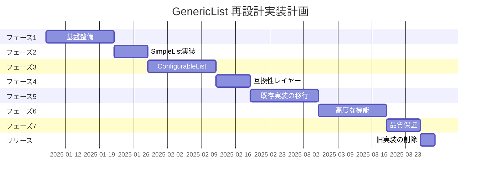

# GenericList 再設計実現計画

## 概要

GenericListコンポーネントの再設計を段階的に実装し、既存のコードを破壊することなく、より使いやすく安定したコンポーネントへと進化させる計画です。

## 実装フェーズ

### フェーズ1: 基盤整備（1-2週間）

#### 1.1 新しいディレクトリ構造の作成
```
packages/ui/src/components/custom/list/
├── core/
│   ├── types.ts              # 新しい型定義
│   ├── hooks/
│   │   ├── useListData.ts    # データ管理
│   │   ├── useListUrl.ts     # URL同期（改善版）
│   │   └── useListFilter.ts  # フィルター管理
│   └── utils/
│       ├── filterHelpers.ts  # フィルター処理
│       └── dataAdapter.ts    # データ変換
├── components/
│   ├── SimpleList.tsx        # レベル1
│   ├── ConfigurableList.tsx  # レベル2
│   └── AdvancedList.tsx      # レベル3
├── legacy/                   # 移行期間中の旧実装
│   └── GenericList.tsx       # 現在のGenericListを移動
└── index.ts
```

**注意**: 開発中は `list` ディレクトリで作業し、完成後に現在の `generic-list` を `list/legacy` に移動します。

#### 1.2 コア型定義の実装
- [ ] `ListDataSource<T>` インターフェース
- [ ] `DataAdapter<T, P>` パターンの実装
- [ ] 改善された `FilterConfig` 型
- [ ] エラーハンドリング型の定義

#### 1.3 ユーティリティ関数の開発
- [ ] フィルター値の自動変換（"all" → undefined）
- [ ] デフォルト値の処理
- [ ] バリデーション関数
- [ ] URLパラメータのパース/シリアライズ

### フェーズ2: SimpleList実装（1週間）

#### 2.1 基本機能の実装
```typescript
// 実装目標
<SimpleList
  items={videos}
  renderItem={(video) => <VideoCard video={video} />}
  itemsPerPage={12}
/>
```

- [ ] 自動ページネーション
- [ ] 基本ソート（最新/古い順）
- [ ] タイトル検索（自動検出）
- [ ] レスポンシブデザイン

#### 2.2 テストとドキュメント
- [ ] ユニットテスト作成
- [ ] Storybook stories
- [ ] 使用例ドキュメント

### フェーズ3: ConfigurableList実装（2週間）

#### 3.1 フィルターシステムの実装
- [ ] 簡潔なフィルター定義API
- [ ] 自動的な"all"オプション生成
- [ ] フィルター依存関係の処理
- [ ] 動的オプションのサポート

#### 3.2 URL同期の改善
- [ ] オプトインURL同期
- [ ] 自動的なパラメータマッピング
- [ ] デバウンス処理の統合
- [ ] ブラウザ履歴の適切な管理

#### 3.3 データアダプターの実装
```typescript
// 実装例
const videoAdapter: DataAdapter<Video, VideoQueryParams> = {
  toParams: (params) => ({
    year: params.filters.year,
    // 自動的に "all" を undefined に変換
  }),
  fromResult: (result) => ({
    items: result.videos,
    total: result.totalCount,
  })
};
```

### フェーズ4: 互換性レイヤーの実装（1週間）

#### 4.1 移行支援ツール
- [ ] `GenericListCompat` ラッパーコンポーネント
- [ ] プロップ変換関数
- [ ] 非推奨警告の実装
- [ ] 移行ガイドの作成

#### 4.2 段階的移行の実施
```typescript
// 既存のコード
<GenericList config={config} fetchData={fetchData} />

// 互換性レイヤー経由
<GenericListCompat config={config} fetchData={fetchData} />

// 最終的な形
<ConfigurableList
  items={items}
  filters={filters}
  dataAdapter={adapter}
/>
```

### フェーズ5: 既存実装の移行（2週間）

#### 5.1 動画一覧ページの移行
- [ ] VideoListGenericをSimpleListに移行
- [ ] fetchVideosForGenericListをDataAdapterに変換
- [ ] テストの更新
- [ ] パフォーマンステスト

#### 5.2 音声ボタン一覧の移行
- [ ] より複雑なフィルターのテストケース
- [ ] カスタムレンダリングの検証

### フェーズ6: 高度な機能の実装（2週間）

#### 6.1 AdvancedList コンポーネント
- [ ] Headless UIパターンの実装
- [ ] カスタムコンポーネントの組み合わせ
- [ ] 高度な状態管理

#### 6.2 パフォーマンス最適化
- [ ] 仮想スクロールの実装
- [ ] メモ化の最適化
- [ ] 楽観的更新の実装

### フェーズ7: 品質保証と文書化（1週間）

#### 7.1 包括的テスト
- [ ] ユニットテスト（カバレッジ90%以上）
- [ ] 統合テスト
- [ ] E2Eテスト
- [ ] パフォーマンステスト

#### 7.2 ドキュメント整備
- [ ] APIリファレンス
- [ ] 使用例集
- [ ] 移行ガイド
- [ ] トラブルシューティング

## リリース戦略

### アルファ版（フェーズ3完了時）
- SimpleListとConfigurableListの基本実装
- 互換性レイヤー
- 基本的なドキュメント

### ベータ版（フェーズ5完了時）
- 全機能の実装完了
- 既存実装の移行完了
- フィードバック収集期間

### 正式リリース（フェーズ7完了時）
- 安定版リリース
- 完全なドキュメント
- 移行ツールの提供
- **重要**: この時点で旧実装を削除し、新実装が標準となる

## 成功指標

1. **使いやすさ**
   - 80%のケースが10行以内で実装可能
   - 初期設定時間が50%削減

2. **パフォーマンス**
   - 初期レンダリング時間が30%改善
   - メモリ使用量が20%削減

3. **保守性**
   - テストカバレッジ90%以上
   - TypeScriptエラー0件
   - ランタイムエラー発生率50%削減

4. **採用率**
   - 3ヶ月以内に全リスト実装の80%が移行完了
   - 開発者満足度90%以上

## リスクと対策

### リスク1: 既存実装との互換性
**対策**: 
- 互換性レイヤーの提供
- 段階的廃止（deprecation）戦略
- 自動移行ツールの提供

### リスク2: パフォーマンス劣化
**対策**:
- 各フェーズでパフォーマンステスト実施
- プロファイリングツールの活用
- 最適化専門フェーズの設定

### リスク3: 学習コストの増加
**対策**:
- 段階的な複雑性の設計
- 豊富な使用例の提供
- インタラクティブなドキュメント

## タイムライン



## 次のステップ

1. この計画のレビューと承認
2. 専用ブランチ（`feat/list-redesign`）の作成
3. フェーズ1の実装開始
4. 週次進捗レビューの設定

## 移行後のディレクトリ構造

最終的に、以下のようなクリーンな構造になります：

```
packages/ui/src/components/custom/
├── list/                     # 新しい標準実装
│   ├── SimpleList.tsx
│   ├── ConfigurableList.tsx
│   ├── AdvancedList.tsx
│   └── index.ts
└── （generic-listディレクトリは削除）
```

インポートパスも簡潔になります：
```typescript
// 移行前
import { GenericList } from '@suzumina.click/ui/components/custom/generic-list';

// 移行後
import { SimpleList } from '@suzumina.click/ui/components/custom/list';
```

## 参考資料

- [現在のGenericList実装](../reference/generic-list-current.md)
- [再設計提案書](./generic-list-redesign.md)
- [API設計ガイドライン](../guides/api-design.md)