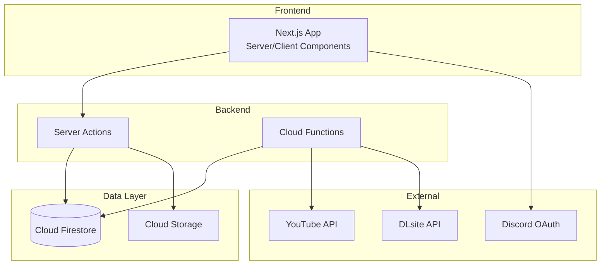

# suzumina.click アーキテクチャ概要

このドキュメントは、suzumina.clickプロジェクトの全体的なアーキテクチャへのエントリーポイントです。

## アーキテクチャドキュメント

### 🏗️ [インフラストラクチャアーキテクチャ](infrastructure-architecture.md)
- GCP (Google Cloud Platform) インフラ構成
- Terraform管理によるInfrastructure as Code
- CI/CDパイプライン（GitHub Actions）
- 環境構成（Staging/Production）
- コスト最適化とスケーリング戦略

### 🎯 [アプリケーションアーキテクチャ](application-architecture.md)
- レイヤードアーキテクチャ設計
- Next.js 15 App Routerの活用
- Server Components/Server Actions
- コンポーネント構成とデータフロー
- セキュリティとパフォーマンス最適化

### 🔧 [ドメインモデル](domain-model.md)
- エンティティとバリューオブジェクト
- ドメイン駆動設計の選択的適用
- ビジネスロジックの配置

### 💾 [データベーススキーマ](database-schema.md)
- Cloud Firestore コレクション設計
- インデックス戦略
- データモデリング

## アーキテクチャ決定記録

重要な技術的決定は[Architecture Decision Records (ADRs)](../decisions/README.md)に記録されています：

- [ADR-001: DDD実装ガイドライン](../decisions/architecture/ADR-001-ddd-implementation-guidelines.md)
- [ADR-002: Entity実装の教訓](../decisions/architecture/ADR-002-entity-implementation-lessons.md)

## システム全体像

## 主要な設計原則

1. **シンプルさ優先** - 過度な抽象化を避ける
2. **型安全性** - TypeScript strictモード
3. **パフォーマンス** - Server Componentsの活用
4. **保守性** - 明確な責務分離
5. **コスト効率** - 個人プロジェクトに最適化

各アーキテクチャの詳細については、上記のリンクから個別のドキュメントを参照してください。