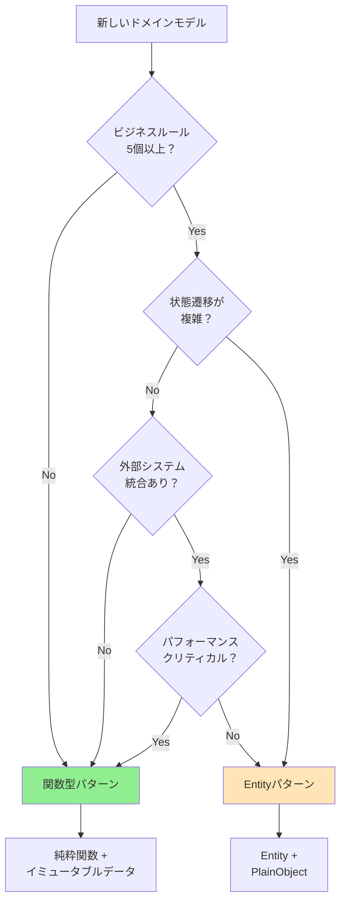

# 関数型ドメインモデリングガイド

suzumina.clickプロジェクトにおける関数型アプローチの実装ガイドです。
Next.js RSCとCloud Functionsに最適化された、実践的なパターンを提供します。

## 目次

1. [基本概念](#基本概念)
2. [コアパターン](#コアパターン)
3. [実装例](#実装例)
4. [移行戦略](#移行戦略)
5. [決定フローチャート](#決定フローチャート)

---

## 基本概念

### 関数型ドメインモデリングとは

**データと振る舞いを分離**し、**不変データ構造**と**純粋関数**でドメインロジックを表現するアプローチです。

#### 従来のEntityパターンとの違い

```typescript
// ❌ Entityパターン（クラスベース）
class Work {
  private _title: string;
  
  constructor(title: string) {
    this._title = title;
  }
  
  updateTitle(newTitle: string): void {
    this._title = newTitle; // 状態を変更
  }
  
  toPlainObject(): WorkPlainObject {
    return { title: this._title }; // RSC用に変換が必要
  }
}

// ✅ 関数型パターン
export interface WorkData {
  readonly title: string; // 不変
}

export const WorkActions = {
  updateTitle: (work: WorkData, newTitle: string): WorkData => ({
    ...work,
    title: newTitle // 新しいオブジェクトを返す
  })
} as const;
```

### なぜNext.js RSCに適しているか

1. **シリアライゼーション不要**: プレーンオブジェクトなのでそのまま送信可能
2. **Tree-shaking対応**: 使用する関数のみバンドルに含まれる
3. **型安全性維持**: TypeScriptの型システムを最大限活用
4. **テスト容易**: 純粋関数は入出力が明確

---

## コアパターン

### 1. イミュータブルデータ型

```typescript
// packages/shared-types/src/models/work.ts

/**
 * Work ドメインモデル
 * - readonly で不変性を保証
 * - オプショナルフィールドは明示的に定義
 * - ネストしたオブジェクトも readonly
 */
export interface WorkData {
  readonly id: string;
  readonly productId: string;
  readonly title: string;
  readonly circle: {
    readonly id: string;
    readonly name: string;
  };
  readonly price: {
    readonly current: number;
    readonly original?: number;
    readonly discountRate?: number;
  };
  readonly releaseDate: string; // ISO 8601
  readonly lastModified?: string;
}

// 部分更新用の型
export type WorkUpdate = DeepPartial<Omit<WorkData, 'id' | 'productId'>>;
```

### 2. 純粋関数によるビジネスロジック

```typescript
// packages/shared-types/src/actions/work-actions.ts

/**
 * Work に関するビジネスロジック
 * - 純粋関数: 同じ入力には必ず同じ出力
 * - 副作用なし: データベース操作などは呼び出し側で
 * - 単一責任: 各関数は1つのことだけを行う
 */
export const WorkActions = {
  /**
   * 価格更新
   */
  updatePrice: (
    work: WorkData, 
    newPrice: number, 
    originalPrice?: number
  ): WorkData => {
    const discountRate = originalPrice 
      ? Math.round((1 - newPrice / originalPrice) * 100)
      : undefined;
      
    return {
      ...work,
      price: {
        current: newPrice,
        original: originalPrice,
        discountRate
      },
      lastModified: new Date().toISOString()
    };
  },

  /**
   * 新作判定（30日以内）
   */
  isNewRelease: (work: WorkData): boolean => {
    const releaseDate = new Date(work.releaseDate);
    const thirtyDaysAgo = new Date();
    thirtyDaysAgo.setDate(thirtyDaysAgo.getDate() - 30);
    return releaseDate > thirtyDaysAgo;
  },

  /**
   * セール中判定
   */
  isOnSale: (work: WorkData): boolean => {
    return work.price.discountRate !== undefined && 
           work.price.discountRate > 0;
  },

  /**
   * 表示用価格フォーマット
   */
  formatPrice: (work: WorkData, locale: 'ja' | 'en' = 'ja'): string => {
    const formatter = new Intl.NumberFormat(locale, {
      style: 'currency',
      currency: 'JPY'
    });
    return formatter.format(work.price.current);
  }
} as const;
```

### 3. 型安全なバリデーション

```typescript
// packages/shared-types/src/validators/work-validators.ts

import { z } from 'zod';

/**
 * Zodスキーマによるランタイムバリデーション
 */
export const WorkIdSchema = z
  .string()
  .regex(/^RJ\d{6,8}$/, 'Invalid work ID format');

export const WorkDataSchema = z.object({
  id: z.string(),
  productId: WorkIdSchema,
  title: z.string().min(1).max(500),
  circle: z.object({
    id: z.string(),
    name: z.string()
  }),
  price: z.object({
    current: z.number().nonnegative(),
    original: z.number().nonnegative().optional(),
    discountRate: z.number().min(0).max(100).optional()
  }),
  releaseDate: z.string().datetime(),
  lastModified: z.string().datetime().optional()
});

export type ValidatedWorkData = z.infer<typeof WorkDataSchema>;

/**
 * 型ガード関数
 */
export const isValidWorkId = (id: string): id is WorkId => {
  return WorkIdSchema.safeParse(id).success;
};

/**
 * Result型でのバリデーション
 */
export const validateWork = (
  data: unknown
): Result<ValidatedWorkData, ValidationError[]> => {
  const result = WorkDataSchema.safeParse(data);
  
  if (result.success) {
    return ok(result.data);
  }
  
  return err(
    result.error.issues.map(issue => ({
      field: issue.path.join('.'),
      message: issue.message
    }))
  );
};
```

### 4. 合成可能な変換パイプライン

```typescript
// packages/shared-types/src/transformers/work-transformers.ts

import { pipe } from 'fp-ts/function';

/**
 * Firestore → WorkData 変換パイプライン
 */
export const transformFirestoreToWork = (doc: FirestoreDocument): WorkData | null => {
  return pipe(
    doc,
    validateFirestoreDocument,
    normalizeFieldNames,
    enrichWithComputedFields,
    validateWork
  );
};

// 個別の変換関数（合成可能）
const normalizeFieldNames = (data: any): any => ({
  id: data.id,
  productId: data.product_id || data.productId,
  title: data.title,
  // ... フィールドマッピング
});

const enrichWithComputedFields = (data: any): any => ({
  ...data,
  _computed: {
    isNewRelease: isWithinDays(data.releaseDate, 30),
    thumbnailUrl: generateThumbnailUrl(data.productId),
    displayTitle: data.maskedTitle || data.title
  }
});
```

### 5. エラーハンドリング

```typescript
// packages/shared-types/src/core/result.ts

/**
 * Result型: エラーを値として扱う
 */
export type Result<T, E> = 
  | { type: 'ok'; value: T }
  | { type: 'err'; error: E };

export const ok = <T>(value: T): Result<T, never> => ({
  type: 'ok',
  value
});

export const err = <E>(error: E): Result<never, E> => ({
  type: 'err',
  error
});

// ヘルパー関数
export const isOk = <T, E>(result: Result<T, E>): result is { type: 'ok'; value: T } =>
  result.type === 'ok';

export const isErr = <T, E>(result: Result<T, E>): result is { type: 'err'; error: E } =>
  result.type === 'err';

// 使用例
export const fetchWork = async (id: string): Promise<Result<WorkData, Error>> => {
  try {
    const data = await getFromFirestore(id);
    if (!data) {
      return err(new Error(`Work ${id} not found`));
    }
    return ok(transformFirestoreToWork(data));
  } catch (error) {
    return err(error as Error);
  }
};
```

---

## 実装例

### Next.js Server Component での使用

```typescript
// apps/web/src/app/works/[id]/page.tsx

import { WorkActions } from '@suzumina.click/shared-types/actions';
import { fetchWork } from '@/lib/firestore';

export default async function WorkDetailPage({ 
  params 
}: { 
  params: { id: string } 
}) {
  // データ取得（Result型）
  const result = await fetchWork(params.id);
  
  if (isErr(result)) {
    return <ErrorPage error={result.error} />;
  }
  
  const work = result.value;
  
  // ビジネスロジック適用（純粋関数）
  const isNew = WorkActions.isNewRelease(work);
  const isOnSale = WorkActions.isOnSale(work);
  const formattedPrice = WorkActions.formatPrice(work);
  
  // RSCなのでそのままレンダリング（シリアライゼーション不要）
  return (
    <div>
      <h1>{work.title}</h1>
      {isNew && <Badge>新作</Badge>}
      {isOnSale && <Badge>セール中 {work.price.discountRate}%OFF</Badge>}
      <p>{formattedPrice}</p>
    </div>
  );
}
```

### Server Action での使用

```typescript
// apps/web/src/app/works/actions.ts

'use server';

import { WorkActions, validateWork } from '@suzumina.click/shared-types';
import { updateFirestore } from '@/lib/firestore';

export async function updateWorkPrice(
  workId: string,
  newPrice: number,
  originalPrice?: number
) {
  // 1. 現在のデータ取得
  const currentWork = await fetchWork(workId);
  if (isErr(currentWork)) {
    return { error: 'Work not found' };
  }
  
  // 2. ビジネスロジック適用（純粋関数）
  const updatedWork = WorkActions.updatePrice(
    currentWork.value,
    newPrice,
    originalPrice
  );
  
  // 3. バリデーション
  const validation = validateWork(updatedWork);
  if (isErr(validation)) {
    return { error: validation.error };
  }
  
  // 4. 永続化
  await updateFirestore(`works/${workId}`, updatedWork);
  
  // 5. 更新されたデータを返す（RSCで直接使用可能）
  return { data: updatedWork };
}
```

### Cloud Functions での使用

```typescript
// apps/functions/src/works/update-prices.ts

import { onSchedule } from 'firebase-functions/v2/scheduler';
import { WorkActions, WorkBatchOperations } from '@suzumina.click/shared-types';

export const updatePrices = onSchedule('every day 00:00', async () => {
  // バッチ処理用の関数型パターン
  const works = await fetchAllWorks();
  
  // map/filter/reduce で処理（関数型の基本）
  const updates = works
    .filter(WorkActions.isOnSale)
    .map(work => {
      // キャンペーン終了チェック
      if (shouldEndCampaign(work)) {
        return WorkActions.updatePrice(
          work,
          work.price.original || work.price.current
        );
      }
      return work;
    })
    .filter(work => work.lastModified); // 変更があったもののみ
  
  // バッチ更新
  await WorkBatchOperations.updateMany(updates);
  
  console.log(`Updated ${updates.length} works`);
});
```

---

## 移行戦略

### Phase 1: 新機能で採用（1-2週間）

```typescript
// 新しいドメインは関数型で実装
// 例: UserPreferences

export interface UserPreferencesData {
  readonly userId: string;
  readonly theme: 'light' | 'dark';
  readonly language: 'ja' | 'en';
  readonly notifications: {
    readonly email: boolean;
    readonly push: boolean;
  };
}

export const UserPreferencesActions = {
  updateTheme: (prefs: UserPreferencesData, theme: 'light' | 'dark') => ({
    ...prefs,
    theme
  }),
  
  toggleNotification: (prefs: UserPreferencesData, type: 'email' | 'push') => ({
    ...prefs,
    notifications: {
      ...prefs.notifications,
      [type]: !prefs.notifications[type]
    }
  })
} as const;
```

### Phase 2: 既存シンプルドメインの移行（1ヶ月）

```typescript
// Circle Entity → 関数型への移行例

// Before (Entity)
class CircleEntity {
  constructor(private _id: string, private _name: string) {}
  isNewCircle(): boolean { /* ... */ }
}

// After (関数型)
export interface CircleData {
  readonly id: string;
  readonly name: string;
  readonly createdAt: string;
}

export const CircleActions = {
  isNewCircle: (circle: CircleData): boolean => 
    isWithinDays(circle.createdAt, 90)
} as const;

// 移行用ブリッジ関数
export const migrateCircleEntity = (entity: CircleEntity): CircleData => ({
  id: entity.id,
  name: entity.name,
  createdAt: entity.createdAt.toISOString()
});
```

### Phase 3: 複雑なEntityの段階的リファクタリング（3-6ヶ月）

```typescript
// Work Entity の段階的移行

// Step 1: Actions を外部関数に抽出
export const WorkEntityActions = {
  updatePrice: (work: Work | WorkData, price: number) => {
    if ('toPlainObject' in work) {
      // Entity の場合
      return work.updatePrice(price);
    }
    // 関数型の場合
    return WorkActions.updatePrice(work, price);
  }
};

// Step 2: 新しいコードは関数型を使用
const work = await fetchWorkAsData(id); // WorkData を返す
const updated = WorkActions.updatePrice(work, 1000);

// Step 3: 古いコードは徐々に移行
// Entity使用箇所を特定して順次置き換え
```

---

## 決定フローチャート

### どのパターンを使うべきか？



### チェックリスト

#### 関数型パターンを選ぶべき場合 ✅

- [ ] CRUD操作が中心
- [ ] ビジネスルールが5個未満
- [ ] RSCで直接使用する
- [ ] Cold Start時間が重要
- [ ] チームメンバーが関数型に慣れている
- [ ] テストのしやすさを重視

#### Entityパターンを維持すべき場合 🏗️

- [ ] 複雑な状態管理（10個以上の状態）
- [ ] 監査・コンプライアンス要件
- [ ] 既存の大規模なEntityコード
- [ ] 外部システムとの複雑な統合
- [ ] ドメインエキスパートがOOPを期待

---

## パフォーマンス比較

### Bundle サイズ影響

```typescript
// Entity パターン
import { Work } from '@/entities/work'; // 50KB
const work = Work.create(...);

// 関数型パターン  
import { updatePrice } from '@/actions/work'; // 2KB (tree-shaken)
const updated = updatePrice(work, 1000);
```

### Cold Start 改善

| パターン | 初期化時間 | メモリ使用量 |
|---------|-----------|------------|
| Entity (全ロード) | 100-150ms | 50MB |
| 関数型 (必要分のみ) | 20-30ms | 15MB |
| ハイブリッド | 40-60ms | 25MB |

---

## よくある質問

### Q: 関数型でプライベートフィールドは？

```typescript
// Symbol を使ったプライベート風実装
const _internal = Symbol('internal');

export interface WorkData {
  readonly id: string;
  readonly title: string;
  readonly [_internal]?: {
    readonly rawData: unknown;
  };
}

// 外部からはアクセス不可
```

### Q: メソッドチェーンは？

```typescript
// pipe 関数で実現
import { pipe } from 'fp-ts/function';

const result = pipe(
  work,
  w => WorkActions.updatePrice(w, 1000),
  w => WorkActions.updateTitle(w, 'New Title'),
  w => WorkActions.setAsNewRelease(w)
);
```

### Q: 継承は？

```typescript
// コンポジションで解決
export interface BaseWork {
  readonly id: string;
  readonly title: string;
}

export interface DlsiteWork extends BaseWork {
  readonly productId: string;
  readonly circle: CircleData;
}

// 共通アクションは別モジュール
export const BaseWorkActions = { /* ... */ };
export const DlsiteWorkActions = {
  ...BaseWorkActions,
  // 追加アクション
};
```

---

## 参考資料

- [ADR-003: 関数型ドメインモデリング採用](../decisions/architecture/ADR-003-functional-domain-modeling.md) (作成予定)
- [Entity実装ガイド](./entity-implementation-guide.md) - 従来パターン
- [Domain-Driven Design with TypeScript](https://github.com/stemmlerjs/ddd-forum) - 外部リソース
- [fp-ts公式ドキュメント](https://gcanti.github.io/fp-ts/)

---

**最終更新**: 2025-08-18  
**バージョン**: 1.0.0  
**ステータス**: ドラフト