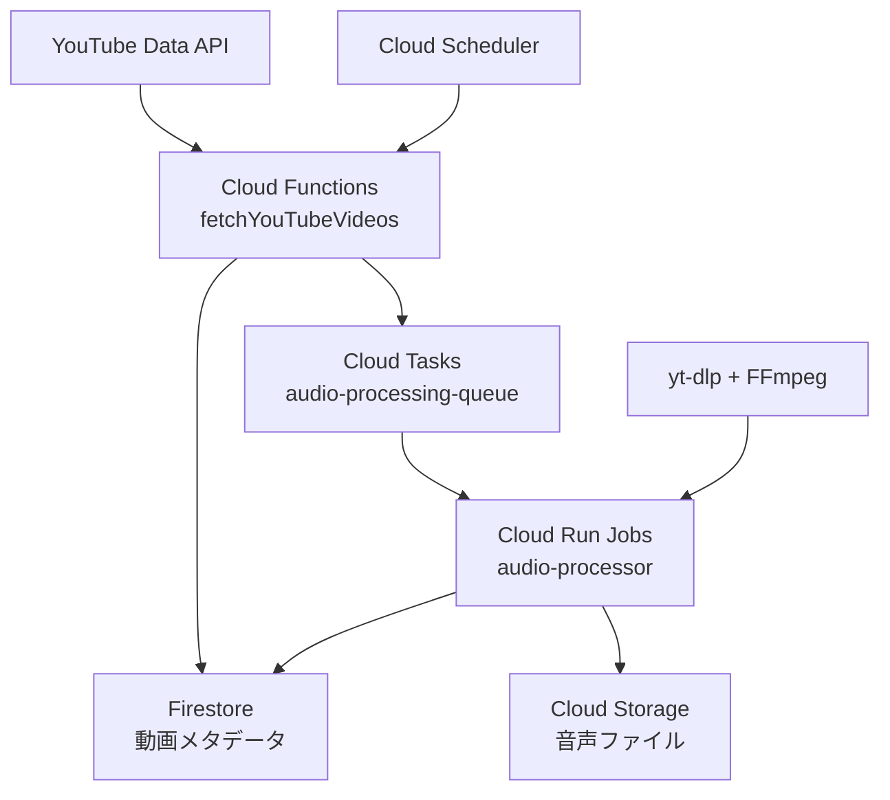

# suzumina.click Terraform Infrastructure

suzumina.clickプロジェクトのGoogle Cloud Platform (GCP)インフラストラクチャをTerraformで管理します。

## 🏗️ インフラストラクチャ概要

### 既存システム（本番稼働中）
- **Cloud Functions**: YouTube/DLsite データ収集
- **Firestore**: データ保存・管理
- **Cloud Scheduler**: 定期実行（毎時・20分間隔）
- **Pub/Sub**: 非同期メッセージング

### 新規追加（音声ボタン機能）
- **Cloud Storage**: 音声ファイル保存（`audio_storage.tf`）
- **Cloud Tasks**: 音声処理キュー（`cloud_tasks.tf`）
- **Cloud Run Jobs**: 音声処理エンジン（`cloud_tasks.tf`）
- **IAM**: 音声処理用権限設定（`iam.tf`）

## 📁 ファイル構成

```
terraform/
├── README.md                    # このファイル
├── providers.tf                 # GCPプロバイダー設定
├── variables.tf                 # 変数定義（音声処理用変数追加）
├── backend.tf                   # Terraformステート管理
│
├── # 既存インフラ（本番稼働中）
├── firebase.tf                  # Firebase/Firestore設定
├── function_*.tf                # Cloud Functions定義
├── pubsub.tf                    # Pub/Sub トピック・サブスクリプション
├── scheduler.tf                 # Cloud Scheduler ジョブ
├── secrets.tf                   # Secret Manager
├── iam.tf                       # IAM権限・サービスアカウント
│
├── # 音声ボタン機能（新規）
├── audio_storage.tf             # 音声ファイル用Cloud Storage
├── cloud_tasks.tf               # Cloud Tasks + Cloud Run Jobs
│
└── # その他
    ├── api_services.tf          # 有効化API
    ├── artifact_registry.tf     # Container Registry
    ├── firestore_*.tf           # Firestoreルール・インデックス
    ├── monitoring.tf            # 監視設定
    └── storage.tf               # その他ストレージ
```

## 🎯 音声ボタン機能アーキテクチャ



### データフロー
1. **Cloud Scheduler** → **fetchYouTubeVideos** (毎時19分)
2. **YouTube API** → **Firestore** (動画メタデータ保存)
3. **Cloud Functions** → **Cloud Tasks** (音声処理タスク送信)
4. **Cloud Tasks** → **Cloud Run Jobs** (音声処理実行)
5. **yt-dlp + FFmpeg** → **Cloud Storage** (Opus/AAC音声保存)
6. **Cloud Run Jobs** → **Firestore** (音声ボタンメタデータ更新)

## 🚀 デプロイ手順

### 1. 前提条件

```bash
# Terraform インストール
brew install terraform

# Google Cloud SDK インストール・認証
brew install google-cloud-sdk
gcloud auth login
gcloud auth application-default login

# プロジェクト設定
gcloud config set project suzumina-click-firebase
```

### 2. 環境設定

```bash
# terraform.tfvarsファイル作成
cp terraform.tfvars.example terraform.tfvars

# 必要な変数を設定
echo 'gcp_project_id = "suzumina-click-firebase"' >> terraform.tfvars
echo 'region = "us-central1"' >> terraform.tfvars
```

### 3. Terraform初期化・実行

```bash
# 初期化
terraform init

# プラン確認
terraform plan

# 適用（本番環境への変更なので要注意）
terraform apply
```

## ⚙️ 音声処理機能の設定項目

### Cloud Storage設定（`audio_storage.tf`）

| リソース | 説明 | 設定値 |
|---------|------|--------|
| **バケット名** | `${project_id}-audio-files` | `suzumina-click-firebase-audio-files` |
| **ライフサイクル** | 1年後自動削除 | 365日 |
| **ストレージクラス** | 30日→Nearline, 90日→Coldline | コスト最適化 |
| **CORS** | Web再生用クロスオリジン設定 | `*.suzumina.click` |

### Cloud Tasks設定（`cloud_tasks.tf`）

| 設定項目 | 説明 | デフォルト値 |
|---------|------|-------------|
| **実行レート** | 秒間最大タスク数 | 1.0 tasks/sec |
| **同時実行数** | 最大並列処理数 | 3 tasks |
| **リトライ** | 最大試行回数 | 3回 |
| **タイムアウト** | タスク最大実行時間 | 30分 |

### Cloud Run Jobs設定（`cloud_tasks.tf`）

| 設定項目 | 説明 | デフォルト値 |
|---------|------|-------------|
| **CPU** | 処理能力 | 4 vCPU |
| **メモリ** | メモリ容量 | 16GB |
| **実行時間** | 最大実行時間 | 1時間 |
| **並列実行** | 同時処理タスク数 | 1 |

## 🔒 セキュリティ・IAM設定

### サービスアカウント

| サービスアカウント | 用途 | 権限 |
|------------------|------|------|
| **audio-processor** | Cloud Run Jobs実行 | Storage Admin, Firestore User |
| **web-app-audio** | Web App音声アクセス | Storage Object Viewer |
| **task-enqueuer** | タスク送信 | Cloud Tasks Enqueuer, Run Invoker |

### 最小権限の原則
- Cloud Run Jobs: 音声ファイル読み書きのみ
- Web App: 音声ファイル読み取りのみ
- Cloud Functions: タスク送信権限追加

## 📊 コスト最適化

### Cloud Storage
- **ライフサイクル管理**: 30日後Nearline（50%削減）→90日後Coldline（75%削減）
- **自動削除**: 1年後完全削除
- **リージョン**: us-central1（標準料金）

### Cloud Run Jobs
- **オンデマンド実行**: 処理時のみ課金
- **最適リソース**: CPU 4/Memory 16GB（音声処理最適化）
- **タイムアウト**: 1時間（無限実行防止）

### Cloud Tasks
- **レート制限**: 1 task/sec（リソース過負荷防止）
- **無料枠**: 月100万オペレーション（十分な範囲）

## 🔍 監視・運用

### ログ・メトリクス
- **Cloud Logging**: 構造化JSON形式
- **Cloud Monitoring**: 処理時間・成功率・エラー率
- **アラート**: 失敗率10%超過時通知

### 運用コマンド

```bash
# 音声処理キューの状況確認
gcloud tasks queues describe audio-processing-queue --location=us-central1

# Cloud Run Jobs実行状況確認
gcloud run jobs executions list --job=audio-processor --region=us-central1

# 音声ファイル容量確認
gsutil du -sh gs://suzumina-click-firebase-audio-files

# ログ確認
gcloud logging read 'resource.type="cloud_run_job" AND resource.labels.job_name="audio-processor"' --limit=50
```

## 🛠️ トラブルシューティング

### よくある問題

1. **Cloud Tasks権限エラー**
   ```bash
   # IAM権限確認
   gcloud projects get-iam-policy suzumina-click-firebase
   ```

2. **Cloud Storage CORS設定**
   ```bash
   # CORS設定確認
   gsutil cors get gs://suzumina-click-firebase-audio-files
   ```

3. **Cloud Run Jobs実行失敗**
   ```bash
   # 最新実行ログ確認
   gcloud run jobs executions describe EXECUTION_NAME --region=us-central1
   ```

### 緊急時手順

1. **音声処理停止**
   ```bash
   gcloud tasks queues pause audio-processing-queue --location=us-central1
   ```

2. **処理再開**
   ```bash
   gcloud tasks queues resume audio-processing-queue --location=us-central1
   ```

## 📋 デプロイチェックリスト

### 初回デプロイ前
- [ ] terraform.tfvars設定完了
- [ ] GCP認証設定完了
- [ ] Docker イメージビルド完了
- [ ] 既存インフラへの影響確認

### デプロイ後確認
- [ ] Cloud Storage バケット作成確認
- [ ] Cloud Tasks キュー作成確認
- [ ] Cloud Run Jobs デプロイ確認
- [ ] IAM権限設定確認
- [ ] 音声処理テスト実行

### 本番移行
- [ ] 段階的デプロイ（開発→ステージング→本番）
- [ ] パフォーマンステスト
- [ ] 監視・アラート設定
- [ ] ドキュメント更新

---

**最終更新**: 2025年6月16日  
**バージョン**: 1.0.0 (音声ボタン機能対応)  
**管理者**: suzumina.click開発チーム