# suzumina.click Terraform Infrastructure

suzumina.clickプロジェクトのGoogle Cloud Platform (GCP)インフラストラクチャをTerraformで管理します。

## 🏗️ インフラストラクチャ概要

### 既存システム（本番稼働中）
- **Cloud Functions**: YouTube/DLsite データ収集
- **Firestore**: データ保存・管理
- **Cloud Scheduler**: 定期実行（毎時・20分間隔）
- **Pub/Sub**: 非同期メッセージング

### 音声ボタン機能（ユーザー作成方式）
- **Cloud Storage**: ユーザー音声ファイル保存
- **IAM**: 音声ファイルアップロード用権限設定（`iam.tf`）

## 📁 ファイル構成

```
terraform/
├── README.md
├── providers.tf
├── variables.tf
├── locals.tf
├── backend.tf
├── terraform.tfvars.example
│
├── # Core Services
├── api_services.tf
├── network.tf
├── iam.tf
│
├── # Application: Cloud Run
├── cloud_run.tf
├── artifact_registry.tf
│
├── # Application: Cloud Functions
├── function_*.tf
├── pubsub.tf
├── scheduler.tf
│
├── # Storage
├── firestore_*.tf
├── storage.tf
├── gcs.tf
│
├── # Operations
├── monitoring*.tf
├── logging.tf
├── billing.tf
└── secrets.tf
```

## 🎯 音声ボタン機能アーキテクチャ（ユーザー作成方式）

```mermaid
graph TB
    A[YouTube Data API] --> B[Cloud Functions<br/>fetchYouTubeVideos]
    B --> C[Firestore<br/>動画メタデータ]
    
    D[ユーザー] --> E[Next.js Web App<br/>音声アップロード]
    E --> F[Cloud Storage<br/>音声ファイル]
    E --> C[Firestore<br/>音声ボタンメタデータ]
    
    G[Cloud Scheduler] --> B
```



### データフロー
1. **Cloud Scheduler** → **fetchYouTubeVideos** (毎時19分)
2. **YouTube API** → **Firestore** (動画メタデータ保存)
3. **ユーザー** → **Web Audio API** (ブラウザ内音声処理)
4. **Next.js Server Actions** → **Cloud Storage** (音声ファイル保存)
5. **Next.js Server Actions** → **Firestore** (音声ボタンメタデータ保存)

## 🚀 デプロイ手順

### 1. 前提条件

```bash
# Terraform インストール
brew install terraform

# Google Cloud SDK インストール・認証
brew install google-cloud-sdk
gcloud auth login
gcloud auth application-default login

# プロジェクト設定
gcloud config set project your-gcp-project-id
```

### 2. 環境設定

```bash
# terraform.tfvarsファイル作成
cp terraform.tfvars.example terraform.tfvars

# 必要な変数を設定
echo 'gcp_project_id = "your-gcp-project-id"' >> terraform.tfvars
echo 'project_number = "123456789012"' >> terraform.tfvars
echo 'region = "asia-northeast1"' >> terraform.tfvars
echo 'environment = "staging"' >> terraform.tfvars
# ...その他必要な変数を設定
```

### 3. Terraform初期化・実行

```bash
# 初期化
terraform init

# プラン確認
terraform plan

# 適用（本番環境への変更なので要注意）
terraform apply
```

## ⚙️ 音声処理機能の設定項目

### Cloud Storage設定（`audio_storage.tf`）

| リソース | 説明 | 設定値 |
|---------|------|--------|
| **バケット名** | `${project_id}-audio-files` | `suzumina-click-firebase-audio-files` |
| **ライフサイクル** | 1年後自動削除 | 365日 |
| **ストレージクラス** | 30日→Nearline, 90日→Coldline | コスト最適化 |
| **CORS** | Web再生用クロスオリジン設定 | `*.suzumina.click` |

### Cloud Tasks設定（`cloud_tasks.tf`）

| 設定項目 | 説明 | デフォルト値 |
|---------|------|-------------|
| **実行レート** | 秒間最大タスク数 | 1.0 tasks/sec |
| **同時実行数** | 最大並列処理数 | 3 tasks |
| **リトライ** | 最大試行回数 | 3回 |
| **タイムアウト** | タスク最大実行時間 | 30分 |

### Cloud Run Jobs設定（`cloud_tasks.tf`）

| 設定項目 | 説明 | デフォルト値 |
|---------|------|-------------|
| **CPU** | 処理能力 | 4 vCPU |
| **メモリ** | メモリ容量 | 16GB |
| **実行時間** | 最大実行時間 | 1時間 |
| **並列実行** | 同時処理タスク数 | 1 |

## 🔒 セキュリティ・IAM設定

### サービスアカウント

| サービスアカウント | 用途 | 権限 |
|------------------|------|------|
| **audio-processor** | Cloud Run Jobs実行 | Storage Admin, Firestore User |
| **web-app-audio** | Web App音声アクセス | Storage Object Viewer |
| **task-enqueuer** | タスク送信 | Cloud Tasks Enqueuer, Run Invoker |

### 最小権限の原則
- Cloud Run Jobs: 音声ファイル読み書きのみ
- Web App: 音声ファイル読み取りのみ
- Cloud Functions: タスク送信権限追加

## 📊 コスト最適化

### Cloud Storage
- **ライフサイクル管理**: 30日後Nearline（50%削減）→90日後Coldline（75%削減）
- **自動削除**: 1年後完全削除
- **リージョン**: us-central1（標準料金）

### Next.js Server Actions
- **ユーザーアップロード**: ブラウザ直接アップロード（サーバー処理最小化）
- **ファイルサイズ制限**: 10MB（音声ファイル適正サイズ）

## 🔍 監視・運用

### ログ・メトリクス
- **Cloud Logging**: 構造化JSON形式
- **Cloud Monitoring**: 処理時間・成功率・エラー率
- **アラート**: 失敗率10%超過時通知

### 運用コマンド

```bash
# 音声ファイル容量確認
gsutil du -sh gs://suzumina-click-firebase-audio-files

# Web App ログ確認
gcloud logging read 'resource.type="cloud_run_revision" AND resource.labels.service_name="suzumina-click-web"' --limit=50

# 音声ファイルアップロード統計
gcloud logging read 'protoPayload.methodName="storage.objects.insert" AND protoPayload.resourceName=~"audio-files"' --limit=20
```

## 🛠️ トラブルシューティング

### よくある問題

1. **音声ファイルアップロード権限エラー**
   ```bash
   # IAM権限確認
   gcloud projects get-iam-policy suzumina-click-firebase
   ```

2. **Cloud Storage CORS設定**
   ```bash
   # CORS設定確認
   gsutil cors get gs://suzumina-click-firebase-audio-files
   ```

3. **音声ファイルアップロード失敗**
   ```bash
   # Cloud Storage設定確認
   gsutil cors get gs://suzumina-click-firebase-audio-files
   ```

### 緊急時手順

1. **音声アップロード一時停止**
   ```bash
   # メンテナンスモード設定
   gcloud run services update suzumina-click-web --set-env-vars MAINTENANCE_MODE=true
   ```

2. **サービス復旧**
   ```bash
   # メンテナンスモード解除
   gcloud run services update suzumina-click-web --remove-env-vars MAINTENANCE_MODE
   ```

## 📋 デプロイチェックリスト

### 初回デプロイ前
- [ ] terraform.tfvars設定完了
- [ ] GCP認証設定完了
- [ ] 既存インフラへの影響確認

### デプロイ後確認
- [ ] Cloud Storage バケット作成確認
- [ ] IAM権限設定確認
- [ ] Web App音声アップロード機能テスト

### 本番移行
- [ ] 段階的デプロイ（開発→ステージング→本番）
- [ ] パフォーマンステスト
- [ ] 監視・アラート設定
- [ ] ドキュメント更新

---

**最終更新**: 2025年6月17日  
**バージョン**: 2.0.0 (ユーザー作成音声ボタン機能対応)  
**管理者**: suzumina.click開発チーム